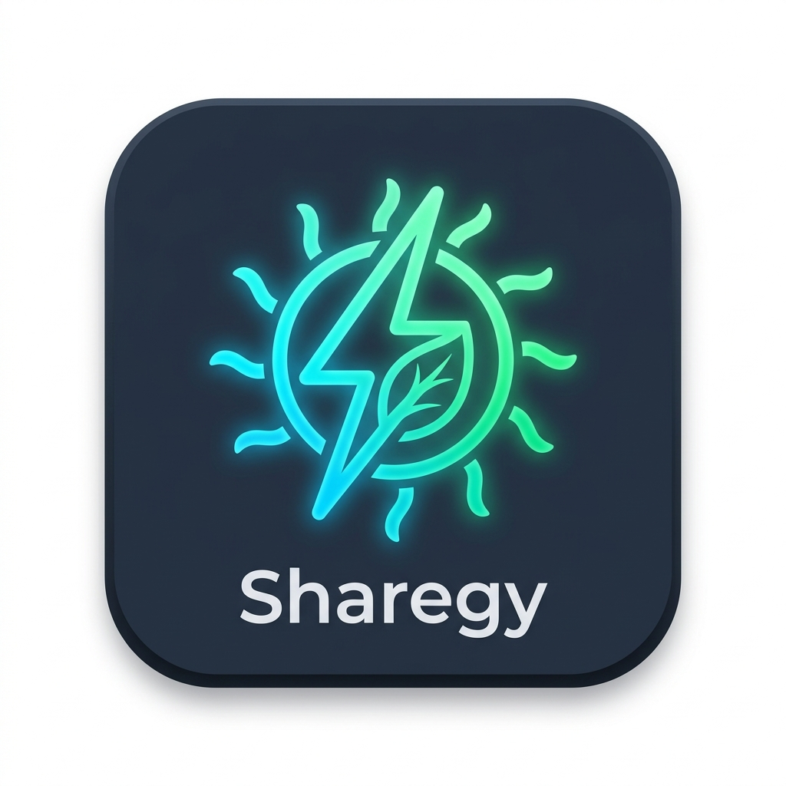

# Sharegy Integration for Home Assistant



[](https://github.com/hacs/default)
[](https://github.com/smartcuc/homeassistant-sharegy/releases)
[](https://opensource.org/licenses/MIT)

Official Home Assistant Integration for the **Sharegy Energy Management Platform** ([sharegy.de](https://sharegy.de)).

Connects your Home Assistant smart home (PV systems, battery storages, heat pumps, BWWP, wallboxes, smart meters, Shelly, Zigbee, ESPHome, KNX) with Sharegy for:
- ☀️ **Realtime EMS Telemetry** (Live energy flow, PV generation, grid feed-in/import, battery SoC)
- 🌡️ **Custom Devices & Submeters** (Heatpumps, Brauchwasserwärmepumpen, temperature sensors, smart plugs)
- 📦 **SQLite Store & Forward Offline Buffer** (zero data loss during internet outages)
- 🎛️ **Bidirectional Smart Load Control** (SG-Ready and dynamic tariff optimization)

---

## 🚀 Installation via HACS (Recommended)

1. Ensure [HACS (Home Assistant Community Store)](https://hacs.xyz/) is installed.
2. In Home Assistant, open **HACS** ➔ **Integrations**.
3. Click the **3 dots** in the top right corner and select **Custom repositories**.
4. Enter repository URL:
   ```
   https://github.com/smartcuc/homeassistant-sharegy
   ```
   Category: **Integration**
5. Click **Add**, find **Sharegy Energy Management**, and click **Download**.
6. **Restart Home Assistant**.

---

## ⚙️ Configuration

1. In Home Assistant, go to **Settings** ➔ **Devices & Services** ➔ **Add Integration**.
2. Search for **Sharegy**.
3. Enter your **Sharegy Home Token** (from the Sharegy Web-App under *Settings ➔ Interfaces*).
4. Select your EMS sensors (Grid Power, Solar Generation, Battery SoC/Power, House Load).
5. Done! Telemetry will stream seamlessly to your Sharegy platform.
