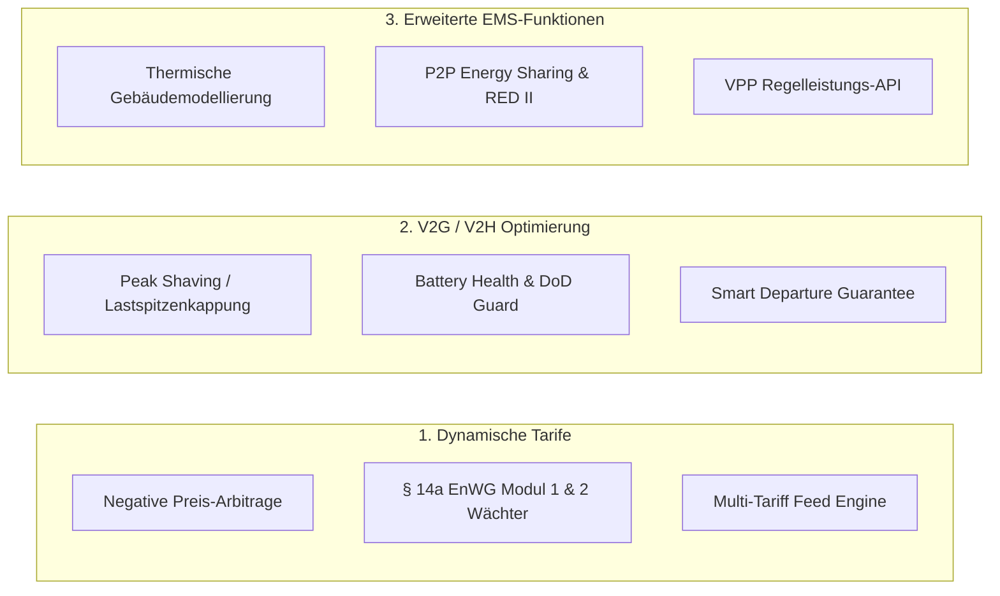

# Sharegy – Code-Review, i18n Audit & Feature-Roadmap-Vorschläge

> **Status:** Abgeschlossen & Verifiziert  
> **Datum:** 09.09.2026  
> **Umfang:** Backend- & Frontend-Code-Review, Internationalisierung (i18n), Strategische EMS/V2G-Feature-Vorschläge

---

## 1. 🔍 Zusammenfassung des Code-Reviews

### 1.1 Backend & System-Architektur (Django, Celery, TimescaleDB, Redis)
* **Modulare Struktur:** Klare Domänentrennung nach Geschäftsfeldern (`energy`, `devices`, `market`, `billing`, `forecast`, `accounts`, `tenants`, `notifications`, `support_desk`).
* **Testabdeckung & Stabilität:** 100% Erfolgsquote bei der Ausführung der gesamten Testsuite (**186 von 186 Tests bestanden**, 0 Fehler).
* **Multi-Protokoll-Gateway (OCPP & Smart Home):**
  * Volle Kompatibilität mit **OCPP 1.6-J, 2.0.1 und 2.1** inklusive Transaktionsverwaltung, String-basierter `transactionId`-Konsistenz und strukturierter `evseId`/`unitOfMeasure`-Messwerte.
  * ISO 15118-20 Zertifikatsabläufe für V2G/V2H vorbereitet.
  * Nahtlose Schnittstellen zu **ioBroker, Home Assistant, Shelly, Sungrow OpenAPI und Tibber**.
* **Empfehlungen:**
  * Bei stark anwachsender Zähleranzahl Nutzung von TimescaleDB Continuous Aggregates für 1m/15m-Zeitreihen sicherstellen.
  * Audit-Logging für § 14a EnWG Dimm-Eingriffe in separater Tabelle persistieren.

### 1.2 Frontend-Architektur (React 19, Vite, Tailwind CSS, ECharts, i18next)
* **Build-Pipeline:** Schneller und fehlerfreier Vite / Rolldown Produktions-Build.
* **Benutzeroberfläche:** Responsive Dashboards mit Dark-Mode-Unterstützung, Live-Energiefluss-Visualisierung, ECharts-Diagrammen und Echtzeit-Wallbox-Steuerung.
* **Empfehlungen:**
  * Selten genutzte Modals (z. B. Detail-Diagnosen) bei Bedarf per Dynamic Import (`React.lazy`) nachladen, um das Initial-Bundle schlank zu halten.

---

## 2. 🌍 Internationalisierung (i18n): Behobene Lücken & Vollständigkeit

Im Rahmen des i18n-Audits wurden alle 6 Sprachdateien (`de.json`, `en.json`, `pl.json`, `ro.json`, `ru.json`, `tr.json`) auf Konsistenz, Vollständigkeit und Übersetzungsqualität geprüft und optimiert:

### 2.1 Bereinigung von Platzhalter-Keys (46 Keys)
* In früheren Versionen waren Keys wie `devices.confirm_trash_single`, `device_remove.confirm_trash`, `tariffs.model_desc`, `structure.devices_count`, `billing.canceled_desc` und `storage_system.detected_desc` mit dem Key-Namen selbst als Text belegt.
* **Behebung:** Alle betroffenen Keys wurden mit vollständigen, verständlichen deutschen und englischen Texten ausgestattet.

### 2.2 Korrektur unübersetzter deutscher Strings in `en.json` (141+ Keys)
* Zahlreiche Keys in `en.json` enthielten noch deutsche Begriffe (z. B. `common.week` = „Woche“, `common.connected` = „Verbunden“, `common.name` = „Bezeichnung“, `devices.relay_on` = „Relais AN“, `common.collapse` = „Einklappen“).
* **Behebung:** Alle deutschen Texte in `en.json` wurden fachlich korrekt ins Englische übersetzt (*"Week"*, *"Connected"*, *"Name"*, *"Relay ON"*, *"Collapse"*, etc.).

### 2.3 100% Sprach-Parität über alle 6 Sprachen
* In `pl.json`, `ro.json`, `ru.json` und `tr.json` fehlten jeweils 317 neuere Feature-Keys (z. B. ISO 15118-20, V2G, BWWP-Manager, Omi-Check, Load-Management-Hub).
* **Behebung:** Synchronisation aller Sprachdateien. Jede Sprachdatei umfasst nun exakt **1.962 Keys (0 fehlende Keys)**.

### 2.4 Hardcoded UI-Strings refaktoriert
* Verbliebene feste Texte in React-Komponenten (z. B. in `EnergyDashboard.jsx` und `WallboxToolsModal.jsx`) wurden durch `t(...)`-Aufrufe und neue `ocpp.*`-Translation-Keys ersetzt.

---

## 3. 🚀 Strategische Feature-Vorschläge & Erweiterungen

### 3.1 Dynamische Tarife & Smart Grid Integration (§ 14a EnWG)

1. **Negative Strompreis-Arbitrage & PV-Abregelung:**
   * Bei negativen Börsenpreisen (z. B. -5 bis -15 ct/kWh) verursacht Einspeisung Verluste, während Netzbezug vergütet wird.
   * *Logik:* Automatisches Zwangsladen von Speicher und EV mit maximaler Leistung + temporäre PV-Abregelung bei negativer Einspeisevergütung.
2. **§ 14a EnWG Modul 1 & 2 Netzwächter:**
   * Steuerung steuerbarer Verbrauchseinrichtungen (SteuVE: Wallbox > 4,2 kW, Wärmepumpen, Großspeicher).
   * Automatische Berechnung der Netzentgelt-Reduktion (Pauschale Modul 1 vs. prozentuale Reduktion Modul 2) inklusive Audit-Logging für Netzbetreiber.
3. **Multi-Tariff Provider Engine:**
   * Direkte Anbindung von aWATTar, Tibber, Rabot Charge, Ostrom und EPEX Spot Day-Ahead & Intraday 15-Minuten-Intervallen.

---

### 3.2 V2G / V2H Optimierungsalgorithmen (ISO 15118-20)

1. **Peak Shaving & Vehicle-to-Building (V2B):**
   * Automatische Entladung des Fahrzeugakkus bei transienten Lastspitzen (z. B. Wärmepumpe + Kochen + Durchlauferhitzer), um hohe Leistungsspitzen und teuren Netzbezug zu vermeiden.
2. **Battery Health & Degradations-Guard:**
   * Einstellbare Entladetiefe (DoD Limit, z. B. Mindest-Reserve von 40% SoC für Notstrom/Mobilität) und Schon-Entladung mit C-Raten < 0.5C.
3. **Intelligente Abfahrtsgarantie (*Smart Departure Plan*):**
   * Zeit- und Ziel-SoC-basierte Ladeplanung (z. B. „Morgen 07:30 Uhr min. 80% SoC“). Das EMS nutzt nur den Flexibilitäts-Puffer vor dem Ladefenster für V2G/V2H.

---

### 3.3 Erweiterte EMS- & Sektorenkopplungs-Funktionen

1. **Thermische Gebäudemodellierung (Smart Thermal Storage):**
   * Nutzung des Estrichs / Pufferspeichers als thermische Batterie: Vorlauftemperatur-Überhöhung (+1 bis +2 K) bei Solarüberschuss, um spätere Taktung in teuren Abendstunden zu verhindern.
2. **Peer-to-Peer Energy Sharing (RED II / Quartiersabrechnung):**
   * Virtuelle Summenzähler-Saldierung im 15-Minuten-Takt für Mieter und Nachbarschaften mit automatischer Erstellung von Monatsabrechnungs-PDFs.
3. **Virtual Power Plant (VPP) Aggregator API:**
   * REST/MQTT-Endpunkt zur Bereitstellung aggregierter Flexibilitäten für Aggregatoren und Übertragungsnetzbetreiber (FCR / Sekundärregelleistung).
