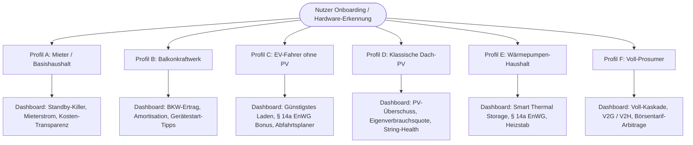

# 📊 Sharegy Feature-Nutzer-Matrix & Ersparnis-Potenzial-Katalog

Dieses Dokument dient als strategische und technische Arbeitsgrundlage, um Sharegy für **alle Nutzergruppen** – vom klassischen Mieter im Mehrfamilienhaus ohne Solaranlage bis zum vollausgestatteten Prosumer – wertstiftend, verständlich und finanziell messbar zu gestalten.

---

## 1. Motivation & Leitbild

Aktuelle Energiemanagement-Systeme (EMS) leiden häufig an **„Prosumer-Blindheit“**: Sie setzen voraus, dass ein Nutzer bereits eine große Dach-PV-Anlage, einen 10-kWh-Batteriespeicher und einen dynamischen Stromtarif besitzt.

In der Realität stellen **Mieter, Wohnungseigentümer (WEG) und Haushalte mit fixen Stromtarifen über 65 % des Marktes** dar. Sharegy soll modular und adaptiv für jedes Setup den **maximalen finanziellen und ökologischen Nutzen** herausarbeiten:

---

## 2. Die 6 Nutzer-Archetypen (Personas)

### 🏠 Profil A: Der Mieter / Basishaushalt
* **Ausstattung**: Digitaler Stromzähler (mME) mit IR-Lesekopf (Tasmota SML) oder Shelly 3EM in Unterverteilung, smarte Zwischenstecker (Shelly/Zigbee).
* **Stromtarif**: Fixer Standardtarif (z. B. 32 ct/kWh Grundversorger / Ökostrom).
* **Hauptziel**: Transparenz, Standby-Verschwendung stoppen, Stromrechnung senken, Mieterstrom nutzen.
* **Typischer Jahresverbrauch**: 2.200 – 3.500 kWh.

### ☀️ Profil B: Der Balkonkraftwerk-Nutzer (BKW)
* **Ausstattung**: Smart Meter / Sensor + 600 W oder 800 Wp steckerfertige Mini-PV (z. B. Hoymiles / Envertech / Shelly Plug).
* **Stromtarif**: Fixer Standardtarif (32 ct/kWh).
* **Hauptziel**: Maximaler Eigenverbrauch des erzeugten Balkonstroms, schnelle Amortisation (< 3 Jahre).
* **Typischer Jahresverbrauch**: 2.800 – 4.000 kWh | BKW-Ertrag: ~650–850 kWh/a.

### 🚗 Profil C: Der EV-Fahrer (ohne eigene Solaranlage)
* **Ausstattung**: Smart Meter + Wallbox (OCPP 1.6 / 2.0.1 steuerbar, z. B. Easee, go-e, Keba, Alfen) + Elektroauto (40–80 kWh Akku).
* **Stromtarif**: Fixer Tarif oder dynamischer Börsentarif (Tibber/Awattar) + **§ 14a EnWG steuerbare Last**.
* **Hauptziel**: Günstigstes Laden (Nachtfenster), garantierte Reichweite am Morgen, § 14a EnWG Netzentgelt-Bonus.
* **Typischer Jahresverbrauch**: 3.000 kWh Haushalt + 3.000 kWh Fahrstrom (15.000 km/a) = 6.000 kWh.

### 🏡 Profil D: Der klassische PV-Besitzer (ohne Speicher)
* **Ausstattung**: 5–15 kWp Dach-PV (z. B. SMA, Fronius, Sungrow, Growatt, SolarEdge), Zweirichtungszähler.
* **Stromtarif**: Fixer Bezugstarif (32 ct/kWh) + feste EEG-Einspeisevergütung (~8,2 ct/kWh).
* **Hauptziel**: Eigenverbrauchsquote von 30 % auf 50–60 % steigern (Vermeidung von teurem Netzbezug).
* **Typischer Jahresverbrauch**: 4.000 kWh | PV-Ertrag: ~8.000–14.000 kWh/a.

### ♨️ Profil E: Der Wärmepumpen-Haushalt
* **Ausstattung**: Luft-Wasser- oder Sole-Wärmepumpe (SG-Ready / Modbus / § 14a EnWG Relais), Pufferspeicher / Estrich, optional Heizstab.
* **Stromtarif**: Separater WP-Tarif, § 14a EnWG steuerbar oder dyn. Börsenstromtarif.
* **Hauptziel**: Vorlauf-Überhöhung bei günstigen Stunden / PV, Netzentgelt-Ersparnis, Vermeidung teurer Sperrzeiten.
* **Typischer Jahresverbrauch**: 3.500 kWh Haushalt + 4.500 kWh Heizwärme = 8.000 kWh.

### ⚡ Profil F: Der Voll-Prosumer (All-in-One)
* **Ausstattung**: Dach-PV (10–25 kWp) + Heimspeicher (5–20 kWh) + Wallbox (mit ISO 15118-20 V2G) + Wärmepumpe + dynamischer Börsentarif.
* **Stromtarif**: Dynamischer Spotmarkttarif + § 14a EnWG (Modul 1 + Modul 2).
* **Hauptziel**: Maximale Autarkie (85–95 %), Netzarbitrage (Laden bei Negativpreisen), Peak Shaving, V2G-Einspeisung.
* **Typischer Jahresverbrauch**: 10.000 – 14.000 kWh.

---

## 3. Umfassende Feature-Nutzer-Matrix

| Funktionsbereich | Feature in Sharegy | Profil A (Mieter) | Profil B (BKW) | Profil C (EV o. PV) | Profil D (PV o. Speicher) | Profil E (Wärmepumpe) | Profil F (Prosumer) |
| :--- | :--- | :---: | :---: | :---: | :---: | :---: | :---: |
| **Transparenz & Basisanalyse** | Echtzeit-Leistungsmessung (1s/10s) | ✅ | ✅ | ✅ | ✅ | ✅ | ✅ |
| | Standby- & Grundlast-Detektor | ⭐⭐⭐ | ⭐⭐⭐ | ⭐⭐ | ⭐⭐ | ⭐⭐ | ⭐⭐ |
| | NILM / Smarte Geräteerkennung | ⭐⭐⭐ | ⭐⭐⭐ | ⭐⭐ | ⭐⭐ | ⭐⭐ | ⭐⭐ |
| | Stromfresser- & Fehlverhaltensalarm | ⭐⭐⭐ | ⭐⭐⭐ | ⭐⭐ | ⭐⭐ | ⭐⭐ | ⭐⭐ |
| | Wöchentlicher KI-Digest per E-Mail | ✅ | ✅ | ✅ | ✅ | ✅ | ✅ |
| **Balkonkraftwerk (Mini-PV)** | BKW-Erzeugungstracking (W / kWh) | ❌ | ⭐⭐⭐ | ❌ | ❌ | ❌ | ❌ |
| | BKW-Eigenverbrauchsquote (%) | ❌ | ⭐⭐⭐ | ❌ | ❌ | ❌ | ❌ |
| | BKW-Amortisationsrechner (ROI-Uhr) | ❌ | ⭐⭐⭐ | ❌ | ❌ | ❌ | ❌ |
| | Einschalttipps für Wasch-/Spülmaschine | ❌ | ⭐⭐⭐ | ❌ | ⭐⭐⭐ | ❌ | ⭐⭐ |
| **Elektromobilität (Wallbox / EV)**| Günstigstes Börsenstunden-Laden | ❌ | ❌ | ⭐⭐⭐ | ❌ | ❌ | ⭐⭐⭐ |
| | Abfahrtsgarantie (Departure Ready) | ❌ | ❌ | ⭐⭐⭐ | ⭐⭐ | ❌ | ⭐⭐⭐ |
| | PV-Überschuss-Laden & Phasensprung | ❌ | ❌ | ❌ | ⭐⭐⭐ | ❌ | ⭐⭐⭐ |
| | V2G / V2H Lastspitzenkappung (ISO 15118-20) | ❌ | ❌ | ❌ | ❌ | ❌ | ⭐⭐⭐ |
| | Battery-Care Ladeschonung (C-Rate) | ❌ | ❌ | ⭐⭐ | ⭐⭐ | ❌ | ⭐⭐⭐ |
| **Wärme & Sektorenkopplung** | Smart Thermal Storage (MPC-Vorlauf) | ❌ | ❌ | ❌ | ❌ | ⭐⭐⭐ | ⭐⭐⭐ |
| | PV-Heizstab Warmwasser-Kaskade | ❌ | ❌ | ❌ | ⭐⭐⭐ | ⭐⭐ | ⭐⭐⭐ |
| | SG-Ready / Modbus Wärmepumpen-Relais | ❌ | ❌ | ❌ | ❌ | ⭐⭐⭐ | ⭐⭐⭐ |
| **Speicher & Arbitrage** | Winter-Netzladung bei Minuspreisen | ❌ | ❌ | ❌ | ❌ | ❌ | ⭐⭐⭐ |
| | Dynamisches DoD / Akkuschutz | ❌ | ❌ | ❌ | ❌ | ❌ | ⭐⭐⭐ |
| **Regulatorik & Recht** | § 14a EnWG Pauschalrabatt (Modul 1) | ❌ | ❌ | ⭐⭐⭐ | ❌ | ⭐⭐⭐ | ⭐⭐⭐ |
| | § 14a EnWG Zeitvariable Netzentgelte (Modul 3)| ❌ | ❌ | ⭐⭐ | ❌ | ⭐⭐ | ⭐⭐⭐ |
| | § 14a EnWG Audit-Logging & Nachweis | ❌ | ❌ | ⭐⭐⭐ | ❌ | ⭐⭐⭐ | ⭐⭐⭐ |
| **Quartier & Community** | P2P Mieterstrom-Sharing (§ 42b EnWG) | ⭐⭐⭐ | ⭐⭐ | ⭐⭐ | ⭐⭐ | ⭐⭐ | ⭐⭐⭐ |
| | Virtuelle Quartiers-Saldierung (15m) | ⭐⭐⭐ | ⭐⭐ | ⭐⭐ | ⭐⭐ | ⭐⭐ | ⭐⭐⭐ |

*Legende: ⭐⭐⭐ = Kern-Mehrwert / Maximaler Hebel | ⭐⭐ = Sinnvolle Ergänzung | ❌ = Nicht relevant / Hardware fehlt*

---

## 4. Detaillierte Ersparnis-Kalkulationsmodelle (€ / Jahr)

### 🧮 1. Grundlast- & Standby-Reduktion (Für Profile A, B, C, D, E, F)
* **Problem**: Viele Haushalte haben eine verdeckte Grundlast von 150–250 W durch daueraktive Altgeräte, Standby-Netzteile, Zirkulationspumpen und NAS-Systeme.
* **Sharegy-Lösung**: Automatischer Algorithmus erkennt die minimale Dauerlast zwischen 02:00 und 05:00 Uhr und identifiziert Einsparpotenziale.
* **Formel**: 
  $$\Delta \text{Kosten} = \Delta P_{\text{Standby}} \text{ (kW)} \times 8.760 \text{ h} \times \text{Strompreis (€/kWh)}$$
* **Beispiel**: Senkung der Grundlast um **70 W**:
  $$0{,}070 \text{ kW} \times 8.760 \text{ h} \times 0{,}32 \text{ €/kWh} = \mathbf{196{,}22 \text{ € / Jahr}}$$

---

### 🧮 2. Balkonkraftwerk-Eigenverbrauchsoptimierung (Profil B)
* **Problem**: Ohne Steuerung verpuffen 40–50 % des Mini-PV-Stroms ungenutzt als unvergütete Einspeisung ins Netz.
* **Sharegy-Lösung**: Push-Benachrichtigungen und smarte Steckdosen starten Spülmaschine, Waschmaschine oder Akku-Ladestationen genau dann, wenn das BKW > 400 W liefert.
* **Formel**:
  $$\text{Ersparnis} = E_{\text{BKW}} \times (\text{Quote}_{\text{optimiert}} - \text{Quote}_{\text{ohne}}) \times \text{Strompreis}$$
* **Beispiel**: 800 Wp BKW (Ertrag 750 kWh/a), Steigerung Eigenverbrauch von 50 % auf 85 % (+262,5 kWh genutzt):
  $$262{,}5 \text{ kWh} \times 0{,}32 \text{ €/kWh} = \mathbf{84{,}00 \text{ € / Jahr (Zusatzvorteil)}}$$
  *(Gesamtersparnis BKW gesamt: $637{,}5 \text{ kWh} \times 0{,}32 \text{ €} = \mathbf{204{,}00 \text{ € / Jahr}}$)*

---

### 🧮 3. Börsenstrom-Nachtladen für E-Autos (Profil C)
* **Problem**: Unkontrolliertes Laden am Feierabend (18:00–21:00 Uhr) fällt in die teuersten Peak-Stunden.
* **Sharegy-Lösung**: Die Wallbox lädt automatisch in den 3–4 günstigsten Nachtstunden (z. B. 01:00–05:00 Uhr).
* **Formel**:
  $$\text{Ersparnis} = E_{\text{Fahrstrom}} \times (\text{Preis}_{\text{Standard}} - \text{Preis}_{\text{Nacht\_Ø}})$$
* **Beispiel**: 15.000 km/Jahr (3.000 kWh), Standardpreis 32 ct/kWh, Nacht-Spot-Ø 18 ct/kWh:
  $$3.000 \text{ kWh} \times (0{,}32 \text{ €} - 0{,}18 \text{ €}) = \mathbf{420{,}00 \text{ € / Jahr}}$$

---

### 🧮 4. § 14a EnWG Netzentgelt-Rückerstattung (Profile C, E, F)
* **Gesetzliche Grundlage**: Seit 01.01.2024 erhalten Betreiber von steuerbaren Verbrauchseinrichtungen (Wallboxen $\ge 4{,}2$ kW, Wärmepumpen, Batteriespeicher) bundesweit verbindliche Rabatte auf Netzentgelte.
* **Modul 1 (Pauschale)**:
  * Jährliche Pauschale je Anlage: **110 € bis 190 € / Jahr** (bundesweiter Durchschnitt: **~160 € / a**).
* **Modul 2 (Prozentuale Reduzierung des Arbeitspreises)**:
  * 60 % Rabatt auf den Netzentgelt-Arbeitspreis (ca. 4–6 ct/kWh Ersparnis auf den WP- oder Ladestrom).
* **Beispiel (Profil F mit Wallbox + Wärmepumpe)**:
  $$\text{Pauschale Modul 1} = 2 \times 160 \text{ €} = \mathbf{320{,}00 \text{ € / Jahr Cash-Vorteil}}$$

---

### 🧮 5. PV-Überschuss-Laden & Warmwasser-Heizstab (Profile D & F)
* **Problem**: Für eingespeisten Solarstrom gibt es nur ~8 ct/kWh, während Bezugsstrom 32 ct/kWh kostet (Spread: **24 ct/kWh**).
* **Sharegy-Lösung**: Stufenlose Regelung der Wallbox (6–16A / 1-zu-3-Phasenumschaltung) und Zuschalten eines modulierenden Heizstabs (0–3 kW) für den Warmwasserspeicher.
* **Beispiel (Profil D)**: 2.000 kWh Solarstrom von Einspeisung in Eigenverbrauch umgewandelt:
  $$2.000 \text{ kWh} \times (0{,}32 \text{ €} - 0{,}08 \text{ €}) = \mathbf{480{,}00 \text{ € / Jahr}}$$

---

### 🧮 6. Smart Thermal Storage / Wärmepumpen-Vorlauf (Profile E & F)
* **Problem**: Wärmepumpen takten häufig am Abend bei Spitzenstrompreisen oder laufen morgens bei kaltem Außentemperaturen ineffizient.
* **Sharegy-Lösung**: Vorausschauende MPC-Modellierung überhöht den Vorlauf um +1,5 K bei Solarüberschuss oder Tiefpreisstunden und nutzt den Estrich als thermische Batterie.
* **Beispiel (Profil E)**: 15 % Tarifarbitrage auf 4.500 kWh WP-Strom:
  $$4.500 \text{ kWh} \times 0{,}15 \times (0{,}32 \text{ €} - 0{,}18 \text{ €}) = \mathbf{94{,}50 \text{ € / a}} + \text{§ 14a Bonus (160 €)} = \mathbf{254{,}50 \text{ € / Jahr}}$$

---

## 5. Zusammenfassung der Ersparnis-Potenziale

| Archetyp | Profil-Name | Typische Hardware | Minimal-Ersparnis | Realistisches Sparpotenzial | Maximal-Potenzial |
| :--- | :--- | :--- | :---: | :---: | :---: |
| **A** | Mieter / Basishaushalt | Smart Meter / IR-Lesekopf | 90 € / a | **180 € / a** | 350 € / a (inkl. P2P) |
| **B** | Balkonkraftwerk | 800 W BKW + Smart Plug | 150 € / a | **245 € / a** | 320 € / a |
| **C** | EV-Fahrer ohne PV | Wallbox + E-Auto | 350 € / a | **580 € / a** | 720 € / a |
| **D** | Klassische Dach-PV | 8 kWp PV (ohne Speicher) | 320 € / a | **510 € / a** | 680 € / a |
| **E** | Wärmepumpe | WP (§ 14a steuerbar) | 280 € / a | **420 € / a** | 580 € / a |
| **F** | Voll-Prosumer | PV + Speicher + EV + WP | 1.400 € / a | **1.950 € / a** | 2.600 € / a |

---

## 6. Konsequenzen für Produkt, UI & Onboarding

### 1. Wizard-Basiertes Hardware-Onboarding
Beim ersten Login wählt der Nutzer sein Profil oder klickt seine Hardware an:
* `[ ] Stromzähler (mME / Shelly / IR-Kopf)`
* `[ ] Balkonkraftwerk (600/800 W)`
* `[ ] Dach-Photovoltaikanlage`
* `[ ] Heimspeicher`
* `[ ] Wallbox / Elektroauto`
* `[ ] Wärmepumpe`
* `[ ] Dynamischer Börsenstromtarif vorhanden`

### 2. Adaptive Dashboard-Kacheln
* **Wenn kein Speicher / keine Wallbox vorhanden**: Die Kacheln werden **nicht als leere Fehler/Offline-Meldungen** angezeigt, sondern das Dashboard ordnet sich automatisch kompakt an.
* **Stattdessen**: Einblendung der **„Potenzial-Kachel“** (z. B. *„💡 Was würde dir ein Balkonkraftwerk bringen? Rechner öffnen“*).

### 3. Personalisierte ROI- & Spar-Berichte
* Der wöchentliche E-Mail-Report rechnet spezifisch für das hinterlegte Profil ab (z. B. Mieter: *„Grundlast diese Woche um 12 W gesenkt = 3,40 € gespart“* vs. Prosumer: *„Autarkie 88 %, 42 € Ersparnis“*).

---

## 7. Offene Diskussionspunkte zur gemeinsamen Optimierung

> [!NOTE]
> 1. **Welche Profile sollen im ersten Schritt in der UI speziell visualisiert werden?** (Empfehlung: Mieter/BKW vs. Prosumer als Haupt-Umschalter).
> 2. **Soll ein interaktiver Ersparnisrechner („Savings Simulator“) als neue Seite in Sharegy integriert werden?**
> 3. **Welche Sensoren für Mieter (z. B. Tasmota IR-Lesekopf, Shelly Plug S, Tibber Pulse) sollen im Setup priorisiert werden?**
