# 📊 Sharegy Feature-Nutzer-Matrix & Tarif-Entscheidungskompass

Dieses Dokument enthält die **vollständige kombinatorische Aufschlüsselung aller Hardware-Konstellationen** im Haushalt, konkrete **Tarif-Empfehlungen (Fester Tarif vs. Dynamischer Börsenstromtarif vs. § 14a WP-Tarif)** sowie die exakten **Sharegy-Einsparpotenziale**.

---

## 1. Das Grundprinzip: Wann lohnt sich welcher Tarif?

| Kriterium | Fester Stromtarif (z. B. 28–32 ct/kWh) | Dynamischer Börsentarif (Tibber, Awattar, Ostrom etc.) |
| :--- | :--- | :--- |
| **Zusatzkosten** | Keine / Standard-Grundpreis (~10 €/Mt.) | Zusätzliche Monatsgebühr (~4–6 €/Mt.) + Smart-Meter-Kosten |
| **Preisrisiko** | 0 % Preisrisiko, feste Kalkulierbarkeit | Preisschwankungen; Risiko bei ungesteuertem Peak-Verbrauch |
| **Voraussetzung** | Keine Steuerung notwendig | **Verschiebbare Großlast ($\ge 2.000$ kWh/a)** (z. B. E-Auto, großer Speicher, Wärmepumpe) |
| **Wann optimal?** | Geringer Verbrauch, keine Großverbraucher, reiner Haushaltsstrom oder BKW ohne Speicher | E-Auto vorhanden, Speicher mit Winter-Netzladung, modulierbare Wärmepumpe |

---

## 2. Vollständige Matrix aller Hardware-Kombinationen

```mermaid
graph TD
    Start([Welche Hardware ist vorhanden?]) --> KatA[Kat. A: Basishaushalt - Nur Stromzähler]
    Start --> KatB[Kat. B: Balkonkraftwerk 600-800W]
    Start --> KatC[Kat. C: E-Mobilität / Wallbox]
    Start --> KatD[Kat. D: Klassische Dach-PV]
    Start --> KatE[Kat. E: Wärmepumpe]
    Start --> KatF[Kat. F: Voll-Prosumer All-in-One]

    KatA --> A1[A.1: Nur Zähler / Haushaltsstrom]
    
    KatB --> B1[B.1: BKW ohne Speicher]
    KatB --> B2[B.2: BKW mit 1-2 kWh Speicher]

    KatC --> C1[C.1: EV ohne PV]
    KatC --> C2[C.2: EV + BKW]
    KatC --> C3[C.3: EV + Dach-PV ohne Speicher]
    KatC --> C4[C.4: EV + Dach-PV + Heimspeicher]

    KatD --> D1[D.1: Dach-PV ohne Speicher]
    KatD --> D2[D.2: Dach-PV + Speicher ohne EV/WP]

    KatE --> E1[E.1: Wärmepumpe ohne PV]
    KatE --> E2[E.2: Wärmepumpe + BKW]
    KatE --> E3[E.3: Wärmepumpe + Dach-PV ohne Speicher]
    KatE --> E4[E.4: Wärmepumpe + Dach-PV + Speicher]

    KatF --> F1[F.1: PV + Speicher + EV + WP + V2G]
```

---

## 3. Detaillierte Profile & Tarif-Empfehlungen

---

### 🏠 KATEGORIE A: Basishaushalt (Nur Haushaltsstrom, keine PV/EV/WP)

#### Profil A.1: Nur Zähler (mME / IR-Lesekopf / Shelly)
* **Hardware**: Zähler (Tasmota SML / Shelly 3EM / Tibber Pulse), smarte Zwischenstecker.
* **Jahresverbrauch**: 2.000 – 3.500 kWh (Haushaltsstrom).
* **🎯 Tarif-Empfehlung**: 🔒 **FESTER STROMTARIF (z. B. 28–30 ct/kWh)**
  * *Warum KEIN dynamischer Tarif?* Da der Strombedarf unverschiebbar morgens (07–09 Uhr) und abends (18–22 Uhr) in die teuren Börsenspitzen fällt, zahlt der Nutzer im Börsenschnitt oft 32–36 ct/kWh. Zusammen mit der monatlichen Zusatzgebühr (~60 €/a) entstünde ein **Verlust**.
* **💡 Sharegy-Funktionen & Hebel**:
  * **Standby-Killer**: Erkennt 50–100 W Grundlastverschwendung $\rightarrow$ **~140–280 € / a**.
  * **Stromfresser-Alarm**: Warnt bei defekten Geräten, offenen Kühlungen $\rightarrow$ **~40–80 € / a**.
  * **P2P-Mieterstrom (Quartier)**: Günstiger Solarstrom vom Nachbardach (22 ct statt 30 ct) $\rightarrow$ **~120 € / a**.
* **💰 Gesamtersparnis**: **180 € bis 360 € / Jahr**

---

### ☀️ KATEGORIE B: Balkonkraftwerk (Stecker-Solar 600–800 W)

#### Profil B.1: Balkonkraftwerk OHNE Speicher (Direktverbrauch)
* **Hardware**: Zähler + 800 Wp BKW (Hoymiles, Envertech, Shelly Plug).
* **Erzeugung**: ~700–850 kWh/a | **Verbrauch**: 2.500 – 3.800 kWh/a.
* **🎯 Tarif-Empfehlung**: 🔒 **FESTER STROMTARIF**
  * *Warum?* Das BKW deckt tagsüber genau die günstigen Sonnenstunden bereits kostenlos ab. Reststrom wird nur morgens/abends gebraucht (wo Börsenpreise hoch sind).
* **💡 Sharegy-Funktionen & Hebel**:
  * **Einschalttipps / Smart Plugs**: Start von WaMa/Spülmaschine bei BKW > 400 W (steigert Eigenverbrauch von 45 % auf 80 %) $\rightarrow$ **~80 € / a Zusatzvorteil**.
  * **BKW-Amortisationsuhr**: Live-Zähler bis zur vollen Amortisation (typisch 2,5 Jahre).
  * **Standby-Kompensationsanzeige**: Visualisiert, wann das BKW die Grundlast auf 0 W drückt.
* **💰 Gesamtersparnis**: **~200 € bis 260 € / Jahr** (BKW-Gesamtertrag)

#### Profil B.2: Balkonkraftwerk MIT Mini-Speicher (1–2 kWh, z. B. Anker Solix, Zendure SolarFlow, EcoFlow)
* **Hardware**: Zähler + 800 W BKW + 1–2 kWh Niedervolt-Speicher.
* **🎯 Tarif-Empfehlung**: 🔒 **FESTER STROMTARIF** *(Sonderfall: Nur bei sehr aktiver Winter-Netzladung experimentell dynamisch)*
  * *Warum?* Der Speicher puffert den Tagesüberschuss für die Nacht. Der verbleibende Netzbezug ist sehr gering (< 1.500 kWh/a) – ein dynamischer Tarif lohnt die Zusatz-Grundgebühr nicht.
* **💡 Sharegy-Funktionen & Hebel**:
  * **Bedarfsgeführte Einspeisung (Nulleinspeisung)**: Speicher gibt immer exakt die aktuelle Grundlast (z. B. 120 W) ab, kein Verschenken von Strom ins Netz.
  * **Akkugesundheits-Schutz (DoD & Temperaturüberwachung)**.
* **💰 Gesamtersparnis**: **~260 € bis 340 € / Jahr**

---

### 🚗 KATEGORIE C: Elektromobilität (Wallbox + Elektroauto)

#### Profil C.1: EV + Wallbox OHNE PV (Reiner Netzstrom)
* **Hardware**: Zähler + steuerbare Wallbox (OCPP 1.6/2.0.1) + E-Auto (15.000 km/a = 3.000 kWh).
* **🎯 Tarif-Empfehlung**: ⚡ **DYNAMISCHER BÖRSENTARIF (Dringende Empfehlung!) + § 14a EnWG Modul 1**
  * *Warum?* 3.000 kWh Fahrstrom sind **zu 100 % flexibel**. Sie können nachts zwischen 01:00 und 05:00 Uhr geladen werden, wenn Windstrom die Preise auf 15–20 ct/kWh drückt (Delta zu 32 ct: **~14 ct/kWh**).
* **💡 Sharegy-Funktionen & Hebel**:
  * **Automatisches Börsenpreis-Nachtladen**: Findet automatisch die $N$ günstigsten Stunden $\rightarrow$ **~420 € / a**.
  * **§ 14a EnWG Pauschal-Gutschrift (Modul 1)**: Gesetzlicher Netzentgelt-Rabatt $\rightarrow$ **+160 € / a Cash-Vorteil**.
  * **Abfahrtsgarantie (Smart Departure)**: Morgens 07:30 Uhr garantiert 80 % SoC.
* **💰 Gesamtersparnis**: **~580 € bis 680 € / Jahr**

#### Profil C.2: EV + Wallbox + Balkonkraftwerk (BKW)
* **Hardware**: Zähler + Wallbox + E-Auto + 800 W BKW.
* **🎯 Tarif-Empfehlung**: ⚡ **DYNAMISCHER TARIF** (ab 8.000 km Fahrleistung)
  * *Warum?* BKW fängt tagsüber den Haushalt ab, das Auto lädt nachts billig an der Börse.
* **💡 Sharegy-Funktionen & Hebel**:
  * BKW-Ertragsanalyse tagsüber + intelligentes Nachtladefenster.
* **💰 Gesamtersparnis**: **~720 € / Jahr**

#### Profil C.3: EV + Wallbox + Dach-PV (5–12 kWp, OHNE Heimspeicher)
* **Hardware**: Zähler + Wallbox + E-Auto + Dach-PV.
* **🎯 Tarif-Empfehlung**: ⚡ **DYNAMISCHER TARIF (Hybrid-Vorteil)** oder **GÜNSTIGER FESTTARIF**
  * *Warum?* 
    * **März bis Oktober**: Auto lädt primär kostenlosen Solarüberschuss (0 ct Bezug vs. 8 ct EEG-Verlust).
    * **November bis Februar**: Keine PV vorhanden $\rightarrow$ Auto lädt zu nächtlichen Windstrom-Tiefpreisen.
* **💡 Sharegy-Funktionen & Hebel**:
  * **Automatische Phasenumschaltung (1-phasig 1,4 kW bis 3-phasig 11 kW)**: Maximale PV-Ausnutzung $\rightarrow$ **~450 € / a**.
  * **Winter-Spot-Laden + § 14a EnWG**: $\rightarrow$ **~280 € / a**.
* **💰 Gesamtersparnis**: **~730 € bis 920 € / Jahr**

#### Profil C.4: EV + Wallbox + Dach-PV + Heimspeicher (5–15 kWh)
* **Hardware**: Zähler + Wallbox + E-Auto + Dach-PV + Speicher.
* **🎯 Tarif-Empfehlung**: ⚡ **DYNAMISCHER BÖRSENTARIF (Volle Empfehlung!)**
* **💡 Sharegy-Funktionen & Hebel**:
  * Sommer: 100 % Autarkie für Haus + Auto.
  * Winter: Speicher & EV laden nachts bei Negativpreisen, Speicher versorgt Haus am Tag.
  * **V2G / V2H (ISO 15118-20)**: Auto unterstützt Haus bei Abendspitzen.
* **💰 Gesamtersparnis**: **~1.400 € bis 1.900 € / Jahr**

---

### 🏡 KATEGORIE D: Klassische Dach-PV (ohne EV, ohne Wärmepumpe)

#### Profil D.1: Dach-PV OHNE Speicher
* **Hardware**: 5–12 kWp Dach-PV, Zweirichtungszähler.
* **🎯 Tarif-Empfehlung**: 🔒 **FESTER STROMTARIF**
  * *Warum?* Ohne große verschiebbare Last (kein Auto/Speicher) liefert die PV tagsüber genug Strom. Der Restbezug abends sollte zum planbaren Festpreis erfolgen.
* **💡 Sharegy-Funktionen & Hebel**:
  * **PV-Überschuss-Verbrauchersteuerung**: Smarte Steckdosen, Warmwasser-Heizstab $\rightarrow$ **~250–400 € / a**.
  * **Wechselrichter-String-Überwachung**: Schutz vor unbemerktem Ertragsausfall $\rightarrow$ **~80 € / a**.
* **💰 Gesamtersparnis**: **~330 € bis 480 € / Jahr**

#### Profil D.2: Dach-PV MIT Heimspeicher (5–12 kWh)
* **Hardware**: Dach-PV + Heimspeicher (ohne EV/WP).
* **🎯 Tarif-Empfehlung**: ⚖️ **FESTER TARIF** (bei hoher PV-Größe) ODER **DYN. TARIF** (wenn Speicher im Winter aus dem Netz geladen wird).
* **💡 Sharegy-Funktionen & Hebel**:
  * 80 % PV-Autarkie im Sommer $\rightarrow$ **~800–1.100 € / a**.
  * Optionale Winter-Speicher-Arbitrage bei dynamischem Tarif $\rightarrow$ **~150 € / a**.
* **💰 Gesamtersparnis**: **~950 € bis 1.250 € / Jahr**

---

### ♨️ KATEGORIE E: Wärmepumpen-Haushalt (ohne EV)

#### Profil E.1: Wärmepumpe OHNE PV
* **Hardware**: Zähler + Wärmepumpe (§ 14a EnWG fähig, 4.000–5.500 kWh/a).
* **🎯 Tarif-Empfehlung**: ⚡ **DYNAMISCHER BÖRSENTARIF** ODER **§ 14a WP-SPEZIALTARIF (Modul 2 mit 60% Netzentgeltrabatt)**
  * *Warum?* Wärmepumpen können über thermische Pufferspeicher und Estrich gezielt in günstige Stunden gesteuert werden.
* **💡 Sharegy-Funktionen & Hebel**:
  * **Smart Thermal Storage (MPC-Vorlaufüberhöhung)**: Vorheizen in günstigen Stunden $\rightarrow$ **~140 € / a**.
  * **§ 14a EnWG Rabatt**: Modul 1 (Pauschale ~160 €) oder Modul 2 (-60 % Netzentgelt auf WP-Strom) $\rightarrow$ **~160–240 € / a**.
* **💰 Gesamtersparnis**: **~300 € bis 420 € / Jahr**

#### Profil E.2: Wärmepumpe + Dach-PV OHNE Speicher
* **Hardware**: Wärmepumpe + 8–15 kWp Dach-PV.
* **🎯 Tarif-Empfehlung**: ⚡ **DYNAMISCHER BÖRSENTARIF (für Winter)** oder **FESTER TARIF**
* **💡 Sharegy-Funktionen & Hebel**:
  * Übergangszeit: PV-Überschuss heizt Warmwasser & Estrich über SG-Ready / Modbus $\rightarrow$ **~350 € / a**.
  * § 14a EnWG Bonus $\rightarrow$ **+160 € / a**.
* **💰 Gesamtersparnis**: **~510 € bis 680 € / Jahr**

#### Profil E.3: Wärmepumpe + Dach-PV + Heimspeicher
* **Hardware**: WP + PV + Speicher (10–15 kWh).
* **🎯 Tarif-Empfehlung**: ⚡ **DYNAMISCHER BÖRSENTARIF (Volle Empfehlung!)**
* **💰 Gesamtersparnis**: **~1.200 € bis 1.650 € / Jahr**

---

### ⚡ KATEGORIE F: Voll-Prosumer (All-in-One Sektorenkopplung)

#### Profil F.1: PV + Speicher + Wallbox/EV + Wärmepumpe + V2G
* **Hardware**: 10–25 kWp PV + 10–20 kWh Speicher + Wallbox + E-Auto + WP + § 14a steuerbar.
* **🎯 Tarif-Empfehlung**: 🚀 **DYNAMISCHER BÖRSENTARIF (Absolute Pflicht!)**
* **💡 Sharegy-Funktionen & Hebel**:
  * **Maximale Sektorenkopplungs-Kaskade**: PV $\rightarrow$ Haus $\rightarrow$ WP $\rightarrow$ Speicher $\rightarrow$ EV $\rightarrow$ Netz.
  * **Doppelter § 14a EnWG Vorteil** (Wallbox + WP getrennt abrechenbar) $\rightarrow$ **+320 € / a**.
  * **V2G / V2H Lastspitzenkappung & Netzarbitrage** $\rightarrow$ **~250 € / a**.
  * **Winter-Speicherladung bei Negativpreisen** $\rightarrow$ **~280 € / a**.
* **💰 Gesamtersparnis**: **~1.950 € bis 2.600 € / Jahr**

---

## 4. Entscheidungs-Matrix auf einen Blick

| Profil | Hardware-Konfiguration | Tarif-Empfehlung | Begründung in 1 Satz | Ersparnis (€/a) |
| :--- | :--- | :---: | :--- | :---: |
| **A.1** | Nur Stromzähler | 🔒 **Fest** | Keine Lastverschiebung möglich; dyn. Tarif birgt Preis- & Gebührenrisiko. | **180 – 360 €** |
| **B.1** | BKW ohne Speicher | 🔒 **Fest** | Günstige Sonnenstunden deckt BKW ab; Restbezug erfolgt in Peakstunden. | **200 – 260 €** |
| **B.2** | BKW + 1–2 kWh Speicher | 🔒 **Fest** | Speicher deckt Grundlast nachts; Netzbezug zu gering für dyn. Tarif. | **260 – 340 €** |
| **C.1** | EV + Wallbox (ohne PV) | ⚡ **Dynamisch** | 3.000 kWh Fahrstrom lassen sich nachts zu Tiefpreisen laden (+§ 14a Bonus). | **580 – 680 €** |
| **C.2** | EV + Wallbox + BKW | ⚡ **Dynamisch** | BKW fängt Haushalt tagsüber ab; EV lädt nachts an der Strombörse. | **720 – 850 €** |
| **C.3** | EV + Wallbox + Dach-PV | ⚡ **Dynamisch** | Sommer = 100 % Solarüberschuss; Winter = Windstrom-Nachtladen. | **730 – 920 €** |
| **C.4** | EV + PV + Speicher | ⚡ **Dynamisch** | Maximale Autarkie im Sommer + Speicher-Netzarbitrage im Winter + V2G. | **1.400 – 1.900 €** |
| **D.1** | Dach-PV ohne Speicher | 🔒 **Fest** | Keine flexible Großlast vorhanden; Eigenverbrauchssteuerung reicht aus. | **330 – 480 €** |
| **D.2** | Dach-PV + Heimspeicher | 🔒 **Fest / Dyn.** | Festpreis für Standardbetrieb; Dynamisch nur bei Winter-Netzladung. | **950 – 1.250 €** |
| **E.1** | Wärmepumpe (ohne PV) | ⚡ **Dyn. / WP-Tarif** | WP kann über Estrich/Puffer in günstige Tiefpreisstunden geschoben werden. | **300 – 420 €** |
| **E.2** | Wärmepumpe + Dach-PV | ⚡ **Dynamisch** | Sommer = PV-Warmwasser; Winter = Börsen-Tiefstpreise für Heizbetrieb. | **510 – 680 €** |
| **F.1** | PV + Speicher + EV + WP | 🚀 **Dynamisch** | Größtmögliche Flexibilität, Doppel-§ 14a-Bonus, V2G und Netzarbitrage. | **1.950 – 2.600 €** |

---

## 5. Technische Integration in Sharegy

### 1. Tarif-Empfehlungs-Widget im Dashboard
Im Bereich „Tarif & Kosten“ sieht der Nutzer einen transparenten Tarif-Kompass:
* *„Basierend auf deinen Geräten (z. B. Wallbox vorhanden, keine PV) sparst du mit einem **dynamischen Tarif ca. 420 € / Jahr** gegenüber einem Festtarif.“*
* Oder bei Mietern: *„Für deinen aktuellen Haushalt ist ein **günstiger Festtarif (unter 30 ct/kWh)** die wirtschaftlichste Wahl.“*

### 2. Tarif-Wechsel-Simulator
Nutzer können simulieren: *„Was würde passieren, wenn ich morgen zu Tibber wechsle?“* bzw. *„Was würde mir ein 800 W Balkonkraftwerk bringen?“*
