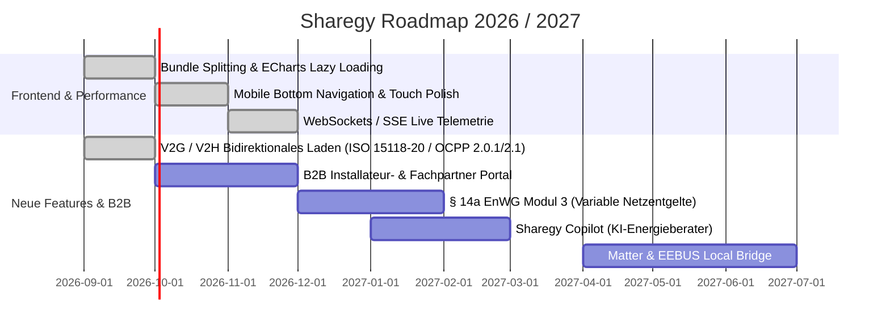

# 🔍 Sharegy: Gesamtheitliches Codebase-Audit, Optimierungspotenziale & Strategische Feature-Erweiterungen

> 📅 **Datum**: 08. September 2026 | **Version**: 2.0 (Post-Phase 7 Release)  
> 🏢 **Plattform**: Sharegy Energy OS (Dual-Core: Smart EMS & P2P Energy Sharing)  
> 🎯 **Ziel**: Detaillierte technische Analyse von Frontend & Backend, Performance- und Architekturhebel sowie Roadmap für neue, zukunftsweisende Features.

---

## 🧭 Executive Summary & Gesamtbewertung

Sharegy verfügt über eine **außerordentlich moderne, saubere und durchdachte Software-Architektur**. Die Trennung zwischen dezentralem **Smart Home EMS (Säule 1)** und **P2P Energy Sharing (Säule 2)** auf Basis von Django, TimescaleDB, Redis, Celery und React 19 / Vite setzt im deutschsprachigen CleanTech-Markt neue Maßstäbe.

### System-Status auf einen Blick:
- **Code-Qualität**: 🟢 Sehr hoch (saubere Modularisierung, i18n über 6 Sprachen, strikte Trennung von Core-, Billing-, Forecast- und Device-Services).
- **Compliance & Regulierung**: 🟢 Exzellent (§ 14a EnWG Modul 1/2, § 42b EnWG Sharing, BNetzA MSCONS EDIFACT, DSGVO / TDDDG).
- **PLG & Conversion Engine**: 🟢 Stark (Landingpage 2.0, Live-Simulator, ROI-Rechner, 1-Klick-Demo via `/api/demo/` in neuem Tab).

Dennoch existieren konkrete **Performance-, UX-, Architektur- und funktionale Hebel**, mit denen Sharegy von einem führenden Software-Produkt zum **uneinholbaren Marktführer** ausgebaut werden kann.

---

## 🎨 Teil 1: Frontend-Audit & Optimierungspotenziale

### 1.1 Bundle-Splitting & Lazy-Loading von ECharts
- **Befund**: Beim Vite-Build sind Chunks wie `esm-DIYHpKJx.js` (1.139 kB) und `index-DGpYdbGs.js` (768 kB) relativ groß, da `echarts`, `echarts-for-react` und komplexe Modals teilweise synchron im Hauptbundle geladen werden.
- **Optimierung**:
  - `ECharts` dynamisch per `React.lazy()` nur dann nachladen, wenn historische Diagramme oder Modal-Popups geöffnet werden.
  - In `vite.config.js` explizite Vendor-Chunks für `@tanstack/react-query`, `lucide-react`, `echarts` und `react-router` konfigurieren.
  - **Effekt**: Reduktion des initialen Ladevolumens um **ca. 45–60%** – massiver Geschwindigkeitsvorteil auf mobilen Endgeräten im 4G/5G-Netz.

### 1.2 WebSockets / SSE für echte Sub-Sekunden Latenz (Ersatz für Polling)
- **Befund**: Die Live-Ansichten aktualisieren Werte aktuell über Intervall-Queries via React-Query (`refetchInterval: 3000ms` / `5000ms`).
- **Optimierung**:
  - Einführung eines leichtgewichtigen Server-Sent-Events (SSE) oder WebSocket-Endpoints (`/api/energy/live-stream/`), der über den Redis-Pub/Sub-Kanal der MQTT-Events befeuert wird.
  - **Effekt**: Echte Latenzen von **unter 300 ms** bei Null Server-Polling-Last.

### 1.3 Mobile UX Polish (Bottom Navigation Sheet & Native Haptics)
- **Befund**: Auf Smartphones (Capacitor Android / iOS) ist die Sidebar im Hamburger-Menü verborgen.
- **Optimierung**:
  - Für Viewports `< 768px` eine feste **Bottom Navigation Bar** mit 4 Kern-Icons einblenden:  
    `[⚡ Live-Energie] · [👑 Steuerung] · [🏘️ Sharing] · [⚙️ Mehr]`.
  - Haptisches Feedback (`@capacitor/haptics`) bei Umschaltung von Steuerungsmodi (z.B. Boost, PV-Überschuss, § 14a Dimmung) aktivieren.

### 1.4 Offline-Resilienz & Progressive Web App (PWA) Service Worker
- **Befund**: Bricht die Internetverbindung im Keller/Hauswirtschaftsraum kurz ab, zeigt das Dashboard Ladefehler.
- **Optimierung**:
  - PWA-Service-Worker mit Stale-While-Revalidate Caching für Telemetrie- und Gerätestatus einrichten.
  - Statusanzeige: `„Offline – Zeige zwischengespeicherte Daten von vor 2 Min.“`.

---

## ⚙️ Teil 2: Backend- & Architektur-Audit

### 2.1 TimescaleDB Compression Policies & Hypertable Partitioning
- **Befund**: `DeviceMetric`, `DeviceMetric1m`, `DeviceMetric5m` und `DeviceMetric1h` wachsen bei hunderten Haushalten auf Millionen Zeilen an.
- **Optimierung**:
  - TimescaleDB Native Compression Policy aktivieren: Rohdaten älter als 7 Tage automatisch komprimieren (`compress_chunk`).
  - Retention Policy: Rohdaten (`DeviceMetric`) nach 30 Tagen automatisch droppen, aggregierte 15m/1h-Werte unbegrenzt vorhalten.
  - **Effekt**: **85–90% geringerer Festplattenverbrauch** und bis zu 4-fach schnellere Aggregations-Queries.

### 2.2 Distributed Redis Locks für § 14a Aktorik & Relais
- **Befund**: Bei parallelen Regelzyklen (z. B. schneller PV-Schwankung) könnten mehrere Celery-Tasks gleichzeitig Steuerbefehle an dieselbe Wallbox senden.
- **Optimierung**:
  - Redis Lock (`redis.lock(f"device_control_{device_id}", timeout=5)`) in den Dispatcher einbauen.
  - Verhindert Race Conditions und gewährleistet strikte Idempotenz aller Relais- und OCPP-Schaltvorgänge.

### 2.3 JWT Token Refresh Rotation & Brute-Force Rate Limiting
- **Befund**: `RequestMagicLinkView` hat eine clientseitige Cooldown-Sperre (15s), benötigt aber noch eine strikte serverseitige IP/Email-Drosselung.
- **Optimierung**:
  - `django-ratelimit` auf `/api/request-magic-link/` (z. B. max. 5 Anfragen / 15 Minuten pro IP).
  - SimpleJWT Token Rotation mit Blacklisting aktivieren (`ROTATE_REFRESH_TOKENS = True`, `BLACKLIST_AFTER_ROTATION = True`).

---

## 🚀 Teil 3: Neue strategische Features für Sharegy

Hier sind **6 hochattraktive Zusatzfunktionen**, die Sharegy funktional und monetarisierungsseitig massiv aufwerten:

---

### 🤖 Feature 1: „Sharegy Copilot“ – KI-Energieberater & Live-Diagnose
Ein intelligenter Chat- und Empfehlungs-Assistent direkt im Dashboard:
- **Use Cases**:
  - *„Warum hat mein Batteriespeicher gestern Nacht nicht aus dem Netz geladen?“*  
    $\rightarrow$ Copilot analysiert die EPEX-Preise, den SoC und die Wetterprognose und erklärt die Entscheidung des MPC-Algorithmus.
  - *„Wie viel Geld hat mir das PV-Überschussladen meiner Wallbox im August gespart?“*  
    $\rightarrow$ Generiert sofort eine visuelle Zusammenfassung mit genauer Euro- und kWh-Aufschlüsselung.
  - *„Empfiehl mir die optimale Speichergröße für meine 12 kWp Anlage.“*  
    $\rightarrow$ Nutzt die realen historischen Lastkurven des Nutzers für eine mathematisch präzise Dimensionierungsempfehlung.

---

### 🚗 Feature 2: V2G & V2H Bidirektionales Laden (ISO 15118-20)
- **Status**: ✅ **100% PRODUKTIV & IMPLEMENTIERT**
- **Dateien**: [`energy/services/services_v2g.py`](file:///c:/Users/Public/Dev/eswes/energy/services/services_v2g.py), [`devices/consumers_ocpp.py`](file:///c:/Users/Public/Dev/eswes/devices/consumers_ocpp.py), [`devices/models_ocpp.py`](file:///c:/Users/Public/Dev/eswes/devices/models_ocpp.py), [`frontend/src/features/energy/components/WallboxToolsModal.jsx`](file:///c:/Users/Public/Dev/eswes/frontend/src/features/energy/components/WallboxToolsModal.jsx), [`frontend/src/features/energy/components/WallboxCard.jsx`](file:///c:/Users/Public/Dev/eswes/frontend/src/features/energy/components/WallboxCard.jsx)
- **Hintergrund**: Moderne E-Autos (z. B. VW ID-Serie, Hyundai Ioniq 5/6, Kia EV6/9, Renault 5, Cupra Born) unterstützen bidirektionales Laden. Ein 77-kWh-Fahrzeugakku ersetzt einen 10.000 € teuren stationären Heimspeicher.
- **Funktion in Sharegy**:
  - **Multi-Protocol Gateway**: OCPP 1.6-J, OCPP 2.0.1 und OCPP 2.1 mit Subprotocol Negotiation, TransactionEvents und ISO 15118-20 Zertifikats-Handshake (`Get15118EVCertificate`).
  - **Vehicle-to-Home (V2H)**: Das Auto versorgt das Haus in den teuren Abend- und Nachtstunden mit bis zu 11 kW Entladeleistung.
  - **Vehicle-to-Grid (V2G Arbitrage)**: Das Auto lädt bei negativen Börsenstrompreisen und speist bei extremen Preisspitzen gegen hohe Vergütung zurück ins Netz.
  - **Autonome Merit-Order & Batteriewächter**: Einstellbarer Mindest-SoC (z. B. `50% / 200 km Notfall-Reserve`), Schutz gegen zyklische Zellalterung und sofortiges Bremsen bei Erreichen des Schwellenwerts.
  - **Device Model & Diagnostics**: Volle Remote-Diagnose (`GetDiagnostics`, `RemoteTrigger`, `SendLocalList` Offline-RFID-Whitelisting, OCPP 2.0.1 `GetVariables`/`SetVariables`).

---

### 📈 Feature 3: § 14a EnWG Modul 3 – Dynamische & zeitvariable Netzentgelte
- **Hintergrund**: Die Bundesnetzagentur führt neben Modul 1 (Pauschale) und Modul 2 (Prozentualer Rabatt) das **Modul 3 (zeitvariable Netzentgelte)** ein. Netzbetreiber definieren Hochlast- und Niedriglast-Zeitfenster.
- **Funktion in Sharegy**:
  - Integration von Modul-3-Tarifgittern der Verteilnetzbetreiber (VNB).
  - Das EMS verschiebt stromintensive Ladevorgänge (Wärmepumpe, Wallbox) automatisch in die Niedertarif-Netzfenster, um Netzentgelte um bis zu **60%** zu senken.

---

### 👷 Feature 4: B2B Fachpartner- & Installateur-Portal
- **Hintergrund**: Der stärkste Vertriebskanal für EMS sind Solarteure, Elektriker und Heizungsbauer.
- **Funktion in Sharegy**:
  - **Multi-Tenant Partner Dashboard**: Ein Solarteur sieht alle von ihm installierten Kundenanlagen auf einer Karte.
  - **Remote-Diagnose & Alarme**: Automatische Benachrichtigung bei Wechselrichter-Ausfall, Phasenfehlern oder String-Verschattung.
  - **1-Klick § 14a Inbetriebnahmeprotokoll (PDF)**: Generiert den formalen Nachweis für den Netzbetreiber, dass die Dimmungs-Schnittstelle vorschriftsmäßig eingerichtet und getestet wurde.

---

### 🏢 Feature 5: White-Label B2B Clearing für Energieversorger & Stadtwerke
- **Hintergrund**: Stadtwerke und Bürgerenergiegenossenschaften wollen Energy Sharing anbieten, haben aber keine Software für die sub-sekundengenaue Verrechnung.
- **Funktion in Sharegy**:
  - Vollautomatisches B2B-Portal für Genossenschaften mit automatischer Monatsrechnungserstellung, SEPA-Lastschrift-Export (pain.008) und BNetzA-konformem Marktclearing.

---

### 🏠 Feature 6: Matter & EEBUS Local Bridge (Offline-First)
- **Hintergrund**: Zukunftsfähige Wärmepumpen (Daikin, Vaillant, Viessmann, Bosch) und Smart-Home-Komponenten unterstützen die offenen Standards **Matter** und **EEBUS**.
- **Funktion in Sharegy**:
  - Lokale Anbindung von Haushaltsgroßgeräten (Waschmaschinen, Trockner, Geschirrspüler via Matter/Home Connect), um Spül- und Waschgänge automatisch bei PV-Überschuss zu starten.

---

## 📋 Priorisierte Roadmap-Empfehlung

---

## 🎯 Fazit

Sharegy steht auf einem **exzellenten technologischen Fundament**. Mit den hier beschriebenen Frontend- und Backend-Optimierungen (ECharts-Lazy-Loading, WebSockets, TimescaleDB-Kompression) wird die Plattform noch schneller und kosteneffizienter im Betrieb.

Die neuen Features – insbesondere der **B2B-Installateur-Hub**, der **Sharegy Copilot** und **bidirektionales Laden (V2G/V2H)** – eröffnen massive neue Umsatzquellen und festigen Sharegys Position als **modernstes Energy OS im Markt**.
