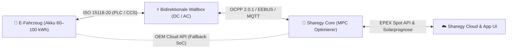
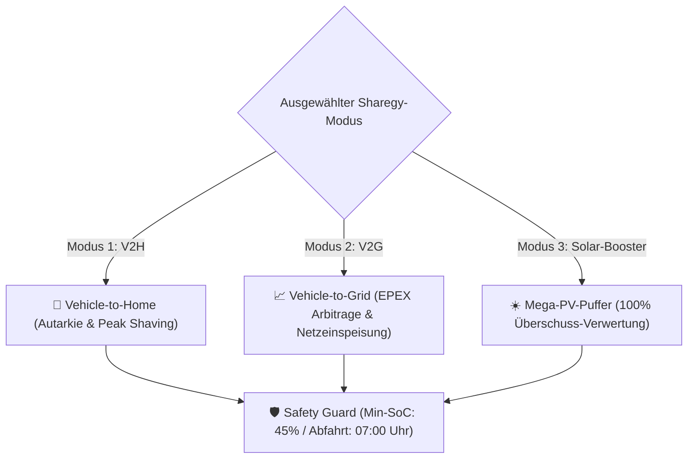

# 🚗 Sharegy V2G & V2H: Bidirektionales Laden & Smart Mobility Arbitrage (ISO 15118-20 & OCPP 2.0.1)

Dieses Dokument definiert das **technische Konzept, die Systemarchitektur, die Sicherheitsmechanismen (Safety Guard)** und den **Implementierungsplan** für bidirektionales Laden (**Vehicle-to-Home / V2H** und **Vehicle-to-Grid / V2G**) in Sharegy.

---

## 🌟 1. Strategischer Mehrwert & Vision

Ein durchschnittlicher stationärer Heimspeicher besitzt eine Speicherkapazität von **5 bis 15 kWh** und kostet in der Anschaffung **4.000 € bis 10.000 €**.  
Moderne Elektrofahrzeuge (z. B. VW ID-Familie mit ID.Software $\ge$ 3.5, Hyundai Ioniq 5/6, Kia EV6/9, Renault 5 E-Tech, Polestar 3/4, Cupra Born, Sigenergy SigenStor) verfügen über Akkus von **60 bis 100 kWh**.

> **Sharegy verwandelt das Elektrofahrzeug in einen rollenden Großspeicher**, der ein Einfamilienhaus über 3 bis 7 Tage vollständig autark mit Strom versorgen kann, teure Lastspitzen kappt und durch vollautomatischen Arbitrage-Handel an der Strombörse (EPEX Spot) erhebliche Erträge erwirtschaftet.

---

## 🔄 2. End-to-End Kommunikations-Architektur

Die bidirektionale Steuerung erfordert ein nahtloses Zusammenspiel zwischen Fahrzeug, Wallbox, HEMS/Sharegy-Core und Strommarkt:



### Die Schnittstellen-Standards im Detail:
1. **Fahrzeug $\leftrightarrow$ Wallbox (ISO 15118-20 / IEC 61851-1)**:
   - **High-Level Communication (HLC)** über Powerline (PLC): Übermittelt kontinuierlich den exakten **State of Charge (SoC in %)**, minimale/maximale Lade- und Entladeleistungen (z. B. $-11\,\text{kW}$ bis $+11\,\text{kW}$), Batterietemperatur und Ladezustandsgrenzen.
2. **Wallbox $\leftrightarrow$ Sharegy Backend (OCPP 2.0.1 & EEBUS)**:
   - **OCPP 2.0.1 (Charging Profiles)**: Nutzung von `SetChargingProfile` mit negativen Leistungswerten zur aktiven Entladung.
   - **EEBUS (SHIP & SPINE)**: Lokales HEMS-Protokoll zur konformen Abstimmung nach § 14a EnWG mit Wechselrichter, Wärmepumpe und Netzanschluss.
3. **Car-to-Cloud API (OEM Fallback)**:
   - Für Wallboxen ohne ISO 15118-20 HLC (z. B. Standard AC-Wallboxen) wird der SoC parallel über Hersteller-APIs (VW WeConnect / ID.Data API, Renault Mobilize, BMW ConnectedDrive, Tesla Fleet API, Hyundai Bluelink) abgefragt.

---

## ⚙️ 3. Die 3 Betriebsmodi in Sharegy



### Modus 1: 🏡 Vehicle-to-Home (V2H – Eigenverbrauchs-Optimierung & Peak Shaving)
* **Ziel**: Reduzierung des Netzbezugs in den teuren Abend- und Nachtstunden auf **0 Watt**.
* **Logik**:
  * Sobald die PV-Erzeugung sinkt und die Hauslast (Wärmepumpe, Kochen, Beleuchtung) ansteigt, entlädt die Wallbox das Auto exakt bedarfsgerecht (z. B. mit $600\,\text{W}$ bis $3.500\,\text{W}$).
  * Priorisierung: Erst stationärer Heimspeicher (falls vorhanden), dann EV-Puffer, um Ladeverluste minimal zu halten.

### Modus 2: 📈 Vehicle-to-Grid (V2G – Dynamische Börsenpreis-Arbitrage)
* **Ziel**: Monetäre Gewinne durch aktive Stromeinspeisung ins öffentliche Netz bei Preisspitzen.
* **Logik**:
  * **Nachts / Mittags (z. B. 01:00–04:00 Uhr oder 13:00–15:00 Uhr)**: Fahrzeug lädt bei negativen oder minimalen EPEX-Preisen (z. B. $0\,\text{ct/kWh}$ bis $10\,\text{ct/kWh}$).
  * **Abendspitze (18:00–21:00 Uhr)**: Fahrzeug speist $10\,\text{bis}\,25\,\text{kWh}$ bei extremen Preisspitzen (z. B. $35\,\text{bis}\,55\,\text{ct/kWh}$) kontrolliert ins Netz ein.
  * **Ertrag**: **Reingewinn von 3 € bis 8 € pro Tag** allein durch Preisdifferenzen (Spread).

### Modus 3: ☀️ Mega-PV-Puffer (100% Sonnenstrom-Verwertung)
* **Ziel**: Vermeidung der Abregelung großer Dachanlagen (10–30 kWp).
* **Logik**:
  * Wenn der 10-kWh-Heimspeicher um 11:30 Uhr voll ist, nimmt der 77-kWh-Akku des Fahrzeugs weitere $40\,\text{kWh}$ Sonnenstrom auf, statt ihn für geringe Cent-Beträge einzuspeisen.
  * An darauffolgenden Regentagen versorgt das Auto das Haus autark.

---

## 🛡️ 4. Sicherheits- & Batterie-Schutz (*Safety Guard Matrix*)

Um Kundenängste hinsichtlich **Reichweitenverlust** und **Batteriealterung** vollständig auszuräumen, erzwingt Sharegy strenge Sicherheitsregeln:

| Schutzmechanismus | Funktionsweise | Nutzen |
|---|---|---|
| **1. Garantierter Mobilitäts-Puffer (Min-SoC)** | Einstellbar im Dashboard (z. B. `Immer mindestens 50% / 220 km im Akku`). | Keine Angst vor leerem Akku bei spontanen Notfallfahrten. |
| **2. Abfahrts-Manager (Target Departure)** | Z. B. `Montag bis Freitag um 07:30 Uhr mit mindestens 80% SoC bereitstehen`. | Algorithmus schaltet rechtzeitig (z. B. ab 04:00 Uhr) vom Entlade- in den Lademodus um. |
| **3. Zell-Degradations-Schutz (Spread Threshold)** | V2G-Netzeinspeisung startet nur, wenn $\Delta \text{Preis} > \text{Zellverschleißkosten}$ (typisch: mind. $6\,\text{ct/kWh}$ Spread). | Verhindert unrentable Zyklenbelastung. |
| **4. Schonende C-Rate (Discharge Power Limit)** | Entladung erfolgt typisch mit $1\,\text{bis}\,4\,\text{kW}$ ($< 0.05\,C$). | Nahezu null thermischer Stress im Vergleich zu Fahrzyklen ($1\text{–}2\,C$). |

---

## 🏗️ 5. Technische Implementierung in Sharegy

### A. Backend-Datenmodelle (`devices/models.py` & `energy/models.py`)

```python
# devices/models.py (Auszug)

class VehicleProfile(models.Model):
    home = models.ForeignKey(Home, on_delete=models.CASCADE, related_name="vehicles")
    name = models.CharField(max_length=100, default="Mein Elektroauto")
    battery_capacity_kwh = models.FloatField(default=77.0)
    max_charge_power_w = models.IntegerField(default=11000)
    max_discharge_power_w = models.IntegerField(default=11000)
    supports_v2h = models.BooleanField(default=True)
    supports_v2g = models.BooleanField(default=False)
    
    # Sicherheits-Gating & Nutzerpräferenzen
    min_reserve_soc_pct = models.IntegerField(default=50) # Nie unter 50% entladen
    target_departure_soc_pct = models.IntegerField(default=80) # Bis Abfahrt auf 80%
    target_departure_time = models.TimeField(null=True, blank=True) # z.B. 07:30
    arbitrage_spread_min_ct = models.FloatField(default=8.0) # Mindest-Spread für V2G in ct/kWh

class BidirectionalSession(models.Model):
    vehicle = models.ForeignKey(VehicleProfile, on_delete=models.CASCADE)
    start_time = models.DateTimeField(auto_now_add=True)
    end_time = models.DateTimeField(null=True, blank=True)
    energy_discharged_v2h_kwh = models.FloatField(default=0.0)
    energy_discharged_v2g_kwh = models.FloatField(default=0.0)
    money_saved_v2h_eur = models.DecimalField(max_digits=8, decimal_places=2, default=0.0)
    money_earned_v2g_eur = models.DecimalField(max_digits=8, decimal_places=2, default=0.0)
```

### B. Erweiterung des MPC-Optimierers (`energy/services/mpc_optimizer.py`)
* Der mathematische Optimierungs-Vektor ($H = 24\,\text{h}$ bzw. $48\,\text{h}$) behandelt das eingesteckte Fahrzeug als **dynamischen Speicher** mit:
  $$\text{SoC}_{\min} = \text{min\_reserve\_soc\_pct}$$
  $$\text{SoC}(T_{\text{departure}}) \ge \text{target\_departure\_soc\_pct}$$
  $$P_{\text{discharge}}(t) \le \min(P_{\text{load}}(t), P_{\text{max\_discharge}})$$

---

## 🎨 6. Frontend UI / UX (Mobility Hub)

Die E-Mobilitäts-Seite (`frontend/src/features/mobility/pages/MobilityPage.jsx`) wird um eine **V2H/V2G Cockpit Card** erweitert:

1. **Betriebsmodus-Selector**:
   - `[ Aus ]` | `[ 🏡 V2H Haus-Autarkie ]` | `[ ⚡ V2H + V2G Börsen-Handel ]`
2. **Interaktiver Mobilitäts-Slider**:
   - `Mindest-Reichweite im Akku behalten`: $50\% \ (\approx 225\,\text{km})$.
3. **Abfahrts-Timer**:
   - `Morgens abfahrbereit bis`: `07:30 Uhr` mit `80%`.
4. **Live-Energiefluss & Ersparnis-Ticker**:
   - Animierter Stromfluss: $Auto \rightarrow Haus \ (2.1\,\text{kW})$
   - Badge: *„Heute durch V2H gespart: +4,80 € (Kein Netzbezug)“*

---

## 📅 7. Stufenweiser Rollout-Plan

| Phase | Meilenstein | Dauer |
|---|---|---|
| **Phase 1: Cockpit & Simulation** | UI-Controls im Mobility Hub, Mindest-SoC-Slider, Abfahrts-Timer & Ertrags-Kalkulator. | 1–2 Tage |
| **Phase 2: OEM-Cloud & OCPP-Integration** | Anbindung der Car-APIs zur Live-SoC-Synchronisation & OCPP 2.0.1 Discharge-Profile. | 3–5 Tage |
| **Phase 3: Vollautomatischer MPC-Arbitrage-Handel** | Integration in den 24h-Börsenstrompreis-Optimierer für automatisierte Netzeinspeisung. | 3–4 Tage |
