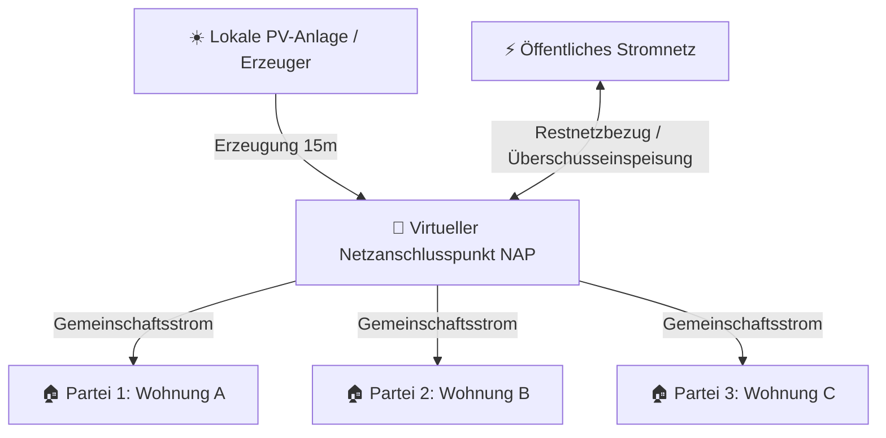

# 🏢 Virtueller Summenzähler & ⚡ Virtual Power Plant (VPP) Aggregator Guide

Dieses Dokument beschreibt die Architektur, Funktionsweise und API-Nutzung für:
1. **Virtueller Summenzähler für Mehrfamilienhäuser & Quartiere** (15-Minuten-Saldierung & automatische PDF-Monatsabrechnung gem. § 42a/b EnWG).
2. **Virtual Power Plant (VPP) Aggregator API** (Sekundärregelleistung aFRR/SRL, FCR und Redispatch 2.0 / Connect+ Fahrplan-Schnittstelle).

---

# Teil 1: 🏢 Virtueller Summenzähler & automatisierte Monatsabrechnung

## 1.1 Hintergrund & Konzept
Bei der gemeinschaftlichen Gebäudeversorgung (Mehrfamilienhäuser / Mieterstrom) oder Nachbarschafts-Communities (Energy Sharing gem. RED II) speisen eine oder mehrere Erzeugungsanlagen (PV, BHKW, Großbatterie) in ein lokales Arealnetz ein. Mehrere Parteien/Wohnungen teilen sich diesen Strom.

Der **Virtuelle Summenzähler** ersetzt teure physikalische Kaskadenzähler oder Summenzähler-Schränke durch eine rein rechnerische 15-Minuten-Intervallsaldierung am **virtuellen Netzanschlusspunkt (NAP)**.



### Kernkennzahlen des virtuellen Summenzählers:
* **Gemeinsam geteilter Solarstrom ($S_{\text{total}}$)**: Direkt im Haus verbrauchter Ökostrom.
* **Restnetzbezug ($I_{\text{grid}}$)**: Strommenge, die aus dem öffentlichen Netz zugekauft werden musste.
* **Überschusseinspeisung ($E_{\text{grid}}$)**: Unverbrauchter PV-Überschuss, der ins Netz eingespeist wird.
* **Autarkiegrad ($\%$ autark)**: $\frac{S_{\text{total}}}{C_{\text{total}}} \times 100\,\%$
* **Eigenverbrauchsquote ($\%$)**: $\frac{S_{\text{total}}}{G_{\text{total}}} \times 100\,\%$

---

## 1.2 Unterstützte Allokationsmodelle

In [`billing/services_sharing_settlement.py`](file:///c:/Users/Public/Dev/eswes/billing/services_sharing_settlement.py) sind drei gesetzlich anerkannte Allokationsmodelle implementiert:

| Modell | Kennung | Beschreibung | Anwendungsfall |
|---|---|---|---|
| **Dynamisch** | `dynamic` | Verbrauchsproportionale Verteilung der Erzeugung in jedem 15-Minuten-Slot in Echtzeit. Wer im Slot verbraucht, erhält anteilig Solarstrom. | Moderne Mieterstrom- & Quartiersmodelle mit iMSys Smart Metern. |
| **Statisch** | `static` | Feste Zuteilungsquoten (z. B. nach Miteigentumsanteil MEA oder vertraglicher Prozentquote). | WEG-Eigentümergemeinschaften mit festen Grundbuch-Anteilen. |
| **Hybrid** | `hybrid` | Stufe 1: Zuteilung nach fester Quote. Stufe 2: Unverbrauchter Überschuss wird dynamisch auf Parteien mit Restbedarf verteilt. | Maximale solare Eigendeckung ohne Erzeugungsverlust bei Abwesenheit einzelner Parteien. |

---

## 1.3 REST-API für den virtuellen Summenzähler

### `GET /api/billing/community/virtual-meter/`
Liefert die 15-Minuten-Zeitreihe sowie die Gesamtkennzahlen für ein gewähltes Zeitintervall.

**Parameter (Query):**
* `tenant_id` *(optional)*: UUID der Community / Liegenschaft (sofern nicht im Header `X-Tenant-ID`).
* `date` *(optional)*: Einzelner Tag im Format `YYYY-MM-DD` (Standard: Heute).
* `start_date` & `end_date` *(optional)*: Datumsbereich für Mehrtages- oder Monatsansichten.
* `allocation_model` *(optional)*: `dynamic`, `static` oder `hybrid` (Standard: aktiver Community-Tarif).

**Beispiel-Response:**
```json
{
  "tenant": {
    "id": "70acf275-5399-49cd-82d8-938526153b75",
    "name": "MFH Sonnenallee 42",
    "slug": "mfh-sonnenallee-42"
  },
  "period": {
    "start": "2026-09-12",
    "end": "2026-09-12",
    "slots_count": 96
  },
  "tariff": {
    "name": "Standard Sharing Tarif",
    "allocation_model": "dynamic",
    "sharing_price_ct_kwh": 15.0,
    "producer_payout_ct_kwh": 12.0
  },
  "totals": {
    "total_generation_kwh": 142.5,
    "total_consumption_kwh": 98.2,
    "total_shared_kwh": 76.4,
    "total_grid_import_kwh": 21.8,
    "total_grid_export_kwh": 66.1,
    "self_sufficiency_rate_pct": 77.8,
    "self_consumption_rate_pct": 53.6
  },
  "members": [
    {
      "membership_id": "...",
      "name": "Max Mustermann (Wohnung 1)",
      "share_percent": 33.3,
      "totals": {
        "consumption_kwh": 32.1,
        "shared_kwh": 25.4,
        "grid_import_kwh": 6.7
      }
    }
  ],
  "timeline": [
    {
      "timestamp": "2026-09-12T12:00:00+02:00",
      "generation_kwh": 8.0,
      "consumption_kwh": 5.0,
      "shared_solar_kwh": 5.0,
      "grid_import_kwh": 0.0,
      "grid_export_kwh": 3.0,
      "self_consumption_rate_pct": 62.5,
      "self_sufficiency_rate_pct": 100.0
    }
  ]
}
```

---

## 1.4 Automatische Monatsabrechnung & PDF-Erstellung

In [`billing/tasks.py`](file:///c:/Users/Public/Dev/eswes/billing/tasks.py) existiert der periodische Celery-Task:
* **Task-Name**: `billing.generate_monthly_community_settlements_and_pdfs`
* **Ausführung**: Läuft automatisch am 1. jedes Monats um 02:00 Uhr (oder manuell triggerbar per API / Admin).
* **Ablauf**:
  1. Ermittelt den abgelaufenen Vormonat.
  2. Saldierung aller 15-Minuten-Werte für jedes Mitglied.
  3. Erstellung von `CommunityMonthlyStatement`-Datensätzen mit Netto-Saldo, Solardeckung, Vergütung und Gemeinschaftsumlage.
  4. Generierung des fiskal- und eichrechtskonformen Monatsabrechnungsnachweises als ReportLab-PDF.
  5. Downloadbar unter `/api/billing/community/statements/<statement_id>/pdf/`.

---

# Teil 2: ⚡ Virtual Power Plant (VPP) Aggregator API

## 2.1 Konzept & Zielgruppe
Das Virtuelle Kraftwerk (VPP) vernetzt Hunderte dezentrale Heimspeicher, steuerbare Verbrauchseinrichtungen gem. § 14a EnWG (Wallboxen, Wärmepumpen) und PV-Anlagen. Über eine einheitliche REST-Schnittstelle können Übertragungsnetzbetreiber (**ÜNB**: 50Hertz, TenneT, Amprion, TransnetBW), Verteilnetzbetreiber (**VNB**) oder Flexibilitäts-Aggregatoren Regelleistung und Redispatch 2.0 abrufen.


### Produktkategorien:
1. **Positive Sekundärregelleistung (aFRR / SRL +kW)**: Speicher gezielt entladen oder steuerbare Lasten (Wallboxen/Wärmepumpen) drosseln/abschalten, um das Stromnetz bei Frequenzabfall (< 50,0 Hz) zu stützen.
2. **Negative Sekundärregelleistung (aFRR / SRL -kW)**: Speicher gezielt mit Überschussstrom aus dem Netz laden oder PV-Anlagen drosseln bei Überfrequenz (> 50,0 Hz).
3. **Primärregelleistung (FCR +/-)**: Sekundenschnelle Frequenzhaltung.
4. **Redispatch 2.0 / Connect+**: Engpassbeseitigung im Übertragungsnetz durch 96-Viertelstunden-Fahrpläne.

---

## 2.2 VPP REST-API Referenz (`/api/vpp/`)

Alle VPP-Endpunkte sind unter `/api/vpp/` registriert.

### 1. `GET /api/vpp/summary/`
Liefert die globale Flottenübersicht und aggregierte Regelleistungs-Kennzahlen.

**Response:**
```json
{
  "timestamp": "2026-09-12T00:10:00+02:00",
  "summary": {
    "total_available_positive_flex_kw": 185.0,
    "total_available_negative_flex_kw": 240.0,
    "total_active_assets_count": 48,
    "response_time_seconds": 15,
    "compliance": ["aFRR", "FCR", "Redispatch 2.0", "§ 14a EnWG"]
  },
  "battery_fleet": {
    "assets_count": 22,
    "total_capacity_kwh": 220.0,
    "total_stored_energy_kwh": 154.0,
    "average_soc_pct": 70.0,
    "available_discharge_power_kw": 110.0,
    "available_charge_power_kw": 110.0
  },
  "steuve_and_loads": {
    "assets_count": 16,
    "curtailable_power_kw": 75.0,
    "section_14a_enwg_compliant": true
  },
  "pv_curtailment": {
    "assets_count": 10,
    "curtailable_power_kw": 130.0,
    "redispatch_ready": true
  }
}
```

---

### 2. `GET /api/vpp/flexibility/`
Echtzeit-Flexibilitätsband zur Marktübermittlung an Regelleistungs-Plattformen (z. B. regelleistung.net).

**Parameter (Query):**
* `tso` *(optional)*: `50hertz`, `tennet`, `amprion`, `transnetbw`, `local_dso`.
* `plz` *(optional)*: Postleitzahlen-Filter (z. B. `10*` für Berlin).

**Response:**
```json
{
  "timestamp": "2026-09-12T00:10:00+02:00",
  "available_positive_power_kw": 185.0,
  "available_negative_power_kw": 240.0,
  "battery_stored_kwh": 154.0,
  "battery_capacity_kwh": 220.0,
  "average_soc_pct": 70.0,
  "controllable_loads_kw": 75.0,
  "pv_curtailable_kw": 130.0,
  "market_products": ["aFRR", "FCR", "Redispatch 2.0"]
}
```

---

### 3. `GET /api/vpp/redispatch-schedule/`
Standardisierter 96-Viertelstunden-Fahrplan gem. **Redispatch 2.0 / Connect+**.

**Parameter (Query):**
* `date` *(optional)*: Zieldatum `YYYY-MM-DD` (Standard: Heute).
* `tso` *(optional)*: Übertragungsnetzbetreiber (Standard: `50hertz`).

**Response (Auszug):**
```json
{
  "schedule_date": "2026-09-12",
  "tso_operator": "50hertz",
  "grid_market_standard": "Redispatch 2.0 / Connect+ XML / JSON Standard",
  "resolution": "PT15M",
  "slots_count": 96,
  "resource_id": "DE-CONNECT-RES-50HERTZ-VPP-001",
  "total_energy_forecast_kwh": 512.4,
  "schedule": [
    {
      "quarter_hour_index": 48,
      "timestamp": "2026-09-12T12:00:00+02:00",
      "planned_net_power_kw": 35.0,
      "forecast_generation_kw": 120.0,
      "forecast_consumption_kw": 85.0,
      "p_max_kw": 142.5,
      "p_min_kw": -85.0,
      "available_positive_flex_kw": 107.5,
      "available_negative_flex_kw": 120.0,
      "connect_plus_resource_id": "DE-CONNECT-RES-50HERTZ-VPP-001"
    }
  ]
}
```

---

### 4. `POST /api/vpp/dispatch/`
Aktivierung eines Regelleistungs- oder Redispatch-Abrufs über die angebundenen Geräte.

**Request Body:**
```json
{
  "target_power_kw": 50.0,
  "duration_minutes": 15,
  "dispatch_type": "positive_flex",
  "requested_by": "TenneT Automated Balancing",
  "pool_id": "optional-uuid-des-pools"
}
```

**Response (Status 201 Created):**
```json
{
  "id": "e8a91234-bcde-4567-8901-234567890abc",
  "status": "active",
  "dispatch_type": "positive_flex",
  "target_power_kw": 50.0,
  "duration_minutes": 15,
  "connect_plus_order_id": "DISP-20260912001000-482",
  "start_time": "2026-09-12T00:10:00+02:00",
  "end_time": "2026-09-12T00:25:00+02:00",
  "activated_devices_count": 22,
  "message": "Dispatch successfully activated across fleet assets."
}
```

---

### 5. `GET /api/vpp/dispatch/<order_id>/`
Detaillierte Telemetrie, Erfüllungsgrad und Vergütungsabrechnung des Abrufs.

**Response:**
```json
{
  "id": "e8a91234-bcde-4567-8901-234567890abc",
  "status": "active",
  "dispatch_type": "positive_flex",
  "target_power_kw": 50.0,
  "delivered_power_kw": 49.2,
  "energy_delivered_kwh": 12.3,
  "fulfillment_rate_pct": 98.4,
  "remuneration_eur": 4.31,
  "start_time": "2026-09-12T00:10:00+02:00",
  "end_time": "2026-09-12T00:25:00+02:00",
  "activated_devices_count": 22,
  "telemetry_points_count": 6,
  "telemetry": [
    {
      "timestamp": "2026-09-12T00:10:00+02:00",
      "target_power_kw": 50.0,
      "measured_power_kw": 48.9,
      "frequency_hz": 49.988,
      "battery_soc_avg": 68.4
    }
  ]
}
```

---

## 2.3 Django-Admin Verwaltung (`/admin/vpp/`)

Unter `https://sharegy.de/admin/vpp/` stehen zur Verfügung:
1. **`VPPFlexibilityPoolAdmin`**: Anlegen von Pools mit Netzbetreiber-Badges (50Hertz, TenneT, Amprion), Produktart und Mindestleistungen.
2. **`VPPDispatchOrderAdmin`**: Übersicht aller Live- und historischen Abrufe mit Status-Badges (🟢 Aktiv, ✅ Abgeschlossen, 🔴 Fehlgeschlagen), Soll/Ist-Leistungsanzeige und Inline-Telemetrietabelle.

---

## 2.4 Zusammenfassung der Code-Struktur

| Datei / Modul | Zweck |
|---|---|
| [`billing/services_virtual_meter.py`](file:///c:/Users/Public/Dev/eswes/billing/services_virtual_meter.py) | Berechnungs-Engine für virtuellen Summenzähler & 15m-Saldierung am NAP. |
| [`billing/tasks.py`](file:///c:/Users/Public/Dev/eswes/billing/tasks.py) | Automatischer Celery Cron-Job für Monatsabrechnung & ReportLab PDF-Erstellung. |
| [`vpp/models.py`](file:///c:/Users/Public/Dev/eswes/vpp/models.py) | Datenmodelle für Pools, Dispatch Orders und Telemetriepunkte. |
| [`vpp/services_vpp.py`](file:///c:/Users/Public/Dev/eswes/vpp/services_vpp.py) | Flotten-Flexibilitätsaggregation, Redispatch 2.0 Fahrplan & Dispatch-Steuerung. |
| [`vpp/views.py`](file:///c:/Users/Public/Dev/eswes/vpp/views.py) | REST API-Endpunkte für ÜNB/VNB (Summary, Flexibility, Schedule, Dispatch). |
| [`vpp/admin.py`](file:///c:/Users/Public/Dev/eswes/vpp/admin.py) | Django-Admin Interface mit Farb-Badges und Inline-Telemetrie. |
| [`billing/test_virtual_master_meter.py`](file:///c:/Users/Public/Dev/eswes/billing/test_virtual_master_meter.py) | Unit- & Integrationstests für virtuellen Summenzähler. |
| [`vpp/test_vpp_aggregator.py`](file:///c:/Users/Public/Dev/eswes/vpp/test_vpp_aggregator.py) | Unit- & Integrationstests für VPP Aggregator & Dispatching APIs. |
