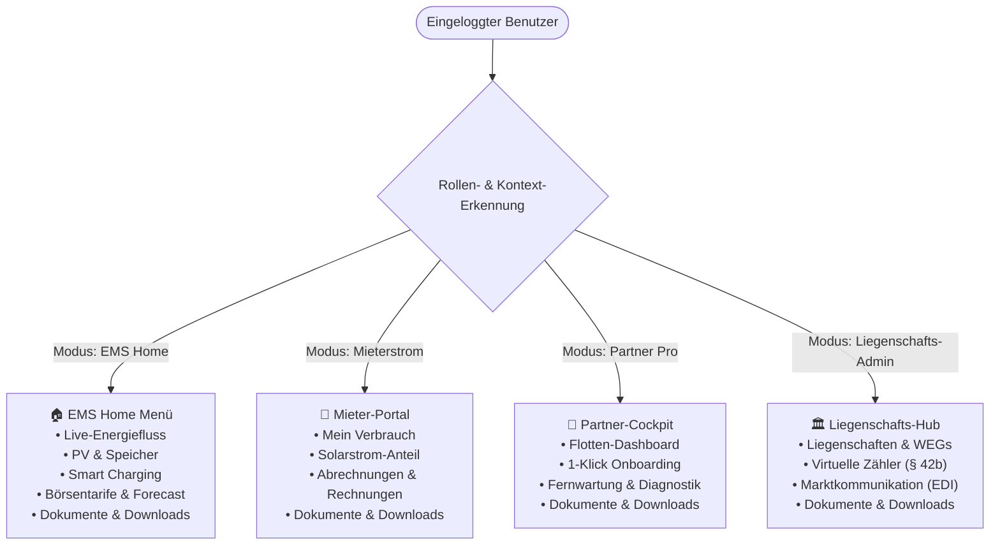

# 🧭 Rollen- & Kontextbasierte Navigation (Sidenav & Topbar)

**Dokument-Status:** Offizielle System- & Admin-Dokumentation  
**Stand:** 19. September 2026 (v5.4 Live)  
**Lead / Module:** `frontend/src/config/navigationConfig.js`, `frontend/src/hooks/useUserNavigation.js`, `frontend/src/components/layout/ContextSwitcher.jsx`, `accounts`  

---

## 🎯 1. Zweck & Nutzen

Die Sharegy Web- & Mobile-App richtet sich an vier stark divergierende Nutzergruppen:
1. **Privater EMS-User (Eigenheimbesitzer / Prosumer)**: Fokus auf PV-Überschuss, Speicher, Wallbox, dynamische Börsentarife und Autarkie.
2. **Tenant-User (Mieter in WEG / Mieterstrom)**: Fokus auf persönlichen Verbrauch, Solarstrom-Anteil, monatliche Abrechnungen und Mieter-Tarif.
3. **Installateur / Service-Betrieb (`PARTNER_PRO`)**: Fokus auf Kunden-Flottenübersicht, 1-Klick QR-Inbetriebnahme und Fernwartungsdiagnose.
4. **Liegenschafts-Admin & Stadtwerke (`TENANT_ADMIN`)**: Fokus auf Gebäude, Unterzähler, § 42b EnWG Messkonzepte, BNetzA EDIFACT-Exporte und Whitelabeling.

Das rollenbasierte Navigationssystem verhindert kognitive Überlastung (Clutter) und liefert jeder Zielgruppe ein maßgeschneidertes Cockpit.

---

## 🏛️ 2. Architektur: Rollenprofile & Menü-Struktur

---

## 📋 3. Menü-Profile im Detail

### 🏠 Profil A: `EMS_PROSUMER` (Eigenheim & Gewerbe-EMS)
| Menüpunkt | Pfad | Icon | Beschreibung |
| :--- | :--- | :---: | :--- |
| **Live-Energiefluss** | `/app` | ⚡ | Echtzeit-Flussdiagramm (PV, Speicher, Netz, Last) |
| **Optimierung & Forecast** | `/app/forecast` | ☀️ | 96h Solar-Ertragsprognose & Autopilot |
| **Wallbox & Smart Charging** | `/app/charging` | 🚗 | PV-Überschussladen & Sofort-Boost |
| **Börsenstrom & Tarife** | `/app/tariffs` | 📈 | 15-Minuten-EPEX-Spot Börsenpreise |
| **Geräte & Wechselrichter** | `/app/devices` | 🔌 | Direktanbindung Cloud-Inverter & Relais |
| **Dokumente & Downloads** | `/app/documents` | 📁 | Zentraler Download-Hub für Berichte & Nachweise |
| **Statistik & Einsparung** | `/app/analytics` | 💰 | Autarkiegrad, Eigenverbrauch & ROI |

### 🏢 Profil B: `TENANT_CONSUMER` (Mieter & Wohnungsnutzer)
| Menüpunkt | Pfad | Icon | Beschreibung |
| :--- | :--- | :---: | :--- |
| **Mein Verbrauch** | `/app/tenant-view` | 📊 | Eigener 15m-Stromverbrauch in Echtzeit |
| **Mieterstrom-Anteil** | `/app/solar-share` | ☀️ | Solarstrom vs. Netzbezug aus der Liegenschaft |
| **Abrechnungen & Belege** | `/app/invoices` | 📄 | Monatliche Stromkosten & Abrechnungs-PDFs |
| **Dokumente & Downloads** | `/app/documents` | 📁 | Verträge, Jahresabrechnungen & Eichnachweise |
| **Tarifinformationen** | `/app/tariff-info` | 🏷️ | Aktueller Arbeitspreis & Grundgebühr |

### 🔧 Profil C: `PARTNER_PRO` (Installateur & Service-Betrieb)
| Menüpunkt | Pfad | Icon | Beschreibung |
| :--- | :--- | :---: | :--- |
| **Flotten-Übersicht** | `/app/partner` | 🛠️ | Alle Kundenanlagen mit Status & Health-Score |
| **1-Klick Onboarding** | `/app/partner/onboard` | ➕ | Neue PV-Anlage / Wechselrichter anlegen |
| **Fernwartung & Diagnose** | `/app/partner/remote-rpc` | 📡 | WSS Reverse-RPC Tests & Fehlercode-Analyse |
| **Dokumente & Downloads** | `/app/documents` | 📁 | IBN-Inbetriebnahmeprotokolle & Prüfberichte |
| **Kunden-Consents** | `/app/partner/consents` | 🛡️ | Wartungs-Freigaben & Zustimmungs-Status |

### 🏛️ Profil D: `TENANT_ADMIN` (Hausverwaltung / Stadtwerke)
| Menüpunkt | Pfad | Icon | Beschreibung |
| :--- | :--- | :---: | :--- |
| **Liegenschaften & WEGs** | `/app/tenant` | 🏢 | Gebäude, Unterzähler & Mieteinheiten |
| **Virtueller Summenzähler** | `/app/vpp/virtual-meter` | 🧮 | § 42b EnWG Reststrom- & Solar-Allokation |
| **Marktkommunikation** | `/app/mako` | ✉️ | BNetzA MSCONS 2.2b / UTILMD 2.4 & AS4 |
| **Dokumente & Downloads** | `/app/documents` | 📁 | DATEV-Buchungsstapel, MSCONS & GoBD-Archive |
| **Branding & Whitelabel** | `/app/settings/whitelabel` | 🎨 | Eigene Farben, Logo & Subdomain |

---

## 🔄 4. Multi-Role Switcher (Kontext-Umschalter)

Besitzt ein Benutzer mehrere Rollen (z. B. Installateur **und** privater Anlagenbesitzer), wird in der Topbar der `ContextSwitcher` aktiv. Das Umschalten persistiert im `localStorage` (`sharegy_active_context`) und steuert unmittelbar die sichtbaren Menüeinträge und Standard-Landing-Pages.
