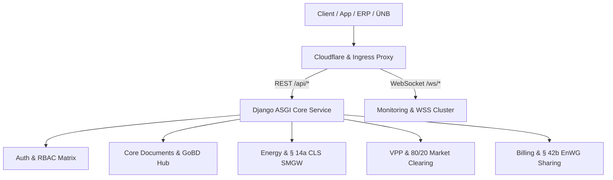

# 🌐 Sharegy API Referenz & Endpunkt-Katalog

**REST & WebSocket Schnittstellen für Partner, Mobile Apps & Externe Systeme**  
*Stand: 19. September 2026 | Version: 5.4 | Base URL: `https://app.sharegy.de/api/` bzw. `https://mon.sharegy.de/ws/`*

---

## 1. Authentifizierung & Autorisierung

Sharegy unterstützt standardisierte Authentifizierungs-Verfahren:

1. **Bearer JWT Token** (für Web-Frontend, Mobile Apps & Admin-Portal):
   * Header: `Authorization: Bearer <access_token>`
   * Gültigkeit: Access Token (15 Min), Refresh Token (30 Tage mit Rotation).
2. **Partner & Aggregator API Key** (für Stadtwerke-ERP / CRM & VPP-Aggregatoren):
   * Header: `X-Partner-API-Key: sk_live_...` oder `X-API-Key: ...`
3. **Edge / Device Token** (für Shelly, ioBroker Adapter & Inverter-Gateways):
   * Header: `X-Device-Token: dev_tok_...` oder WebSocket Sub-Protocol / Query Param.

---

## 2. Endpunkt-Übersicht nach Modulen



---

## 3. Kern-Endpunkte im Detail

### 3.1 Authentifizierung & Granulare RBAC-Rollenmatrix

#### `POST /api/auth/token/`
Bezieht ein JWT-Token-Paar für Benutzer.
* **Payload**: `{"email": "user@example.com", "password": "..."}`
* **Response (200 OK)**: `{"access": "eyJ...", "refresh": "eyJ..."}`

#### `GET /api/auth/me/`
Gibt das Profil des authentifizierten Benutzers inkl. RBAC-Rollenflags zurück.
* **Response (200 OK)**:
  ```json
  {
    "id": "u-491",
    "email": "dispatcher@stadtwerke.de",
    "platform_role": "dispatcher",
    "is_system_admin": false,
    "is_dispatcher": true,
    "is_billing_specialist": false,
    "is_field_technician": false,
    "is_auditor": false
  }
  ```

---

### 3.2 Zentraler Dokumenten- & Export-Manager (`/api/core/documents/`)

#### `GET /api/core/documents/`
Liefert alle generierten Abrechnungsbelege, DATEV-Exporte, MSCONS-Dateien, IBN-Protokolle und Eichnachweise mit SHA-256 Hash.
* **Query-Parameter**: `category`, `search`, `limit`, `offset`
* **Response (200 OK)**:
  ```json
  {
    "count": 42,
    "results": [
      {
        "id": "doc_8f1b2c3d",
        "title": "Abrechnung § 42b EnWG - August 2026",
        "category": "billing_statement",
        "file_type": "PDF",
        "file_size_bytes": 245812,
        "download_url": "/api/core/documents/doc_8f1b2c3d/download/",
        "sha256_hash": "e3b0c44298fc1c149afbf4c8996fb92427ae41e4649b934ca495991b7852b855",
        "created_at": "2026-09-01T00:00:00Z"
      }
    ]
  }
  ```

#### `POST /api/core/documents/generate/`
Stößt eine On-Demand Dokumenten-Generierung an.
* **Payload**: `{"category": "datev_export", "period": "2026-08", "format": "csv"}`
* **Response (202 Accepted)**: `{"status": "processing", "document_id": "doc_99a8b7"}`

---

### 3.3 § 14a EnWG CLS SMGW Gateway (`/api/energy/cls/`)

#### `POST /api/energy/cls/signal/`
BSI TR-03109-1 konformer Endpunkt für eingehende Dimm- und Lastabwurfsignale vom Smart Meter Gateway CLS-Kanal.
* **Payload**:
  ```json
  {
    "signal_id": "cls_sig_991823",
    "vnb_operator_id": "9900123456789",
    "target_power_kw": 4.2,
    "duration_minutes": 120,
    "cause": "grid_congestion_level_2"
  }
  ```
* **Response (200 OK - FNN Quittung)**:
  ```json
  {
    "status": "acknowledged",
    "dispatch_id": "fnn_ack_881923",
    "execution_timestamp_utc": "2026-09-19T03:45:00Z",
    "allocated_steuve_count": 8,
    "power_budget_effective_kw": 4.2
  }
  ```

#### `GET /api/energy/cls/status/`
Liefert den aktuellen Drosselungsstatus, aktive Signale und das Audit-Log.

#### `POST /api/energy/cls/clear/`
Stellt nach VNB-Entwarnung den ungedrosselten Normalbetrieb für alle SteuVE wieder her.

---

### 3.4 Virtuelles Kraftwerk (VPP) & 80/20 Market Clearing (`/api/vpp/`)

#### `GET /api/vpp/flexibility/`
Ermittelt in Echtzeit die aggregierte Lade- und Entladekapazität (MW) über alle Heimspeicher und Pools.
* **Response (200 OK)**:
  ```json
  {
    "total_assets": 640,
    "available_discharge_power_kw": 2850.0,
    "available_charge_power_kw": 3120.0,
    "reserve_soc_guaranteed_percent": 20.0
  }
  ```

#### `POST /api/vpp/dispatch/`
Sendet eine Pool-Dispatch-Order zur Frequenzstützung (positive/negative SRL).
* **Payload**: `{"dispatch_type": "afrr_positive", "requested_power_kw": 1200.0, "duration_sec": 900}`

#### `GET /api/vpp/clearing/statements/`
Liefert die monatlichen Abrechnungen mit 80/20 Erlösausschüttung für Kunden und Verwalter.

---

### 3.5 Energy Sharing & Virtueller Summenzähler (§ 42b EnWG)

#### `GET /api/billing/balance-slots/`
Gibt 15-Minuten-Bilanzierungsdaten ($P_{\text{NAP}}$, Solar-Allokation, Reststrom) zurück.

#### `GET /api/billing/invoices/`
Rechtssichere Mieterstrom- und Energy-Sharing-Rechnungen mit Einzelnachweisen.

---

### 3.6 WebSocket Streaming-Endpunkte (`wss://`)

* `wss://app.sharegy.de/ws/energy/live/` (Sub-Sekunden-Telemetrie & Sankey-Stream)
* `wss://app.sharegy.de/ws/vpp/market/` (Echtzeit VPP-Dispatch & Netzfrequenz)
* `wss://mon.sharegy.de/ws/admin/fleet/` (Control-Plane Reverse-RPC & Fernwartung)
