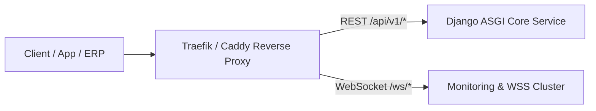

# 🌐 Sharegy API Referenz & Endpunkt-Katalog

**REST & WebSocket Schnittstellen für Partner, Mobile Apps & Externe Systeme**  
*Stand: 12. September 2026 | Version: 5.3 | Base URL: `https://app.sharegy.de/api/` bzw. `https://mon.sharegy.de/ws/`*

---

## 1. Authentifizierung & Autorisierung

Sharegy unterstützt drei standardisierte Authentifizierungs-Verfahren:

1. **Bearer JWT Token** (für Web-Frontend, Mobile Apps & Admin-Portal):
   * Header: `Authorization: Bearer <access_token>`
   * Gültigkeit: Access Token (15 Min), Refresh Token (30 Tage mit Rotation).
2. **Partner API Key** (für Stadtwerke-ERP / CRM Integrationen):
   * Header: `X-Partner-API-Key: sk_live_...`
3. **Edge / Device Token** (für Shelly, ioBroker Adapter & Inverter-Gateways):
   * Header: `X-Device-Token: dev_tok_...` oder WebSocket Sub-Protocol / Query Param.

---

## 2. Endpunkt-Übersicht



---

## 3. Kern-Endpunkte nach Modul

### 3.1 Authentifizierung & Mandanten-Theming

#### `POST /api/v1/auth/token/`
Bezieht ein JWT-Token-Paar für Benutzer.
* **Payload**:
  ```json
  {
    "email": "user@example.com",
    "password": "SecretPassword123!"
  }
  ```
* **Response (200 OK)**:
  ```json
  {
    "access": "eyJhbGciOiJIUzI1Ni...",
    "refresh": "eyJhbGciOiJIUzI1Ni...",
    "user": { "id": "u-491", "email": "user@example.com", "role": "TENANT_USER" }
  }
  ```

#### `GET /api/core/tenant/theming/`
Gibt das Whitelabel-Farbschema und Branding für die aktuelle Domain zurück.
* **Response (200 OK)**:
  ```json
  {
    "tenant_name": "Stadtwerke Musterstadt",
    "primary_color": "#0055A5",
    "secondary_color": "#FFCC00",
    "accent_color": "#00A86B",
    "logo_url": "https://cdn.sharegy.de/logos/sw-muster.png",
    "portal_title": "Musterstadt Energie-Portal"
  }
  ```

---

### 3.2 B2B Partner Portal & Flottenmanagement

#### `GET /api/v1/partners/fleet-overview/`
Liefert eine aggregierte Übersicht aller durch einen Partner installierten Anlagen.
* **Auth**: Partner-Rolle oder `X-Partner-API-Key`.
* **Response (200 OK)**:
  ```json
  {
    "total_systems": 142,
    "online_systems": 138,
    "systems_with_errors": 4,
    "aggregated_pv_power_kw": 1280.5,
    "aggregated_storage_kwh": 950.0,
    "fleet_health_score": 97.2
  }
  ```

#### `POST /api/v1/partners/quick-onboard/`
Legt ein neues Kundensystem mit Inverter-Cloud-Zugang im 1-Klick-Verfahren an.
* **Payload**:
  ```json
  {
    "customer_email": "kunde@musterstadt.de",
    "system_name": "PV Anlage Familie Meier",
    "inverter_brand": "sungrow",
    "credentials": {
      "username": "meier_sg",
      "password": "sg_password_2026",
      "app_key": "optional_gateway_key"
    },
    "grid_connection_kw": 11.0,
    "storage_capacity_kwh": 10.0
  }
  ```

---

### 3.3 EMS & Live-Telemetrie

#### `GET /api/v1/ems/live-power/`
Gibt den aktuellen Energiefluss (PV, Netz, Batterie, Last, Wallbox) in Echtzeit zurück.
* **Response (200 OK)**:
  ```json
  {
    "timestamp": "2026-09-12T14:30:00Z",
    "pv_power_watts": 6450,
    "grid_power_watts": -2100,
    "battery_power_watts": 2800,
    "battery_soc_percent": 78.5,
    "house_load_watts": 1550,
    "wallbox_power_watts": 0,
    "heatpump_power_watts": 0,
    "status": "PV_SURPLUS_CHARGING"
  }
  ```

#### `GET /api/v1/ems/dynamic-tariffs/`
Ruft die 15-Minuten-EPEX-Spot Börsenstrompreise inklusive Netzentgelte ab.
* **Response (200 OK)**:
  ```json
  {
    "unit": "EUR/kWh",
    "prices": [
      { "start": "2026-09-12T14:00:00Z", "end": "2026-09-12T14:15:00Z", "total_price": 0.182, "spot_price": 0.042 },
      { "start": "2026-09-12T14:15:00Z", "end": "2026-09-12T14:30:00Z", "total_price": 0.178, "spot_price": 0.038 }
    ]
  }
  ```

---

### 3.4 BNetzA Marktkommunikation & EDIFACT

#### `POST /api/v1/billing/edi-export/mscons/`
Generiert eine MSCONS 2.2b EDIFACT-Nachricht für 15-Minuten-Zählerwerte.
* **Payload**:
  ```json
  {
    "tenant_id": 1,
    "malo_id": "DE0001234567890000000000000001234",
    "meter_reading_type": "DELIVERY_AND_CONSUMPTION",
    "start_date": "2026-09-01T00:00:00Z",
    "end_date": "2026-09-01T23:59:59Z"
  }
  ```
* **Response (200 OK)**:
  ```json
  {
    "status": "GENERATED",
    "message_reference": "SHAREGY-MSCONS-20260912-001",
    "edifact_payload": "UNB+UNOC:3+9901234567890:500+9909876543210:500+260912:1430+SHAREGY-MSCONS-20260912-001'UNH+1+MSCONS:D:04B:UN:2.2b'..."
  }
  ```

---

### 3.5 WebSockets & Echtzeit-Kanäle

| WSS-Endpunkt | Protokoll / Format | Zweck |
| :--- | :--- | :--- |
| `wss://mon.sharegy.de/ws/edge/` | Sharegy JSON RPC v2 | Outbound WSS Verbindung für ioBroker Adapter & Edge-Gateways |
| `wss://mon.sharegy.de/ws/shelly/` | Shelly RPC over WSS | Direkte Zähler- und Relaisdaten von Shelly Pro / 3EM Geräten |
| `wss://mon.sharegy.de/ws/ocpp/{charge_point_id}` | OCPP 1.6-J / 2.0.1 / 2.1 | Ladeinfrastruktur & Wallbox-Management (Smart Charging) |
| `wss://mon.sharegy.de/ws/live-metrics/` | Pub/Sub JSON Stream | UI-Live-Aktualisierung des Energieflussdiagramms |

---

## 4. HTTP-Statuscodes & Fehlerbehandlung

Alle API-Fehler folgen dem **RFC 7807 Problem Details** Standard:

```json
{
  "type": "https://sharegy.de/errors/unauthorized-remote-access",
  "title": "Consent Required",
  "status": 403,
  "detail": "No active MaintenanceConsent found for device sg-inverter-042. Please request customer approval in app."
}
```

* `200 OK`: Erfolgreiche Anfrage.
* `201 Created`: Ressource erfolgreich erstellt.
* `400 Bad Request`: Ungültige Parameter / Validierungsfehler.
* `401 Unauthorized`: Fehlendes oder abgelaufenes JWT-Token.
* `403 Forbidden`: Unzureichende Rechte (RBAC) oder fehlender Consent.
* `429 Too Many Requests`: Rate-Limit überschritten (Standard: 120 req/min pro IP).
* `500 Internal Server Error`: Server-Fehler (wird automatisch geloggt).
