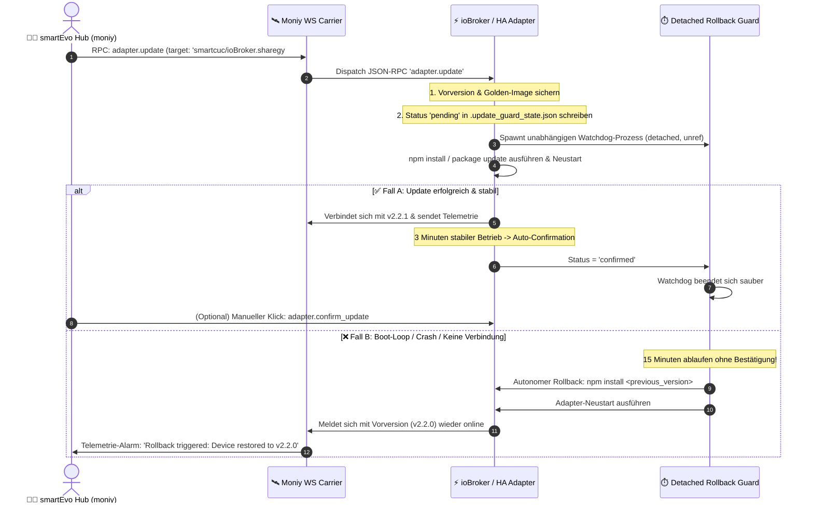

# 🛡️ Canary A/B OTA Remote Update & Automated Rollback Watchdog Architecture

**Stand:** 20. September 2026 (v1.0)  
**Status:** Aktiv implementiert in `iobroker.sharegy`, `homeassistant/custom_components/sharegy` und `moniy`  
**Dokument-ID:** `docs/architecture/CANARY_OTA_UPDATE_AND_ROLLBACK_WATCHDOG_ARCHITECTURE.md`  
**Zielgruppe:** B2B-Partner, Enterprise-Kunden, System-Architekten, DevOps & Service-Operations

---

## 🎯 1. Motivation: Das "Zero-Truck-Roll" Paradigma

In der dezentralen Energiewende (PV-Heimspeicher, § 14a EnWG Drosselung, Wärmepumpen, Zählerschränke) ist Software-Wartung vor Ort der **größte Kosten- und Risikofaktor**:
* Ein fehlgeschlagenes Adapter-Update, ein Syntax-Fehler oder eine inkompatible Node.js/Python-Dependency führt traditionell zum Ausfall des Edge-Systems.
* Der Kunde oder PV-Installateur muss manuell eingreifen oder ein Servicetechniker muss physisch vor Ort anfahren (**"Truck Roll"**).
* **Kosten pro Einsatz:** 150 € bis 300 € + verärgerte Kunden + Ausfallzeiten bei dynamischen Stromtarifen oder Netzdrosselungen.

### Die Lösung: Autonomes A/B OTA-Update mit 15-Minuten Dead-Man Switch
Sharegy und smartEvo moniy führen eine **selbstheilende, zweistufige Update-Architektur** ein:
Jedes Remote-Update wird in einer geschützten Verifikationsphase ausgeführt. Bestätigt der neue Adapter nicht innerhalb von 15 Minuten seine uneingeschränkte Betriebsbereitschaft, führt das System **völlig autonom ein Rollback auf die funktionierende Vorversion** durch.

---

## 🏗️ 2. Die 4-Phasen Lebenszyklus-Architektur

---

## 🔒 3. Technische Kernkomponenten

### 1. Der entkoppelte Watchdog-Guard (`scripts/rollback_guard.js`)
* Wird als **vollständig losgelöster Hintergrundprozess** (`spawn(..., { detached: true, stdio: 'ignore' }).unref()`) gestartet.
* Läuft unabhängig vom Hauptadapter oder ioBroker-Daemon. Selbst wenn der Adapter beim Start einen harten Exception-Crash erleidet, bleibt der Watchdog aktiv.
* Pollt alle 10 Sekunden den Status in `.update_guard_state.json`.

### 2. Der Update-Watchdog Controller (`lib/updateWatchdog.js` / `update_guard.py`)
* Verwaltet die Zustände:
  - `idle`: Kein Update aktiv.
  - `pending`: Update installiert, 15-Minuten Verifikationsfenster läuft.
  - `confirmed`: Version dauerhaft als stabil abgenommen.
  - `rolled_back`: Automatisches oder manuelles Rollback vollzogen.
* **Auto-Confirm Heuristik:** Sendet der Adapter nach dem Neustart 3 Minuten lang kontinuierlich Telemetriedaten an `sharegy.de` und `mon.smartevo.de` ohne fatale Fehler, wird das Update automatisch als `confirmed` markiert.

---

## 🛰️ 4. JSON-RPC 2.0 Schnittstellen-Referenz

| RPC-Methode | Parameter | Beschreibung |
|---|---|---|
| **`adapter.update`** | `{"target": "smartcuc/ioBroker.sharegy#main", "timeout_seconds": 900}` | Triggert Canary A/B OTA-Update mit 15-Minuten Rollback-Garantie |
| **`adapter.confirm_update`** | `{"reason": "manual_admin_rpc"}` | Bestätigt die neue Version dauerhaft und entwaffnet den Watchdog |
| **`adapter.rollback`** | `{}` | Löst ein sofortiges Notfall-Rollback auf die Vorversion aus |
| **`adapter.get_update_status`**| `{}` | Gibt aktuellen Watchdog- und Verifikations-Status zurück |

---

## 💼 5. Positionierung als Sharegy Enterprise USP

Dieses Feature hebt Sharegy signifikant vom Wettbewerb (1KOMMA5°, Enpal, herkömmliche EMS-Anbieter) ab:

### 1. Für Stadtwerke, Energieversorger & White-Label Partner
* **Garantiertes Zero-Downtime Flottenmanagement:** Tausende Zählerschränke und HEMS-Installationen können per Knopfdruck aktualisiert werden, ohne dass ein einziger Servicetechniker ausrücken muss.
* **SLA-Sicherheit:** § 14a EnWG Drosselung und Mieterstromabrechnungen bleiben selbst bei unvorhergesehenen Software-Inkompatibilitäten unterbrechungsfrei geschützt.

### 2. Für PV-Installateure & Fachpartner
* **Keine Haftungsrisiken:** Installateure haben die Sicherheit, dass Kunden-Installationen sich bei Fehlern selbst reparieren ("Self-Healing Edge").

### 3. Für Endkunden & die Open-Source-Community (ioBroker / Home Assistant)
* **„Unbricking-Garantie“:** Selbst Beta-Updates oder experimentelle Versionen können gefahrlos getestet werden.
