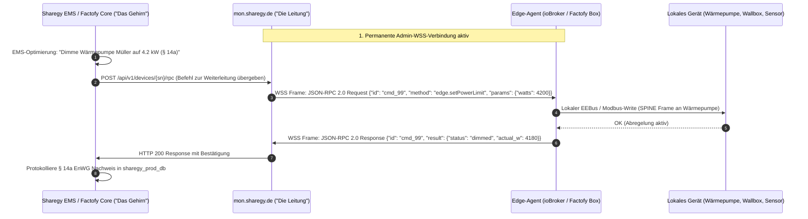

# 🌐 Decoupled Monitoring, Control Plane & In-Flight Backup Architecture

**Dokument-Status:** Enterprise Architektur-Blueprint & Infrastruktur-Spezifikation  
**Plattformen:** 
- **Sharegy** (Energy HEMS SaaS & Smart Grid Platform – Django/PostgreSQL/React)
- **Factofy** (Digitaler Zwilling für Kommunen, Städte & Liegenschaften – Next.js/PostgreSQL)  
**Version:** 2.1 (Brain vs. Carrier Clarification & Git Repo Strategy)  
**Datum:** 12. September 2026  
**Zielgruppe:** System-Architekten, DevOps, Backend- & Edge-Entwickler  

---

## 🏛️ 1. Motivation & Grundprinzip: Strikte Trennung von Steuerungs-Logik ("Brain") und Verbindungs-Schicht ("Carrier")

Um maximale Ausfallsicherheit, Sicherheit und Wiederverwendbarkeit zwischen **Sharegy** (Balkonkraftwerke, HEMS, Mieterstrom, Wallboxen) und **Factofy** (Digitaler Zwilling für Kommunen, Gebäude, CO₂-Bilanzierung, Liegenschaften) zu gewährleisten, trennen wir die Systeme in zwei voneinander vollkommen unabhängige Schichten:

1. **Business & Decision Plane (Fachdomänen-SaaS – "Das Gehirn"):**
   - **Sharegy SaaS (`app.sharegy.de`):** Eigene Instanz, eigene Datenbank (`sharegy_prod_db`). **100 % Hoheit über alle Steuerungs- und Optimierungsentscheidungen**:
     - Dynamische EMS-Optimierung (PV-Überschussladen, Batteriespeicher-Management)
     - Börsenstrompreise (Tibber / EPEX Spot) & automatische Schaltzeiten
     - § 14a EnWG Netzdienliche Abregelung auf 4,2 kW bei Netzüberlastung
     - § 42b EnWG Mieterstromzuteilung & Stripe-Abrechnung
   - **Factofy SaaS (`app.factofy.io` - Next.js):** Eigene Instanz, eigene Datenbank (`factofy_prod_db`). **100 % Hoheit über kommunale Zwillingsdaten**:
     - Liegenschafts-Monitoring, Quartiersanalysen, CO₂-Zertifikate, kommunale Wärmeplanung
2. **Stateless Connection & Control Plane (Zentraler Flotten- & Admin-Knoten – "Die Telefonleitung"):**
   - **`mon.sharegy.de` / `mon.factofy.io`:** Eigenständiges, hochverfügbares Monitoring-SaaS mit eigener Datenbank (`mon_core_db`).
   - **Keine Business-Logik / Kein Gehirn:** Dient rein als hochstabiler **Verbindungs-Carrier (Reverse-RPC Tunnel)**, Uptime-/Hardware-Monitor und **In-Flight 5-Minuten-DB-Backup Vault**.

---

## 🏗️ 2. Gesamtarchitektur & Systemübersicht

```
                        ┌────────────────────────────────────────────────────────┐
                        │      EDGE-GERÄT (z. B. ioBroker / Factofy Sensor-Box)  │
                        └───────────┬────────────────────────────────┬───────────┘
                                    │                                │
               [ 1. BUSINESS DATA PLANE ]               [ 2. CONTROL & ADMIN PLANE ]
               Reine Nutz- & Messdaten                  Flotten-Management & Fernwartung
                                    │                                │
                   WSS / HTTPS      │               WSS (Admin)      │
             (Messwerte, Zähler,    │             (Heartbeat, Logs,  │
              Leistung, Energie)    │              Reverse-RPC, OTA) │
                                    │                                │
                                    ▼                                ▼
     ┌──────────────────────────────────────────┐    ┌──────────────────────────────────────────┐
     │             SHAREGY APPLIKATION          │    │         ZENTRALES MONITORING & ADMIN     │
     │        (app.sharegy.de - Django)         │    │         (mon.sharegy.de / mon.factofy)   │
     ├──────────────────────────────────────────┤    ├──────────────────────────────────────────┤
     │ • Steuerungs-Gehirn: EMS-Optimizer       │    │ • Eigene Datenbank: mon_core_db          │
     │ • § 14a EnWG Dimmung & § 42b Abrechnung  │    │ • Flottenstatus (CPU, RAM, Uptime, FW)   │
     │ • Eigene Datenbank: sharegy_prod_db      │    │ • Reiner Reverse-RPC Transport-Tunnel    │
     │ • Port 8000 (Gunicorn WSGI)              │    │ • Port 8001 (FastAPI / ASGI Cluster)     │
     └────────────────────┬─────────────────────┘    └────────────────────▲─────────────────────┘
                          │                                               │
                          │   5-Minuten In-Flight Delta-Backup            │
                          └───────────────────────────────────────────────┤
                                                                          │
                             [ FACTOFY DATA PLANE ]                       │
                           ┌─────────────────────────┐                    │
                           │   FACTOFY APPLIKATION   │                    │
                           │ (app.factofy.io Next.js)│────────────────────┘
                           ├─────────────────────────┤  5-Minuten In-Flight
                           │ • Kommunaler Zwilling   │  Delta-Backup
                           │ • Eigene DB: factofy_db │
                           └─────────────────────────┘
```

---

## 🔌 3. Dual-Socket Edge-Architektur (ioBroker & Factofy IPC)

Auf dem Edge-Gerät (z. B. ioBroker im Haushalt oder Factofy-Knoten im Rathaus) laufen **zwei separate, leichtgewichtige Verbindungen**:

### A. Data-Socket (`wss://app.sharegy.de/ws/telemetry/` bzw. Factofy Data)
* **Verantwortung:** Streaming hochfrequenter Messdaten (aktuelle Watt, PV-Erzeugung, SoC, Zählerstände, Temperatur/Sensorwerte).
* **Ausfall-Verhalten:** Bei einem Release des Fachportals puffert der Edge-Client die Messwerte lokal im RAM/Flash und sendet sie nach Reconnect gebatcht nach.

### B. Admin- & Monitoring-Socket (`wss://mon.sharegy.de/ws/agent/`)
* **Verantwortung:**
  1. **Health-Heartbeat (alle 30–60s):** Sendet Telemetrie zu CPU-Last, RAM, Uptime, Adapterversion und lokaler Bus-Konnektivität (Modbus/CAN/EEBus).
  2. **Bidirektionaler Reverse-RPC Tunnel:** Empfängt Diagnose-, Log- und Konfigurationsbefehle aus der Cloud **ohne Port-Forwarding, DynDNS oder VPN**.
* **Ausfall-Verhalten:** Völlig unabhängig vom Webportal. Auch wenn `app.sharegy.de` oder `app.factofy.io` gewartet werden, bleibt die Fernwartung der Boxen zu 100 % online.

---

## ⚡ 4. Zero-Trust WSS Reverse-RPC Protokoll (JSON-RPC 2.0)

### Ablauf eines Steuerungs- oder Diagnosebefehls:



---

## 🛡️ 5. In-Flight Continuous Database Backup Engine (5-Minuten Delta-RPO)

Um bei einem Totalausfall oder Datenverlust eines Hauptsystems sofortige Wiederherstellung zu garantieren, fungiert das Monitoring-System zusätzlich als **isolierter Disaster-Recovery-Tresor**:

```
 ┌──────────────────────────────────────┐                ┌──────────────────────────────────────┐
 │       PRODUKTIONS-DB (SHAREGY)       │                │      MONITORING & BACKUP VAULT       │
 │       PostgreSQL (sharegy_prod_db)   │                │      (mon.sharegy.de / mon_core_db)  │
 ├──────────────────────────────────────┤                ├──────────────────────────────────────┤
 │ • Primärer Schreib-/Lese-Workload    │  Alle 5 Min.   │ • Getrennter Server / Storage-Volume │
 │ • WAL-Archivierung (Write-Ahead-Log) ├───────────────►│ • Verschlüsselte Delta-WAL Replikation│
 │ • Schneller SSD / NVMe Cache         │  (Encrypted)   │ • Snapshot-Prüfung & Checksum-Audit  │
 └──────────────────────────────────────┘                │ • RPO (Recovery Point): < 5 Minuten  │
                                                         └──────────────────────────────────────┘
```

---

## 🗂️ 6. Repository- & Projekt-Strategie (Eigenes Git-Projekt)

### Empfehlung: `smartcuc/mon-nexus` (Eigenes Repository)

### Empfehlung: `smartcuc/moniy` (Eigenes Repository)

Das Monitoring- & Admin-System ist als **eigenständiges Git-Projekt** (`smartcuc/moniy` – *Monitor our Y's: Sharegy & Factofy*) aufgesetzt:

1. **Vollständige Entkopplung:**
   - Eigene `pyproject.toml`, `requirements.txt`, eigenes FastAPI-Backend.
   - Eigenständige CI/CD-Pipelines und getrennter Lebenszyklus.
2. **Wiederverwendbare Edge-Bibliothek:**
   - Im `moniy` Repository liegt der schlanke `edge-agent-client` (Python & TypeScript/Node), der sowohl in den **ioBroker-Adapter (`iobroker.sharegy`)** als auch in die **Factofy-Kommunalbox** importiert wird.
   - Ein kleiner Python-Client `mon_nexus_client` wird in Sharegy (Django) und Factofy (Next.js/Node API) eingebunden, um mit einer Zeile Code RPC-Befehle abzusetzen.

---

## 🗄️ 7. Instanzen-, Domain- & Datenbank-Matrix

| System / Rolle | Subdomain | Technologie | Datenbank | Verantwortung |
|---|---|---|---|---|
| **Sharegy Core SaaS** | `app.sharegy.de` | Django / React | `sharegy_prod_db` | **Steuerungs-Gehirn:** EMS, § 14a EnWG, § 42b Mieterstrom, Tarife, Billing |
| **Factofy Core SaaS** | `app.factofy.io` | Next.js / Node | `factofy_prod_db` | **Kommunal-Gehirn:** Digitaler Zwilling, Quartiere, Liegenschaften |
| **Control Plane SaaS** | `mon.sharegy.de`<br>`mon.factofy.io` | FastAPI (Async) | `mon_core_db` | **Carrier-Leitung & Vault:** WSS-Sockets, Remote-RPC Tunnel, **5m DB-Backups** |
