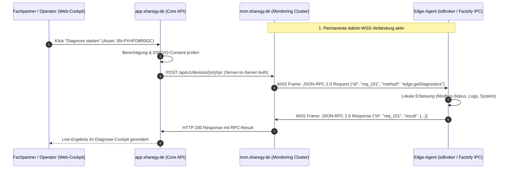

# 🌐 Decoupled Monitoring, Control Plane & In-Flight Backup Architecture

**Dokument-Status:** Enterprise Architektur-Blueprint & Infrastruktur-Spezifikation  
**Plattformen:** Sharegy (Energy HEMS SaaS) & Factofy (Industrial IoT SaaS)  
**Version:** 2.0 (Dual-Plane & Disaster Recovery Update)  
**Datum:** 12. September 2026  
**Zielgruppe:** System-Architekten, DevOps, Backend- & Edge-Entwickler  

---

## 🏛️ 1. Motivation & Grundprinzip: Strikte Trennung von Data Plane & Control Plane

Um maximale Ausfallsicherheit, Sicherheit und Wiederverwendbarkeit zwischen **Sharegy** (Balkonkraftwerke, HEMS, Mieterstrom, Wallboxen) und **Factofy** (Industrie-IoT, Maschinenüberwachung, OEE) zu gewährleisten, trennen wir die Systeme in zwei voneinander vollkommen unabhängige Schichten:

1. **Business Data Plane (Fachdomänen-SaaS)**:
   - Separate Instanzen, getrennte Datenbanken (`sharegy_prod_db` vs. `factofy_prod_db`), eigene URLs (`app.sharegy.de` vs. `app.factofy.io`).
   - Verarbeitet reine Anwendungslogik: Abrechnungen, Stripe, Mieterverträge, § 42b EnWG, Maschinenaufträge, OEE-Kalkulationen.
2. **Control & Monitoring Plane (Zentraler Flotten- & Admin-Knoten)**:
   - Eigenständiges, hochverfügbares Monitoring-SaaS mit eigener Datenbank (`mon_core_db`) und dedizierten URLs (`mon.sharegy.de`, `mon.factofy.io`).
   - Hält permanente WebSockets, überwacht System-Health (CPU, RAM, Uptime), tunnelt **Zero-Trust Reverse-RPC Befehle** und empfängt **kontinuierliche 5-Minuten In-Flight DB-Backups**.

---

## 🏗️ 2. Gesamtarchitektur & Systemübersicht

```
                        ┌────────────────────────────────────────────────────────┐
                        │         EDGE-GERÄT (z. B. ioBroker / Factofy IPC)      │
                        └───────────┬────────────────────────────────┬───────────┘
                                    │                                │
               [ 1. BUSINESS DATA PLANE ]               [ 2. CONTROL & ADMIN PLANE ]
               Reine Nutz- & Messdaten                  Flotten-Management & Fernwartung
                                    │                                │
                   WSS / HTTPS      │               WSS (Admin)      │
             (Messwerte, Zähler,    │             (Heartbeat, Logs,  │
              Leistung, Energie)    │              Reverse-RPC, OTA) │
                                    │                                │
                                    ▼                                ▼
     ┌──────────────────────────────────────────┐    ┌──────────────────────────────────────────┐
     │             SHAREGY APPLIKATION          │    │         ZENTRALES MONITORING & ADMIN     │
     │             (app.sharegy.de)             │    │         (mon.sharegy.de / mon.factofy)   │
     ├──────────────────────────────────────────┤    ├──────────────────────────────────────────┤
     │ • Eigene Datenbank: sharegy_prod_db      │    │ • Eigene Datenbank: mon_core_db          │
     │ • Abrechnung, § 42b EnWG, Mieterportal   │    │ • Flottenstatus (CPU, RAM, Uptime, FW)   │
     │ • Dynamische Stromtarife, EMS            │    │ • Zero-Trust Remote-RPC Tunnel           │
     │ • Port 8000 (Gunicorn WSGI)              │    │ • Port 8001 (Daphne ASGI Cluster)        │
     └────────────────────┬─────────────────────┘    └────────────────────▲─────────────────────┘
                          │                                               │
                          │   5-Minuten In-Flight Delta-Backup            │
                          └───────────────────────────────────────────────┤
                                                                          │
                             [ FACTOFY DATA PLANE ]                       │
                           ┌─────────────────────────┐                    │
                           │   FACTOFY APPLIKATION   │                    │
                           │   (app.factofy.io)      │────────────────────┘
                           ├─────────────────────────┤  5-Minuten In-Flight
                           │ • Eigene DB: factofy_db │  Delta-Backup
                           │ • Maschinen-OEE, Takt   │
                           └─────────────────────────┘
```

---

## 🔌 3. Dual-Socket Edge-Architektur (ioBroker & Factofy IPC)

Auf dem Edge-Gerät (z. B. Raspberry Pi, HEMS-Gateway oder Industrie-IPC) laufen **zwei separate, leichtgewichtige Verbindungen**:

### A. Data-Socket (`wss://app.sharegy.de/ws/telemetry/`)
* **Verantwortung:** Streaming hochfrequenter Messwerte (aktuelle Watt, PV-Erzeugung, SoC, Zählerstände).
* **Ausfall-Verhalten:** Bei einem Release oder Neustart des Business-Portals puffert der Edge-Client die Messwerte lokal im RAM/Flash-Ringbuffer und sendet sie nach Reconnect gebatcht nach.

### B. Admin- & Monitoring-Socket (`wss://mon.sharegy.de/ws/agent/`)
* **Verantwortung:**
  1. **Health-Heartbeat (alle 30–60s):** Sendet Telemetrie zu CPU-Last, RAM, Uptime, Adapterversion und lokaler Bus-Konnektivität (Modbus/CAN).
  2. **Bidirektionaler Reverse-RPC Tunnel:** Empfängt Diagnose-, Log- und Konfigurationsbefehle aus der Cloud **ohne Port-Forwarding, DynDNS oder VPN**.
* **Ausfall-Verhalten:** Völlig unabhängig vom Webportal. Auch wenn `app.sharegy.de` gewartet wird, bleibt die Fernwartung der Boxen zu 100 % online.

---

## ⚡ 4. Zero-Trust WSS Reverse-RPC Protokoll (JSON-RPC 2.0)

### Ablauf eines Remote-Befehls (z. B. Fachpartner startet Diagnose)



### Standardisierte JSON-RPC 2.0 Methoden

#### 1. System-Health & Diagnostik
```json
// Request (Cloud -> Edge)
{
  "jsonrpc": "2.0",
  "id": "diag_001",
  "method": "edge.healthCheck",
  "params": {}
}

// Response (Edge -> Cloud)
{
  "jsonrpc": "2.0",
  "id": "diag_001",
  "result": {
    "status": "healthy",
    "uptime_seconds": 124800,
    "adapter_version": "1.5.0",
    "cpu_load_pct": 14.2,
    "free_memory_mb": 620,
    "bus_devices_online": 4
  }
}
```

#### 2. Log-Extraktion bei Störungen
```json
// Request (Cloud -> Edge)
{
  "jsonrpc": "2.0",
  "id": "diag_002",
  "method": "edge.getRecentLogs",
  "params": {
    "severity": "error",
    "max_lines": 50
  }
}
```

#### 3. Remote-Konfiguration & Neustart
```json
// Request (Cloud -> Edge)
{
  "jsonrpc": "2.0",
  "id": "cmd_003",
  "method": "edge.restartService",
  "params": {
    "service_name": "modbus_driver",
    "graceful": true
  }
}
```

---

## 🛡️ 5. In-Flight Continuous Database Backup Engine (5-Minuten Delta-RPO)

Um bei einem Totalausfall oder Datenverlust des Hauptsystems sofortige Wiederherstellung zu garantieren, fungiert das Monitoring-System zusätzlich als **isolierter Disaster-Recovery-Tresor**:

```
 ┌──────────────────────────────────────┐                ┌──────────────────────────────────────┐
 │       PRODUKTIONS-DB (SHAREGY)       │                │      MONITORING & BACKUP VAULT       │
 │       PostgreSQL (sharegy_prod_db)   │                │      (mon.sharegy.de / mon_core_db)  │
 ├──────────────────────────────────────┤                ├──────────────────────────────────────┤
 │ • Primärer Schreib-/Lese-Workload    │  Alle 5 Min.   │ • Getrennter Server / Storage-Volume │
 │ • WAL-Archivierung (Write-Ahead-Log) ├───────────────►│ • Verschlüsselte Delta-WAL Replikation│
 │ • Schneller SSD / NVMe Cache         │  (Encrypted)   │ • Snapshot-Prüfung & Checksum-Audit  │
 └──────────────────────────────────────┘                │ • RPO (Recovery Point): < 5 Minuten  │
                                                         └──────────────────────────────────────┘
```

### Eigenschaften des In-Flight Backups:
1. **5-Minuten Delta-Sync:** Über kontinuierliche PostgreSQL WAL-Replikation (z. B. via `pg_receivewal` oder leichtgewichtige Streaming-Deltas) werden alle Transaktionen im 5-Minuten-Takt in den Monitoring-Tresor übertragen.
2. **Kryptografische Isolation:** Die Backup-Daten werden vor der Übertragung mit einem dedizierten Key verschlüsselt (AES-256) und liegen auf einem physisch/logisch getrennten Speicherbereich.
3. **Automatisches Audit im Monitoring-Cockpit:** Das Monitoring-System prüft und visualisiert den Backup-Status in Echtzeit:
   - 🟢 *Sharegy DB:* Letzter Delta-Snapshot vor 2 Min. (Integrität OK)
   - 🟢 *Factofy DB:* Letzter Delta-Snapshot vor 4 Min. (Integrität OK)
4. **Instant Standby Recovery:** Im Katastrophenfall kann die Datenbank direkt aus dem Monitoring-Cluster mit einem maximalen Datenverlust von unter 5 Minuten (RPO < 5 Min.) wiederhergestellt werden.

---

## 🗄️ 6. Instanzen-, Domain- & Datenbank-Matrix

| System / Rolle | Subdomain | Datenbank | Verantwortung |
|---|---|---|---|
| **Sharegy Core SaaS** | `app.sharegy.de` | `sharegy_prod_db` | Verträge, Mieterstrom, Abrechnung, § 42b EnWG, Stripe |
| **Factofy Core SaaS** | `app.factofy.io` | `factofy_prod_db` | Fertigungsdaten, Maschinenaufträge, OEE-Kennzahlen |
| **Control Plane SaaS** | `mon.sharegy.de`<br>`mon.factofy.io` | `mon_core_db` | Flottenübersicht, WSS-Sockets, Remote-RPC, **In-Flight 5m Backups** |

---

## 🚀 7. Roadmap & Umsetzungsphasen

1. **Phase 1: Dual-Socket Definition & WSS-Ingress**
   - Aufsetzen des isolierten WSS-Endpunkts `/ws/agent/` für den Admin- & Health-Kanal.
2. **Phase 2: Bidirektionaler JSON-RPC 2.0 Dispatcher**
   - Implementierung des `RemoteRPCClient` und der WSS-Bridge für Live-Befehle (Diagnose, Logs).
3. **Phase 3: ioBroker & Factofy Edge-Agent SDK**
   - Integration des dualen Verbindungsmodells in `iobroker.sharegy` und den Factofy Linux-Agenten.
4. **Phase 4: In-Flight 5-Minuten Delta-Backup Vault**
   - Konfiguration der kontinuierlichen PostgreSQL-Delta-Replikation in das Monitoring-System mit Dashboard-Status.
