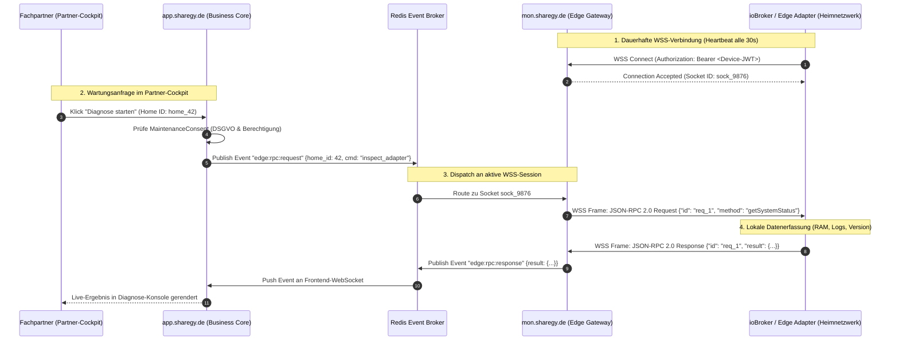

# 🌐 Decoupled Monitoring, Edge Ingestion & Remote RPC Architecture (`mon.sharegy.de`)

**Dokument-Status:** Architektur-Blueprint & Infrastruktur-Spezifikation  
**Version:** 1.0  
**Datum:** 12. September 2026  
**Zielgruppe:** System-Architekten, DevOps, Backend- & Edge-Entwickler  

---

## 🏛️ 1. Motivation & Problemstellung

Mit dem Wachstum von Sharegy zu einer **hochfrequenten IoT- und Energy-Sharing-Plattform** steigt die Anzahl permanenter Client- und Edge-Verbindungen (ioBroker-Adapter, Shelly-Messgeräte, Wallboxen, Wechselrichter-Gateways) rasant an.

### Herausforderungen eines monolithischen Ingress-Modells:
1. **Verbindungsabbrüche bei Deployments:** Jedes Rollout an der Webanwendung (`app.sharegy.de`) trennt tausende persistente WebSocket-Verbindungen (Thundering-Herd-Problem bei gleichzeitigem Reconnect).
2. **Blast-Radius & Ressourcenteilung:** Fehlerhafte Edge-Clients (z. B. fehlerhafte Polling-Schleifen im Kunden-Netzwerk) können Web-Worker und relationale Datenbankpools überlasten und das Endkundenportal verlangsamen.
3. **Sicherheitsisolation (Least Privilege):** Edge-Geräte im Heimnetzwerk sollten ausschließlich mit isolierten Ingest-Endpunkten kommunizieren und keinen Zugriff auf sensible Business- und Abrechnungs-APIs haben.
4. **Bidirektionale Fernwartung:** Wartungsbefehle an HEMS-Geräte hinter Routern/Firewalls (NAT) müssen ohne Port-Forwarding, VPN oder DynDNS in Echtzeit ausgeführt werden können.

---

## 🏗️ 2. Ziel-Architektur & Subdomain-Taxonomie

```
                               ┌──────────────────────────────────────────────┐
                               │             DNS & INGRESS ROUTING            │
                               └───────┬──────────────────────────────┬───────┘
                                       │                              │
                ┌──────────────────────▼───────┐      ┌───────────────▼────────────────────────┐
                │   app.sharegy.de / Portal    │      │    mon.sharegy.de / Ingest & Edge      │
                │   (Business, User, Billing)  │      │    (WSS, Reverse-RPC, Telemetrie)      │
                ├──────────────────────────────┤      ├────────────────────────────────────────┤
                │ • Django Web / React Frontend│      │ • High-Concurrency Async Gateway       │
                │ • PostgreSQL (Core / Billing)│      │ • TimescaleDB / Redis Streams          │
                │ • Stripe, § 42b EnWG, Auth   │      │ • Millionen Datensätze / Sekunde       │
                │ • Geringe Last, hohe ACID-   │      │ • 10.000e offene WSS-Sockets           │
                │   Konsistenz                 │      │ • Keine Downtime bei Portal-Updates    │
                └──────────────┬───────────────┘      └────────────────┬───────────────────────┘
                               │                                       │
                               └───────────────► REDIS ◄───────────────┘
                                           (Message Broker /
                                            Events / JWT Sync)
```

### Subdomain-Übersicht

| Domäne / Subdomain | Verantwortung & Workload | Protokolle | Auth-Methode |
|---|---|---|---|
| **`sharegy.de`** / **`www`** | Öffentliche Website, Landing Page, SEO, Preiskalkulator, Dokumentation | HTTPS | Öffentlich |
| **`app.sharegy.de`** | Endkunden- & Mieter-Portal, Dashboard, Abrechnungen, Einstellungen, Native WebView | HTTPS, WSS (UI-Livefeed) | Session / JWT (User) |
| **`mon.sharegy.de`** | **Edge-Telemetrie, High-Throughput Ingestion & Reverse-RPC Wartung** | WSS, HTTPS, MQTT | Device-Token / HMAC |
| **`partner.sharegy.de`** | Fachpartner- & Installateurs-Cockpit (Flottenübersicht, Schnell-Inbetriebnahme) | HTTPS | JWT (Partner-Rolle) |
| **`cname.sharegy.de`** | Ingress-Proxy für B2B-Whitelabel Custom-Domains (Stadtwerke, Hausverwaltungen) | HTTPS (SNI) | Tenant-Resolver |

---

## ⚡ 3. Endpunkt-Spezifikation für `mon.sharegy.de`

Die Monitoring-Instanz exponiert spezialisierte, zustandslose und hochperformante Schnittstellen:

```
wss://mon.sharegy.de
 ├── /ws/edge/v1/          → Universeller WSS-Kanal für ioBroker, Home Assistant & Custom Edge HEMS
 ├── /ws/shelly/v1/        → Direktes WSS-Outbound-Protokoll für Shelly Gen2/Gen3/Pro
 ├── /ws/ocpp/v1/          → OCPP 1.6-J & 2.0.1 Ingress für vernetzte Wallboxen
 └── /ws/gateway/v1/       → Virtuelle Summenzähler & Gateway-Ingress

https://mon.sharegy.de
 ├── /api/v1/ingest/push   → Hochleistungs-REST-Ingress für Batch-Telemetrie
 ├── /api/v1/health        → Liveness & Readiness Probes
 └── /api/v1/metrics       → Prometheus / OpenTelemetry Telemetrie-Exporter
```

---

## 🔌 4. Zero-Trust WSS Reverse-RPC Fernwartung

### Ablauf eines Wartungs- & Diagnosebefehls



### JSON-RPC 2.0 Protokoll-Spezifikation (WSS-Payload)

#### 1. Ping & Health-Check
```json
// Request (Cloud -> Edge)
{
  "jsonrpc": "2.0",
  "id": "diag_101",
  "method": "edge.healthCheck",
  "params": {}
}

// Response (Edge -> Cloud)
{
  "jsonrpc": "2.0",
  "id": "diag_101",
  "result": {
    "status": "healthy",
    "uptime_seconds": 864200,
    "adapter_version": "1.4.2",
    "cpu_load_pct": 8.4,
    "free_memory_mb": 512,
    "local_devices_online": 6
  }
}
```

#### 2. Log-Extraktion bei Störungen
```json
// Request (Cloud -> Edge)
{
  "jsonrpc": "2.0",
  "id": "diag_102",
  "method": "edge.getRecentLogs",
  "params": {
    "severity": "warn",
    "max_entries": 50
  }
}
```

#### 3. Push von Optimierungs-Konfigurationen
```json
// Request (Cloud -> Edge)
{
  "jsonrpc": "2.0",
  "id": "cfg_201",
  "method": "edge.updateConfig",
  "params": {
    "polling_interval_ms": 2000,
    "grid_export_limit_w": 0,
    "battery_charge_override_w": 3000
  }
}
```

---

## 🔒 5. Sicherheits- & Datenschutz-Konzept

1. **Kein offenes Inbound-Interface beim Kunden:** Die Verbindung erfolgt **ausschließlich ausgehend (Outbound TLS)** von Port 443 des Kunden-Routers. Keine Portweiterleitung oder Firewall-Freigaben erforderlich.
2. **Kryptografische Token-Signierung:** Jeder Edge-Client erhält ein kryptografisches `Device-JWT` mit strikt beschränkten Scopes (`scope: ["telemetry:push", "rpc:respond"]`).
3. **DSGVO & § 14a EnWG Consent:** Fernwartungsbefehle werden im Backend blockiert, sofern kein aktiver `MaintenanceConsent` des Anlageninhabers vorliegt.
4. **Audit-Logging:** Jeder ausgeführte RPC-Befehl wird manipulationssicher mit Timestamp, ausführendem Partner-Benutzer und Ergebnis im Audit-Log protokolliert.

---

## 📈 6. Skalierungs- & Migrationsplan

* **Phase 1 (Monolith-optimiert - Ist-Zustand):**
  * WSS-Endpunkte laufen im bestehenden Django Channels / Daphne Container unter `/ws/energy/`, `/ws/edge/`, `/ws/ocpp/`.
* **Phase 2 (Subdomain-Split - Empfohlener nächster Schritt):**
  * Nginx / Traefik Ingress-Router leitet `mon.sharegy.de` auf einen dedizierten ASGI-Worker-Pool weiter.
  * Trennung der TimescaleDB Hypertables in einen separaten I/O-optimierten Storage-Pool.
* **Phase 3 (High-Scale Microservice):**
  * Ausgliederung des WSS-Gateways in einen eigenständigen Go- oder Rust-basierten WebSocket-Broker bei > 50.000 parallelen Edge-Sockets.
