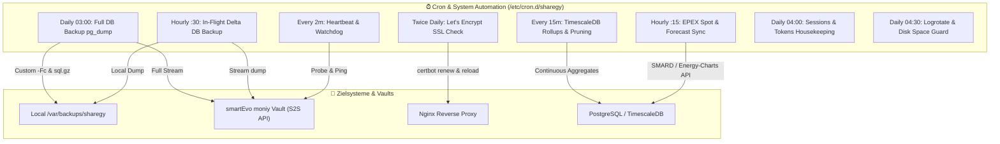

# Sharegy Operations, Automated Backups & Crontab Architecture Manual

## 1. Systemübersicht & Betriebskonzept

Dieses Handbuch dokumentiert die automatisierte Betriebsarchitektur, Datensicherung und System-Wartung für **Sharegy** in Produktiv- und Staging-Umgebungen.

Alle Skripte befinden sich im Verzeichnis [`scripts/`](file:///c:/Users/Public/Dev/sharegy/scripts) und sind für den unterbrechungsfreien Betrieb auf Ubuntu/Debian Linux Servern ausgelegt.



---

## 2. Übersicht aller Skripte

| Skript | Intervall | Funktion | Log-Datei |
| :--- | :--- | :--- | :--- |
| [`scripts/backup_db.sh`](file:///c:/Users/Public/Dev/sharegy/scripts/backup_db.sh) | Täglich 03:00 | Vollständiger PostgreSQL/TimescaleDB Dump (`-Fc` & `.sql.gz`), S2S-Stream zu `moniy`, 14-Tage Retention. | `/var/log/sharegy/db_backup.log` |
| [`scripts/backup_db_diff.sh`](file:///c:/Users/Public/Dev/sharegy/scripts/backup_db_diff.sh) | Stündlich :30 | In-Flight Delta-Dump, Streaming direkt zu moniy Vault, 48h Retention. | `/var/log/sharegy/db_diff_backup.log` |
| [`scripts/restore_db.sh`](file:///c:/Users/Public/Dev/sharegy/scripts/restore_db.sh) | On-Demand | Sichere interaktive / automatisierte Wiederherstellung von Dumps. | stdout |
| [`scripts/renew_ssl.sh`](file:///c:/Users/Public/Dev/sharegy/scripts/renew_ssl.sh) | 2x täglich | `certbot renew`, Graceful Nginx Reload, OpenSSL Ablaufprüfung, HTTPS Health Check. | `/var/log/sharegy/ssl_renew.log` |
| [`scripts/maintenance_timescaledb.sh`](file:///c:/Users/Public/Dev/sharegy/scripts/maintenance_timescaledb.sh) | Alle 15 Min | TimescaleDB Hypertables, Continuous Aggregates, Metric-Rollups, Bereinigung alter Roh-Ticks. | `/var/log/sharegy/timescaledb_maintenance.log` |
| [`scripts/cleanup_housekeeping.sh`](file:///c:/Users/Public/Dev/sharegy/scripts/cleanup_housekeeping.sh) | Täglich 04:00 | Django `clearsessions`, abgelaufene Auth/Magic-Tokens, MQTT State Reconcile. | `/var/log/sharegy/housekeeping.log` |
| [`scripts/rotate_logs.sh`](file:///c:/Users/Public/Dev/sharegy/scripts/rotate_logs.sh) | Täglich 04:30 | Gzip-Komprimierung von Logs > 1 Tag, Löschen > 14 Tage, Festplatten-Warnung (> 85%). | `/var/log/sharegy/log_rotation.log` |
| [`scripts/sync_market_and_forecast.sh`](file:///c:/Users/Public/Dev/sharegy/scripts/sync_market_and_forecast.sh) | Stündlich :15 | EPEX Spot & SMARD 15m Day-Ahead Strompreise, DWD/Open-Meteo PV-Prognosen. | `/var/log/sharegy/market_forecast_sync.log` |
| [`scripts/heartbeat_watchdog.sh`](file:///c:/Users/Public/Dev/sharegy/scripts/heartbeat_watchdog.sh) | Alle 2 Min | Prüft Gunicorn, DB, Redis, Celery. Automatischer Restart & moniy Incident-Eskalation. | `/var/log/sharegy/watchdog.log` |
| [`scripts/install_cron.sh`](file:///c:/Users/Public/Dev/sharegy/scripts/install_cron.sh) | 1-Click Setup | Setzt `chmod +x`, erstellt `/var/log/sharegy` und installiert `/etc/cron.d/sharegy`. | stdout |

---

## 3. Installation & Aktivierung

Auf dem Produktionsserver ausführen:

```bash
cd /var/www/sharegy/live
sudo ./scripts/install_cron.sh
```

Damit werden alle notwendigen Rechte gesetzt und die Crontab unter `/etc/cron.d/sharegy` aktiviert.
