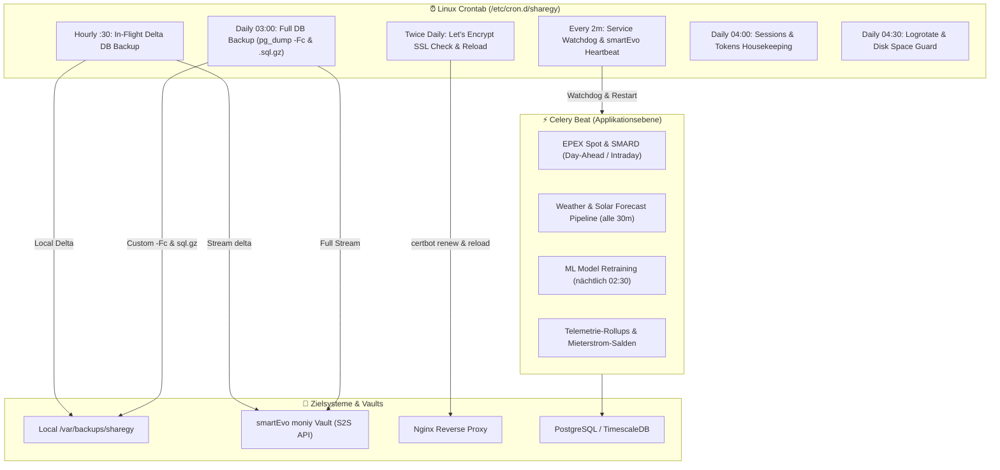

# Sharegy Operations, Automated Backups & Crontab Architecture Manual

## 1. Systemübersicht: Klare Trennung zwischen Celery Beat & System-Cron

In der Sharegy-Architektur existiert eine saubere Trennung der Zuständigkeiten:

1. **Celery Beat (Applikations- & Daten-Ebene)**:
   - **Börsenstrompreise**: `market.tasks.fetch_spot_prices_retry` (Day-Ahead Fenster um 00:05, 13:05, 14:05 etc.)
   - **Preisranking & Heatmap**: `market.tasks_analysis.compute_daily_spot_summary`
   - **Wetter & PV-Prognosen**: `forecast.tasks.update_all_forecasts` (alle 30 Min) & `fetch-weather-data`
   - **ML-Training**: `forecast.tasks.train_all_generator_ml_models` (nächtlich 02:30)
   - **Telemetrie-Aggregation & Abrechnungssalden**: 1m, 5m, 15m Rollups und Mieter-Abrechnungsslots.

2. **System-Crontab (Infrastruktur-, Backup- & OS-Ebene)**:
   - **Full & Differential Backups**: PostgreSQL & TimescaleDB Dumps, S2S-Streaming an `moniy`.
   - **SSL-Zertifikate**: Let's Encrypt / Certbot Renewal, Nginx Reload & Healthcheck.
   - **High-Availability Watchdog**: Überwacht Gunicorn, Celery, Redis & Postgres (startet bei Crash neu).
   - **Log-Rotation & Disk Space Guard**: Gzip-Komprimierung & Speicherüberwachung.
   - **Housekeeping**: Django Session- & Token-Bereinigung.



---

## 2. Übersicht der System-Skripte

| Skript | Intervall | Ebene | Funktion |
| :--- | :--- | :--- | :--- |
| [`scripts/backup_db.sh`](file:///c:/Users/Public/Dev/sharegy/scripts/backup_db.sh) | Täglich 03:00 | System | Full DB-Backup (`-Fc` & `.sql.gz`), S2S-Stream zu `moniy`, 14-Tage Retention. |
| [`scripts/backup_db_diff.sh`](file:///c:/Users/Public/Dev/sharegy/scripts/backup_db_diff.sh) | Stündlich :30 | System | In-Flight Delta-Dump, Streaming direkt zu moniy Vault, 48h Retention. |
| [`scripts/restore_db.sh`](file:///c:/Users/Public/Dev/sharegy/scripts/restore_db.sh) | On-Demand | System | Sichere interaktive / automatisierte Wiederherstellung von Dumps. |
| [`scripts/renew_ssl.sh`](file:///c:/Users/Public/Dev/sharegy/scripts/renew_ssl.sh) | 2x täglich | System | `certbot renew`, Graceful Nginx Reload, OpenSSL Ablaufprüfung, HTTPS Health Check. |
| [`scripts/heartbeat_watchdog.sh`](file:///c:/Users/Public/Dev/sharegy/scripts/heartbeat_watchdog.sh) | Alle 2 Min | System | Überwacht Gunicorn, DB, Redis, Celery. Automatischer Restart & moniy Eskalation. |
| [`scripts/cleanup_housekeeping.sh`](file:///c:/Users/Public/Dev/sharegy/scripts/cleanup_housekeeping.sh) | Täglich 04:00 | System | Django `clearsessions`, abgelaufene Auth/Magic-Tokens. |
| [`scripts/rotate_logs.sh`](file:///c:/Users/Public/Dev/sharegy/scripts/rotate_logs.sh) | Täglich 04:30 | System | Gzip-Komprimierung von Logs > 1 Tag, Löschen > 14 Tage, Festplatten-Warnung (> 85%). |
| [`scripts/sync_market_and_forecast.sh`](file:///c:/Users/Public/Dev/sharegy/scripts/sync_market_and_forecast.sh) | On-Demand / Fallback | App-CLI | Manuelle CLI-Ausführung von Marktpreisen & Prognosen (falls Celery Beat gestoppt ist). |
| [`scripts/install_cron.sh`](file:///c:/Users/Public/Dev/sharegy/scripts/install_cron.sh) | 1-Click Setup | System | Setzt `chmod +x`, erstellt Verzeichnisse und installiert `/etc/cron.d/sharegy`. |

---

## 3. Installation & Aktivierung

Auf dem Produktionsserver ausführen:

```bash
cd /var/www/sharegy/live
sudo ./scripts/install_cron.sh
```
