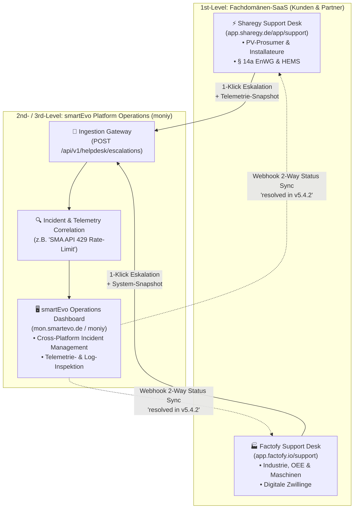

# 🌐 Unified Cross-Platform Helpdesk & Escalation Architecture

**Stand:** 19. September 2026 (v5.4 / Enterprise & Operations)  
**Status:** Aktiv implementiert in `moniy` & `sharegy`  
**Dokument-ID:** `docs/architecture/UNIFIED_CROSS_PLATFORM_HELPDESK_AND_ESCALATION_ARCHITECTURE.md`

---

## 🎯 1. Motivation & Strategie: Warum getrennte Fach-Helpdesks + zentraler smartEvo-Hub?

Bei einer wachsenden Multi-SaaS-Plattformfamilie (**Sharegy**, **Factofy**, **Moniy**, **Valofy**) entsteht ein klassisches Spannungsfeld:
* **Die Fachwelt der Kunden:** Ein PV-Installateur oder Prosumer in Sharegy spricht über Wechselrichter, § 14a EnWG Drosselung, Batteriespeicher und Strompreise. Ein Produktionsleiter in Factofy spricht über Maschinen-OEE, ERP-Schnittstellen und Fertigungstakte.
* **Das Problem eines "Sammel-Helpdesks":** Würde man alle Kunden in ein einziges Support-Portal werfen, entstünde Verwirrung, unsauberes Branding und erhebliche **DSGVO-Risiken** (Vermischung von Produktions- und Privatdaten).
* **Die Lösung: Das 3-stufige ITIL-Eskalationsmodell:**
  1. **1st-Level (Fach-Helpdesks):** Bleibt strikt getrennt in der jeweiligen Anwendung (`app.sharegy.de`, `app.factofy.io`). Installateure & Partner lösen Anwenderfragen direkt vor Ort.
  2. **2nd- & 3rd-Level (smartEvo Platform Hub in `moniy`):** Wenn ein Problem nicht auf Fach-Ebene gelöst werden kann (z.B. Bug im Inverter-Treiber, API-Rate-Limit, Datenbank-Blockade), eskaliert der Partner das Ticket mit **einem Klick** an das zentrale **smartEvo Platform Operations Team**.

---

## 🏛️ 2. Gesamtarchitektur & Systemübersicht



---

## 📦 3. Der "1-Klick Telemetrie-Snapshot" (Datenschutzkonforme Fehlerdiagnose)

Wenn ein Sharegy-Installateur ein Ticket an smartEvo eskaliert, sammelt der `SmartEvoEscalationService` automatisch die technischen Diagnosedaten:

```json
{
  "source_platform": "sharegy",
  "external_ticket_id": "SH-1042",
  "customer_tier": "Partner",
  "category": "hardware_inverter",
  "priority": "critical",
  "subject": "SMA Tripower X: Inverter throws 500 error on live telemetry sync",
  "description": "Installateur Schmidt meldet Verbindungsabbruch seit 14:00 Uhr.",
  "user_email_hash": "a8f5c3b8901e...",
  "telemetry_snapshot": {
    "platform_version": "v5.4",
    "devices": [
      {
        "device_id": "d748f2-...",
        "manufacturer": "SMA",
        "model": "Sunny Tripower X 15",
        "firmware": "3.02.14.R",
        "last_error": "SMA_API_RATE_LIMIT_EXCEEDED: 429 Too Many Requests"
      }
    ]
  },
  "callback_url": "https://app.sharegy.de/api/v1/support/webhook/smartevo-sync/"
}
```

### Vorteile für Entwickler & Partner:
1. **Keine Rückfragen:** Der Entwickler sieht sofort Modell, Firmware und die exakte Fehler-Exception.
2. **DSGVO-Konformität:** Keine Passwörter, keine Klarnamen oder privaten Abrechnungsdaten im System-Snapshot.
3. **Automatisches Incident-Tagging:** Mehrere Tickets desselben Fehlers (z.B. SMA-Cloud-Ausfall) werden automatisch gruppiert (`incident_tag: "sma-cloud-inverter"`).

---

## 🔄 4. Status-Synchronisation & Lebenszyklus

| Status in smartEvo (`moniy`) | Status in Sharegy (`app.sharegy.de`) | Bedeutung |
|---|---|---|
| `open` | `waiting_internal` | Ticket bei smartEvo eingegangen, wartet auf Triage |
| `in_investigation` | `waiting_internal` | smartEvo Platform Engineer analysiert Logs & Telemetrie |
| `patched` | `waiting_internal` | Bugfix in Entwicklungs-Pipeline eingespielt |
| `resolved` | `resolved` | Patch ausgerollt (inkl. `resolved_in_version`), Partner wird benachrichtigt |
| `closed` | `closed` | Vorgang abgeschlossen |

---

## 🌐 5. Endpunkt-Katalog in `moniy`

| Methode | Endpunkt | Zweck |
|---|---|---|
| `POST` | `/api/v1/helpdesk/escalations` | Empfang neuer Eskalationen von Sharegy / Factofy |
| `GET` | `/api/v1/helpdesk/escalations` | Liste & Filterung aller systemweiten Tickets |
| `GET` | `/api/v1/helpdesk/escalations/{id}` | Vollständige Ticket-Ansicht inkl. Telemetrie-Snapshot |
| `PATCH`| `/api/v1/helpdesk/escalations/{id}` | Status-Update, Zuweisung & Lösungsnotizen |
| `GET` | `/api/v1/helpdesk/stats` | Aggregierte MTTR- & Incident-Statistiken |

---

## 📄 6. Verankerung im System
* Dokumentiert in [`docs/architecture/UNIFIED_CROSS_PLATFORM_HELPDESK_AND_ESCALATION_ARCHITECTURE.md`](./UNIFIED_CROSS_PLATFORM_HELPDESK_AND_ESCALATION_ARCHITECTURE.md).
* Referenziert im zentralen Dokumentations-Index [`docs/README.md`](../README.md).
