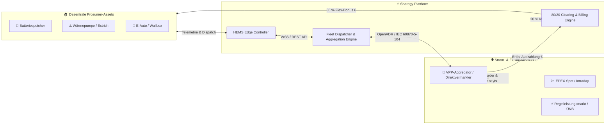
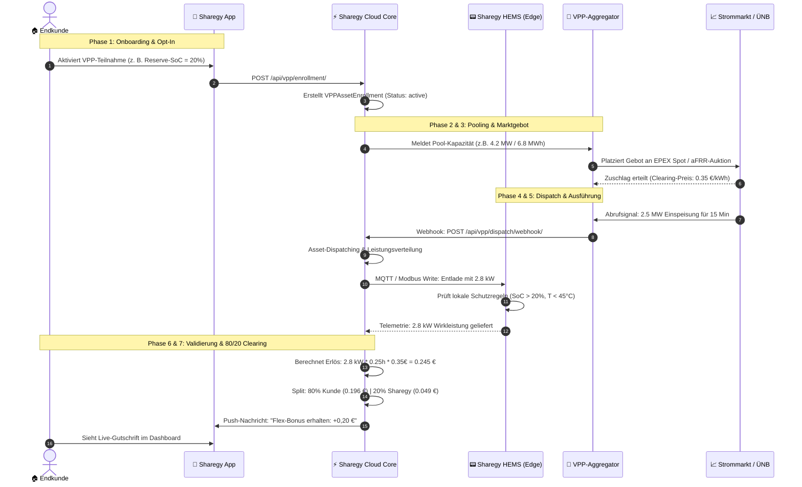
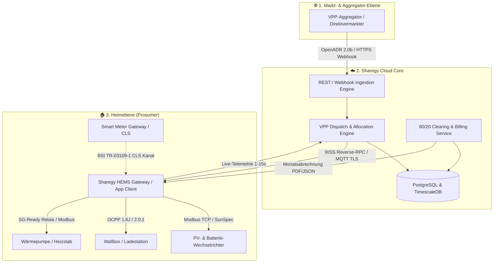
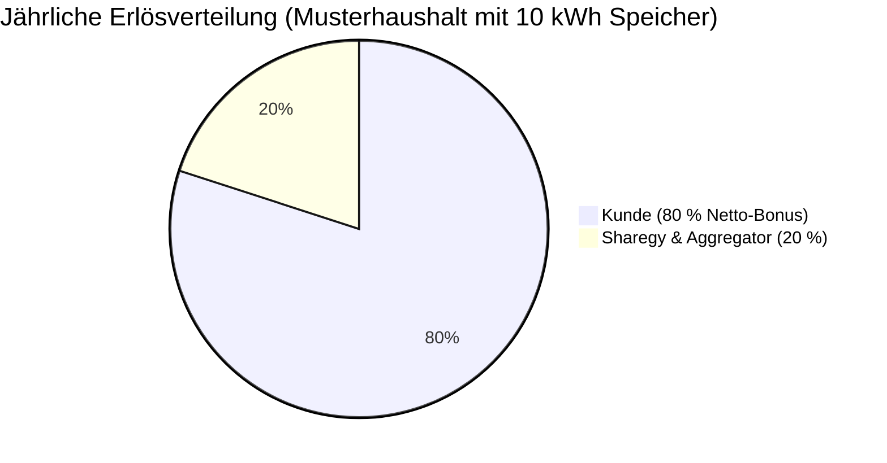

# ⚡ Virtuelles Kraftwerk (VPP) & Flexibilitäts-Bonus: Ökosystem-, Kooperations- & Prozess-Handbuch

**Dokument-Version:** 2.0  
**Stand:** September 2026  
**Zielgruppe:** Management, Produktmanagement, Backend- & DevOps-Engineers, B2B-Partner (Stadtwerke, Installateure, Aggregatoren), Community-Manager & Kundenservice.

---

## 📑 Inhaltsverzeichnis

1. [Executive Summary & Grundprinzip](#1-executive-summary--grundprinzip)
2. [Akteure & Kooperations-Matrix: Wer arbeitet mit wem wo zusammen?](#2-akteure--kooperations-matrix-wer-arbeitet-mit-wem-wo-zusammen)
3. [End-to-End Prozessbeschreibung (Phase 1 bis 7)](#3-end-to-end-prozessbeschreibung-phase-1-bis-7)
4. [Technische Schnittstellen, Kommunikationsprotokolle & Datenflüsse](#4-technische-schnittstellen-kommunikationsprotokolle--datenflüsse)
5. [Regulatorischer & Gesetzlicher Rahmen (EnWG, BNetzA, MaKo)](#5-regulatorischer--gesetzlicher-rahmen-enwg-bnetza-mako)
6. [Wirtschaftlichkeit, 80/20 Erlös-Split & Rechenbeispiele](#6-wirtschaftlichkeit-8020-erlös-split--rechenbeispiele)
7. [Kunden-Erlebnis, Dashboard & App-Bedienung](#7-kunden-erlebnis-dashboard--app-bedienung)
8. [Monitoring, SLA-Sicherheit & Notfall-Konzepte](#8-monitoring-sla-sicherheit--notfall-konzepte)

---

## 1. Executive Summary & Grundprinzip

### 1.1 Was ist der Sharegy Flexibilitäts-Bonus?
Moderne Haushalte und Gewerbebetriebe besitzen wertvolle energetische Flexibilitäten: **Batteriespeicher, bidirektionale Elektrofahrzeuge (V2G/V2H), modulierende Wärmepumpen (SG-Ready/Modbus) und Brauchwasserwärmepumpen (BWWP)**. Im normalen Alltag stehen diese Speicherkapazitäten viele Stunden des Tages ungenutzt oder vollgeladen im Keller.

Der **Sharegy Flexibilitäts-Bonus** schließt die Brücke zwischen dem dezentralen Prosumer und den lukrativen Großhandels- und Regelenergiemärkten:
1. **Bündelung (Pooling):** Tausende private Heimspeicher und Lasten werden digital zu einem **Virtuellen Großkraftwerk (Virtual Power Plant, VPP)** zusammengeschaltet.
2. **Monetarisierung am Strommarkt:** Bei extremen Strompreisschwankungen (z. B. Negativpreise bei Windspitzen oder Preisspitzen bei Dunkelflauten) sowie bei Frequenzschwankungen im Übertragungsnetz (Regelleistung aFRR/mFRR/FCR) stellt der Pool sekundenschnell Leistung bereit.
3. **Transparenter 80/20 Erlös-Split:** Der erwirtschaftete Erlös wird automatisch abgerechnet: **80 % erhält der Kunde als direkte Gutschrift / Bonus**, **20 % verbleiben bei Sharegy und dem Vermarktungspartner** für Plattformbetrieb, Algorithmen und Marktzugang.

---

## 2. Akteure & Kooperations-Matrix: Wer arbeitet mit wem wo zusammen?

Der Betrieb eines Virtuellen Kraftwerks erfordert ein reibungsloses Zusammenspiel von 7 Hauptakteuren aus Energiewirtschaft, IT und Endkundenbereich:

| Nr. | Akteur / Organisation | Rolle & Hauptaufgabe | Vertragliche / Technische Verbindung zu |
| :--- | :--- | :--- | :--- |
| **1** | **Endkunde (Prosumer)** | Stellt die Hardware (Speicher, Wallbox, WP) bereit, definiert die Mindestreserve (z. B. 20 % SoC nie unterschreiten) und kassiert 80 % des Erlöses. | • **Sharegy App & AGB** (Opt-In Vertrag) • **Installateur** (Hardware-Installation) |
| **2** | **Sharegy (Plattform & HEMS)** | Erfasst Live-Telemetrie, berechnet Pool-Kapazitäten, verteilt Dispatch-Befehle zielgerichtet, schützt Heimanlagen und rechnet monatlich auf Cent-Ebene ab. | • **Endkunde** (Software-Bereitstellung) • **VPP-Aggregator** (B2B API-Schnittstelle) • **Messstellenbetreiber** (Sub-Metering Daten) |
| **3** | **VPP-Aggregator / Vermarkter** *(z. B. Next Kraftwerke, Sonnen, Entrix, tiko)* | Besitzt die Börsen- und Regelenergie-Zulassungen (aFRR/mFRR/EPEX), platziert Gebote und schickt aggregierte Abruf-Signale an Sharegy. | • **Sharegy** (Rahmenvertrag Flexibilitätsvermarktung) • **Übertragungsnetzbetreiber (ÜNB)** • **Strombörsen (EPEX Spot / EEX)** |
| **4** | **Übertragungsnetzbetreiber (ÜNB)** *(TenneT, 50Hertz, Amprion, TransnetBW)* | Verantwortlich für Frequenzstabilität (50 Hz) im deutschen Höchstspannungsnetz; kauft Regelenergie (FCR, aFRR, mFRR) ein. | • **VPP-Aggregator** (Präqualifikation & Abruf) |
| **5** | **Verteilnetzbetreiber (VNB)** | Lokales Stromnetz vor Ort; schützt Ortsnetztrafos vor Überlastung (§ 14a EnWG, Redispatch 2.0). | • **Endkunde / Elektriker** (Netzanschluss) • **Messstellenbetreiber (MSB)** |
| **6** | **Messstellenbetreiber (gMSB/wMSB)** | Installiert Smart Meter Gateways (SMGW), moderne Messeinrichtungen (mME) und CLS-Steuerboxen nach BSI TR-03109-1. | • **Endkunde** (Messvertrag) • **Verteilnetzbetreiber (VNB)** |
| **7** | **Installateur / Stadtwerk / B2B-Partner** | Berät den Kunden vor Ort, installiert Wechselrichter/Speicher und bindet die Anlage via Sharegy Partner-Portal ein. | • **Endkunde** (Kauf- & Wartungsvertrag) • **Sharegy** (Partner-/Whitelabel-Vertrag) |

---

## 3. End-to-End Prozessbeschreibung (Phase 1 bis 7)

### Phase 1: Onboarding, Asset-Audit & Opt-In
* **Geräte-Erkennung:** Das System erkennt kompatible Batteriespeicher (z. B. SMA, Fronius, Sungrow, Growatt, Sigenergy, SolarEdge, Tesla Powerwall), Wallboxen (OCPP 1.6/2.0.1, Easee, go-e, Keba) und Wärmepumpen (SG-Ready, Modbus TCP).
* **Kunden-Opt-In:** Der Nutzer aktiviert in der Sharegy App mit einem Klick den *„Flexibilitäts-Bonus“*.
* **Autonomie-Garantie:** Der Nutzer wählt seinen persönlichen **Reserve-SoC Schieberegler** (z. B. 20 % oder 30 %). Das HEMS garantiert, dass der Speicher für den Hausbedarf niemals unter diese Schwelle für VPP-Zwecke entladen wird.

### Phase 2: Präqualifikation & Virtuelle Pool-Bildung
* **Kapazitäts-Aggregation:** Die Sharegy Cloud aggregiert im 1-Minuten-Takt die verfügbare Regelkapazität aller eingeschriebenen Geräte:
  $$P_{\text{pool, pos}} = \sum \min(P_{\text{max\_dis}}, P_{\text{inv}}) \quad \text{für } \text{SoC} > \text{SoC}_{\text{reserve}}$$
  $$P_{\text{pool, neg}} = \sum \min(P_{\text{max\_chg}}, P_{\text{inv}}) \quad \text{für } \text{SoC} < \text{SoC}_{\text{max}}$$
* **Pool-Meldung:** Die aggregierte Leistung (z. B. 5,4 MW Regelleistung) wird verschlüsselt an den lizenzierten VPP-Aggregator gemeldet.

### Phase 3: Markt-Bidding & Fahrplan-Anmeldung
* **Markt-Platzierung:** Der Aggregator bietet die Leistung auf den Day-Ahead-, Intraday- oder Regelleistungsmärkten (aFRR/mFRR) an.
* **Fahrplan-Quittierung:** Nach Zuschlagserteilung wird der Fahrplan beim Bilanzkreisverantwortlichen (BKV) eingebucht.

### Phase 4: Echtzeit-Dispatch & Signal-Kaskade
* **Eintreffen des Dispatch-Befehls:** Bei Marktbedarf sendet der Aggregator ein Abrufsignal an den Sharegy Webhook-Endpunkt (`/api/vpp/dispatch/webhook/`).
* **Intelligente Asset-Verteilung (Dispatching):** Sharegy berechnet in $< 500\,\text{ms}$, welche Speicher am besten geeignet sind (höchster SoC, geringste Zelltemperatur, kürzeste Zykluszahl) und teilt den Gesamtabruf auf die Einzelgeräte auf.

### Phase 5: Lokale Ausführung & Hardware-Schutz
* **HEMS-Kommando:** Das HEMS sendet den Steuerbefehl via lokalem MQTT, Modbus TCP oder Cloud-RPC an den Batterie-Wechselrichter.
* **Safety First:** Sollte die Hauslast plötzlich ansteigen (z. B. Herd oder Durchlauferhitzer schaltet ein) oder die Batterietemperatur steigen, drosselt das lokale HEMS den VPP-Abruf sofort prioritär zugunsten der Haussicherheit.

### Phase 6: Telemetrie & 15-Minuten-Messwert-Validierung
* **Live-Quittierung:** Während des Abrufs sendet das Gerät alle 5 bis 15 Sekunden hochauflösende Telemetriedaten (`VPPDispatchTelemetry`: Wirkleistung $P$, Spannung $U$, Frequenz $f$, Batteriestand $\text{SoC}$).
* **Erbringungsnachweis:** Die Daten werden manipulationssicher mit Zeitstempeln versehen und mit den 15-Minuten-Intervallwerten des Zählers abgeglichen.

### Phase 7: Automatisches 80/20 Market Clearing & Auszahlung
* **Finanzielle Abrechnung:** Für jedes Dispatch-Event wird der Bruttoerlös berechnet:
  $$\text{Erlös}_{\text{gross}} = \text{Gelieferte Energie } (E_{\text{kwh}}) \times \text{Marktprämie } (P_{\text{market}})$$
* **80/20 Split:**
  * **80 %** fließen direkt auf das virtuelle Guthabenkonto des Kunden (`VPPClearingStatement`).
  * **20 %** decken Plattformbetrieb, Softwareentwicklung und Aggregator-Gebühren.
* **Auszahlung:** Das Guthaben wird wahlweise monatlich per SEPA-Überweisung ausgezahlt oder mit der Stromrechnung/Community-Gebühr verrechnet.

---

## 4. Technische Schnittstellen, Kommunikationsprotokolle & Datenflüsse

### Unterstützte Schnittstellen & Standards:
1. **OpenADR 2.0b (Open Automated Demand Response):** Standard für automatisierte Laststeuerung zwischen Aggregator und Sharegy.
2. **IEC 60870-5-104 & IEC 61850:** Fernwirkprotokolle für hochzuverlässige Anbindung an Leitwarten der Netzbetreiber.
3. **Modbus TCP / SunSpec / RTU:** Lokale Direktsteuerung von Wechselrichtern (SMA Speedwire, Fronius Solar API / Modbus, Sungrow WiNet-S, SolarEdge Modbus Multi-Unit).
4. **OCPP 1.6-J & OCPP 2.0.1 / ISO 15118-20:** Intelligentes Lademanagement und bidirektionales Entladen (V2G) für Elektrofahrzeuge.
5. **EEBUS (SPINE & SHIP):** Offizieller deutscher BNetzA-Standard zur Ansteuerung von steuerbaren Verbrauchseinrichtungen (§ 14a EnWG).
6. **BSI TR-03109-1 (CLS-Kanal):** Anbindung an Smart Meter Gateways (SMGW) über die Controllable-Local-System-Schnittstelle.

---

## 5. Regulatorischer & Gesetzlicher Rahmen (EnWG, BNetzA, MaKo)

### 5.1 § 14a EnWG (Steuerbare Verbrauchseinrichtungen - SteuVE)
Seit dem 1. Januar 2024 müssen Neuanlagen (Wallboxen $> 4{,}2\,\text{kW}$, Wärmepumpen $> 4{,}2\,\text{kW}$, Batteriespeicher mit Netzbezug $> 4{,}2\,\text{kW}$) netzdienlich steuerbar sein.
* **Vorteil für den Kunden:** Erhält im Gegenzug eine garantierte **Netzentgeltreduzierung (Modul 1: ca. 120–180 €/Jahr pauschal** oder **Modul 2: prozentuale Reduktion des Arbeitspreises um bis zu 60 %)**.
* **Sharegy EMS-Lösung:** Statt harter Drosselung durch den Netzbetreiber fängt das Sharegy HEMS das Dimm-Signal auf und steuert die Geräte dynamisch an (z. B. Autoladung wird durch Batteriespeicher oder PV kompensiert, ohne dass der Kunde Komfort einbüßt).

### 5.2 Redispatch 2.0 & Regelenergie-Märkte
* **Abgrenzung:** Während Redispatch 2.0 ein gesetzlicher Zwangseingriff des Netzbetreibers bei Netzengpässen ist, erfolgt die VPP-Teilnahme über Sharegy **vollkommen freiwillig und marktbasiert** zu Spitzenpreisen.
* **Präqualifikation:** Kleinspeicher werden aggregiert im Pool präqualifiziert. Für den Endkunden entfällt jeglicher bürokratische Aufwand.

### 5.3 MaKo 2026 / EDIFACT / Bilanzkreisabrechnung
* Die erbrachte Flexibilität wird bilanziell neutral gehalten, sodass weder der Energieversorger des Kunden noch der Verteilnetzbetreiber fehlerhafte Ausgleichsenergie abrechnen.
* Sharegy unterstützt den Datenaustausch via Zählpunkt-Clearing und standardisierten 15-Minuten-Lastprofilen (RLM/iMSys).

---

## 6. Wirtschaftlichkeit, 80/20 Erlös-Split & Rechenbeispiele

### 6.1 Die mathematische Abrechnung
Für jedes Dispatch-Event $i$ mit einer Dauer von $t$ Minuten:

$$\text{Gelieferte Energie } E_{\text{kwh}} = P_{\text{avg}} \, [\text{kW}] \times \frac{t \, [\text{min}]}{60}$$

$$\text{Brutto-Erlös } R_{\text{gross}} = E_{\text{kwh}} \times \text{Marktprämie } [\text{€/kWh}]$$

$$\mathbf{\text{Kunden-Bonus (80 \%)}} = R_{\text{gross}} \times 0{,}80$$

$$\mathbf{\text{Sharegy / Aggregator Fee (20 \%)}} = R_{\text{gross}} \times 0{,}20$$

---

### 6.2 Praxis-Rechenbeispiele für verschiedene Anlagentypen

#### 📊 Fallbeispiel 1: Einfamilienhaus (Standard-Prosumer)
* **Ausstattung:** 10 kWp PV-Anlage, 10 kWh Heimspeicher (5 kW Lade-/Entladeleistung), 11 kW Wallbox.
* **Teilnahme-Parameter:** Reserve-SoC = 20 % (8 kWh nutzbare Flexibilität).
* **Durchschnittliche Abrufe:** ~120 netzdienliche Abrufe & Arbitrage-Zyklen pro Jahr (ca. 45–60 Min Dauer).
* **Durchschnittliche Marktprämie:** 0,32 €/kWh.
* **Ergebnis pro Jahr:**
  * **Brutto-Erlös des Pools:** $120 \times 4\,\text{kWh} \times 0{,}32\,\text{€} = \mathbf{153{,}60\,\text{€}}$
  * **Intraday-Arbitrage & Negativpreis-Ladung:** $+156{,}40\,\text{€}$
  * **Gesamterlös:** $310{,}00\,\text{€}$
  * **👉 80 % Kunden-Auszahlung:** $\mathbf{248{,}00\,\text{€ / Jahr}}$ (steuerfrei als private Einnahme unterhalb der Freigrenzen).
  * **👉 20 % Plattform-Erlös:** $62{,}00\,\text{€ / Jahr}$.

---

#### 🏢 Fallbeispiel 2: Mehrfamilienhaus / WEG mit Mieterstrom
* **Ausstattung:** 60 kWp PV-Anlage, 45 kWh Batteriespeicher (25 kW Umrichter), 6 Ladepunkte, gemeinsame Wärmepumpe.
* **Teilnahme-Parameter:** Reserve-SoC = 25 % (ca. 34 kWh nutzbare Flexibilität).
* **Ergebnis pro Jahr:**
  * **Gesamterlös des Pools:** $\mathbf{1.850{,}00\,\text{€ / Jahr}}$
  * **👉 80 % WEG-Gemeinschaftskasse:** $\mathbf{1.480{,}00\,\text{€ / Jahr}}$ (senkt Nebenkosten für alle Bewohner direkt).
  * **👉 20 % Sharegy Fee:** $370{,}00\,\text{€ / Jahr}$.

---

#### 🚜 Fallbeispiel 3: Gewerbebetrieb / Landwirtschaft
* **Ausstattung:** 150 kWp PV-Anlage, 100 kWh Gewerbespeicher (50 kW Leistung).
* **Ergebnis pro Jahr:**
  * **Gesamterlös des Pools:** $\mathbf{4.200{,}00\,\text{€ / Jahr}}$
  * **👉 80 % Gewerbe-Bonus:** $\mathbf{3.360{,}00\,\text{€ / Jahr}}$.
  * **👉 20 % Sharegy Fee:** $840{,}00\,\text{€ / Jahr}$.

---

## 7. Kunden-Erlebnis, Dashboard & App-Bedienung

### 7.1 Was sieht der Nutzer in der App?
In der Sharegy App (unter **„Energie“ ➔ „VPP Flexibilitäts-Bonus“**) steht die Komponente [`VppCustomerParticipationCard.jsx`](file:///c:/Users/Public/Dev/sharegy/frontend/src/features/energy/components/VppCustomerParticipationCard.jsx) zur Verfügung:

1. **Live-Status Badge:**
   * 🟢 *„Aktiv im Pool (80 % Erlös-Split)“* – Anlage ist betriebsbereit und präqualifiziert.
   * 🟡 *„Standby / Reserve aktiv“* – Speicherladung liegt unterhalb der eingestellten Reservegrenze.
   * ⚡ *„Live Dispatch aktiv“* – Speicher speist aktuell vergütet ins Netz ein oder lädt günstige Überschussenergie.
2. **Einnahmen-KPIs:**
   * **Bisher verdient:** Echtzeit-Guthaben in € (z. B. `184,50 €`).
   * **Prognose laufendes Jahr:** Hochrechnung basierend auf Marktvolatilität (z. B. `240–310 €`).
   * **Anzahl Abrufe:** Zähler aller erfolgreichen Events (z. B. `48 Abrufe`).
   * **Netzentlastung / CO₂ vermieden:** Umweltbeitrag in kg CO₂.
3. **Interaktiver Reserve-SoC Schieberegler:**
   * Der Nutzer kann jederzeit stufenlos festlegen, wie viel % der Batterie ausschließlich für das eigene Haus reserviert bleiben (z. B. 20 %).
4. **Transparente Historie & PDF-Monatsabrechnungen:**
   * Jeder einzelne Abruf ist mit Datum, Dauer, gelieferter Leistung und Cent-Vergütung aufgeführt.
   * Monatliche PDF-Abrechnung zum Download für die Steuerunterlagen.

---

## 8. Monitoring, SLA-Sicherheit & Notfall-Konzepte

### 8.1 Sicherheits- und Schutzlogiken
* **Eigenverbrauchs-Vorrang:** Der Eigenbedarf des Haushalts hat im HEMS stets **absolute Priorität vor VPP-Befehlen**.
* **Zellschonung & Batterielebensdauer:** Es gelten feste Grenzwerte für Lade-/Entladeraten (max. 0,5C–1C) und Zelltemperaturen ($10^\circ\text{C} \le T \le 45^\circ\text{C}$). Der VPP-Einsatz reduziert die kalendarische Alterung durch Vermeidung langer Vollladestände bei 100 % SoC.
* **Offline-Sicherheit (Watchdog):** Erhält das HEMS bei einem laufenden Dispatch länger als 60 Sekunden kein Keep-Alive Signal aus der Cloud, schaltet es automatisch in den sicheren Standard-Eigenverbrauchsmodus zurück.
* **Manueller Override:** Der Nutzer kann die VPP-Teilnahme mit einem Klick in der App sofort pausieren oder beenden.

---

## 9. Fazit & strategischer Ausblick

Der **Sharegy Flexibilitäts-Bonus** transformiert passive Heimspeicher in eine aktive Einnahmequelle für den Bürger und bildet das Fundament für die Energiewende:
* **Für den Bürger:** Bis zu **250–350 €/Jahr Zusatzeinnahmen** ohne Komfortverlust.
* **Für das Stromnetz:** Grüne Frequenzstabilität ohne fossile Gaskraftwerke.
* **Für Sharegy & Partner:** Skalierbare Software-Marge (20 %) und maximale Kundenbindung.
