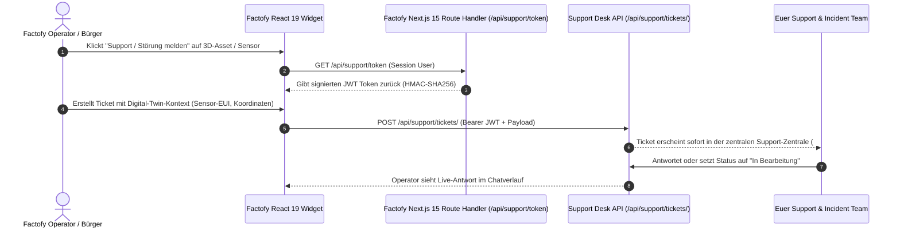

# 🏙️ Factofy Integration Guide: Universal Helpdesk & Ticket System

**Projekt**: Factofy (Digital Twin & Smart City Platform)  
**Stack**: Next.js 15 (App Router), React 19, TypeScript 5.7+, Lucide-React, PostgreSQL  
**Zweck**: Nahtlose, serverlose Anbindung von Factofy an das zentrale Support- & Incident-System ohne zusätzliche Datenbank oder Django-Backend in Factofy.

---

## 🏛️ Architektur-Überblick

Das Support- & Incident-Backend läuft zentral auf dem Sharegy/HEMS-Host. Factofy bindet den Support über eine **stateless JWT-Authentifizierung** und eine **autarke React 19 Komponente (`FactofySupportWidget.tsx`)** ein:



---

## ⚙️ Schritt 1: Umgebungsvariablen in Factofy (`.env.local`)

Füge in Factofy (`.env.local` bzw. `.env.production`) folgende Variablen hinzu:

```bash
# URL zum zentralen Support-API-Endpunkt
NEXT_PUBLIC_SUPPORT_API_URL="https://api.sharegy.de/api/support"
# Für lokale Entwicklung:
# NEXT_PUBLIC_SUPPORT_API_URL="http://localhost:8000/api/support"

# Projekt-Schlüssel für Factofy
NEXT_PUBLIC_SUPPORT_PROJECT_KEY="factofy"

# Gemeinsames Secret zur JWT-Signierung (muss mit SupportProjectConfig.secret_key übereinstimmen)
SUPPORT_SHARED_SECRET="factofy-shared-secret-key-2026"
```

---

## 🔑 Schritt 2: Next.js 15 Token-Route Handler anlegen

Erstelle in Factofy die Datei `app/api/support/token/route.ts`:

```typescript
// app/api/support/token/route.ts
import { NextResponse } from "next/server";
import crypto from "crypto";

function base64url(input: Buffer | string): string {
  const buf = typeof input === "string" ? Buffer.from(input, "utf-8") : input;
  return buf.toString("base64").replace(/=/g, "").replace(/\+/g, "-").replace(/\//g, "_");
}

export async function GET(request: Request) {
  try {
    // 1. Hole den aktuell eingeloggten Factofy-Nutzer aus eurer Session / Auth
    // Beispiel: const session = await getFactofySession(request);
    // Hier als Fallback/Demo-Payload:
    const user = {
      id: "fact_usr_8821",
      email: "operator@stadtwerke-digital.de",
      name: "Klaus Operator",
      tenant: "stadt_nord",
    };

    const projectKey = process.env.NEXT_PUBLIC_SUPPORT_PROJECT_KEY || "factofy";
    const secret = process.env.SUPPORT_SHARED_SECRET || "factofy-shared-secret-key-2026";

    // 2. JWT Header & Payload erzeugen
    const header = { alg: "HS256", typ: "JWT" };
    const now = Math.floor(Date.now() / 1000);
    const payload = {
      iss: `support-hub-${projectKey}`,
      project: projectKey,
      sub: user.id,
      email: user.email,
      name: user.name,
      tenant: user.tenant,
      iat: now,
      exp: now + 86400 * 7, // 7 Tage gültig
    };

    const encodedHeader = base64url(JSON.stringify(header));
    const encodedPayload = base64url(JSON.stringify(payload));
    const signingInput = `${encodedHeader}.${encodedPayload}`;

    const signature = crypto
      .createHmac("sha256", secret)
      .update(signingInput)
      .digest();
    const encodedSignature = base64url(signature);

    const token = `${signingInput}.${encodedSignature}`;

    return NextResponse.json({ token, user });
  } catch (error: any) {
    return NextResponse.json(
      { error: "Token generation failed", details: error.message },
      { status: 500 }
    );
  }
}
```

---

## 🎨 Schritt 3: React 19 / TypeScript Komponente (`FactofySupportWidget.tsx`)

Kopiere diese autarke TypeScript-Komponente nach `components/FactofySupportWidget.tsx` in Factofy. Sie nutzt direkt `lucide-react`, welches bereits in Factofy installiert ist:

```tsx
// components/FactofySupportWidget.tsx
"use client";

import React, { useState, useEffect, useRef } from "react";
import {
  LifeBuoy,
  X,
  PlusCircle,
  Inbox,
  Send,
  Paperclip,
  CheckCircle2,
  AlertTriangle,
  ShieldAlert,
  FileText,
  Download,
  RefreshCw,
  User,
  Bot,
  Layers,
  MapPin,
} from "lucide-react";

interface SupportContext {
  buildingId?: string;
  sensorEui?: string;
  coordinates?: [number, number];
  layer?: string;
  gatewayId?: string;
  asset3dId?: string;
  [key: string]: any;
}

interface FactofySupportWidgetProps {
  context?: SupportContext;
  buttonClassName?: string;
}

export default function FactofySupportWidget({
  context = {},
  buttonClassName,
}: FactofySupportWidgetProps) {
  const [isOpen, setIsOpen] = useState(false);
  const [activeTab, setActiveTab] = useState<"new" | "list">("new");
  const [jwtToken, setJwtToken] = useState<string | null>(null);

  // Tickets & Form State
  const [tickets, setTickets] = useState<any[]>([]);
  const [loadingTickets, setLoadingTickets] = useState(false);
  const [selectedTicket, setSelectedTicket] = useState<any | null>(null);

  const [subject, setSubject] = useState("");
  const [category, setCategory] = useState("sensors");
  const [priority, setPriority] = useState("medium");
  const [message, setMessage] = useState("");
  const [files, setFiles] = useState<File[]>([]);
  const [submitting, setSubmitting] = useState(false);
  const [replyText, setReplyText] = useState("");

  const apiBase =
    process.env.NEXT_PUBLIC_SUPPORT_API_URL || "https://api.sharegy.de/api/support";

  // Token abrufen
  useEffect(() => {
    async function fetchToken() {
      try {
        const res = await fetch("/api/support/token");
        const data = await res.json();
        if (data.token) setJwtToken(data.token);
      } catch (err) {
        console.error("Failed to obtain support JWT:", err);
      }
    }
    fetchToken();
  }, []);

  const loadTickets = async () => {
    if (!jwtToken) return;
    setLoadingTickets(true);
    try {
      const res = await fetch(`${apiBase}/tickets/?project_key=factofy`, {
        headers: { Authorization: `Bearer ${jwtToken}` },
      });
      if (res.ok) {
        const data = await res.json();
        setTickets(data);
      }
    } catch (e) {
      console.error("Error loading tickets:", e);
    } finally {
      setLoadingTickets(false);
    }
  };

  useEffect(() => {
    if (isOpen && jwtToken) {
      loadTickets();
    }
  }, [isOpen, jwtToken]);

  const handleCreateTicket = async (e: React.FormEvent) => {
    e.preventDefault();
    if (!subject.trim() || !message.trim() || !jwtToken || submitting) return;

    setSubmitting(true);
    try {
      const formData = new FormData();
      formData.append("project_key", "factofy");
      formData.append("subject", subject.trim());
      formData.append("category", category);
      formData.append("priority", priority);
      formData.append("initial_message", message.trim());
      formData.append("context_payload", JSON.stringify(context));
      files.forEach((f) => formData.append("attachments", f));

      const res = await fetch(`${apiBase}/tickets/`, {
        method: "POST",
        headers: { Authorization: `Bearer ${jwtToken}` },
        body: formData,
      });

      if (!res.ok) throw new Error("Ticket-Erstellung fehlgeschlagen");
      const created = await res.json();

      setSubject("");
      setMessage("");
      setFiles([]);
      setSelectedTicket(created);
      await loadTickets();
    } catch (err: any) {
      alert(err.message);
    } finally {
      setSubmitting(false);
    }
  };

  const handleSendReply = async (e: React.FormEvent) => {
    e.preventDefault();
    if (!replyText.trim() || !selectedTicket || !jwtToken) return;

    try {
      const formData = new FormData();
      formData.append("body", replyText.trim());

      const res = await fetch(`${apiBase}/tickets/${selectedTicket.id}/messages/`, {
        method: "POST",
        headers: { Authorization: `Bearer ${jwtToken}` },
        body: formData,
      });

      if (res.ok) {
        setReplyText("");
        const detailRes = await fetch(`${apiBase}/tickets/${selectedTicket.id}/`, {
          headers: { Authorization: `Bearer ${jwtToken}` },
        });
        if (detailRes.ok) setSelectedTicket(await detailRes.json());
      }
    } catch (e) {
      alert("Fehler beim Antworten");
    }
  };

  return (
    <>
      {/* Floating Trigger Button */}
      <button
        type="button"
        onClick={() => setIsOpen(true)}
        className={
          buttonClassName ||
          "fixed bottom-6 right-6 z-40 flex items-center gap-2 px-4 py-3 bg-blue-600 hover:bg-blue-700 text-white rounded-2xl shadow-xl font-semibold text-sm transition-all hover:scale-105"
        }
      >
        <LifeBuoy className="w-5 h-5" />
        <span>Störung / Support</span>
        {Object.keys(context).length > 0 && (
          <span className="w-2 h-2 rounded-full bg-emerald-400 animate-ping" />
        )}
      </button>

      {/* Drawer */}
      {isOpen && (
        <>
          <div
            onClick={() => setIsOpen(false)}
            className="fixed inset-0 z-50 bg-slate-950/60 backdrop-blur-xs"
          />

          <div className="fixed inset-y-0 right-0 z-50 w-full max-w-md bg-slate-900 border-l border-slate-800 text-slate-100 shadow-2xl flex flex-col">
            {/* Header */}
            <div className="p-4 border-b border-slate-800 flex items-center justify-between bg-slate-950/60">
              <div className="flex items-center gap-2.5">
                <div className="w-8 h-8 rounded-xl bg-blue-600 flex items-center justify-center text-white">
                  <LifeBuoy className="w-4 h-4" />
                </div>
                <div>
                  <h3 className="text-sm font-bold text-white">Factofy Incident Desk</h3>
                  <p className="text-[11px] text-slate-400">Digital Twin & IoT Support</p>
                </div>
              </div>
              <button
                type="button"
                onClick={() => {
                  setIsOpen(false);
                  setSelectedTicket(null);
                }}
                className="p-1.5 text-slate-400 hover:text-white rounded-lg hover:bg-slate-800"
              >
                <X className="w-5 h-5" />
              </button>
            </div>

            {/* Context Badge (Falls auf Gebäude oder Sensor geklickt) */}
            {Object.keys(context).length > 0 && (
              <div className="px-4 py-2 bg-blue-950/40 border-b border-blue-900/40 text-[11px] flex items-center gap-2 text-blue-300">
                <Layers className="w-3.5 h-3.5 shrink-0" />
                <span className="truncate">
                  Kontext aktiv: {context.buildingId && `Gebäude: ${context.buildingId} `}
                  {context.sensorEui && `Sensor: ${context.sensorEui}`}
                </span>
              </div>
            )}

            {/* Sub-view: Ticket Chat Thread */}
            {selectedTicket ? (
              <div className="flex-1 flex flex-col min-h-0">
                <div className="p-3 border-b border-slate-800 bg-slate-950/40 flex items-center justify-between">
                  <button
                    type="button"
                    onClick={() => setSelectedTicket(null)}
                    className="text-xs text-blue-400 hover:underline font-semibold"
                  >
                    ← Zurück zur Übersicht
                  </button>
                  <span className="font-mono text-xs px-2 py-0.5 rounded bg-blue-950 text-blue-300 font-bold">
                    #{selectedTicket.ticket_number}
                  </span>
                </div>

                <div className="flex-1 overflow-y-auto p-4 space-y-3">
                  <h4 className="text-xs font-bold text-white mb-2">{selectedTicket.subject}</h4>
                  {selectedTicket.messages?.map((m: any) => (
                    <div
                      key={m.id}
                      className={`p-3 rounded-xl text-xs leading-relaxed ${
                        m.is_staff_reply
                          ? "bg-slate-800 border border-slate-700 text-white ml-4"
                          : "bg-blue-600 text-white mr-4"
                      }`}
                    >
                      <div className="flex justify-between text-[10px] opacity-75 mb-1">
                        <span>{m.sender_name}</span>
                        <span>{new Date(m.created_at).toLocaleTimeString("de-DE", { hour: "2-digit", minute: "2-digit" })}</span>
                      </div>
                      <p className="whitespace-pre-wrap">{m.body}</p>
                    </div>
                  ))}
                </div>

                <form onSubmit={handleSendReply} className="p-3 border-t border-slate-800 flex gap-2">
                  <input
                    type="text"
                    value={replyText}
                    onChange={(e) => setReplyText(e.target.value)}
                    placeholder="Nachricht schreiben..."
                    className="flex-1 px-3 py-2 text-xs rounded-xl bg-slate-800 border border-slate-700 text-white focus:outline-none focus:ring-2 focus:ring-blue-500"
                  />
                  <button
                    type="submit"
                    className="px-3.5 py-2 bg-blue-600 hover:bg-blue-700 text-white rounded-xl text-xs font-bold"
                  >
                    <Send className="w-4 h-4" />
                  </button>
                </form>
              </div>
            ) : (
              /* Sub-view: Tabs (New Ticket vs List) */
              <>
                <div className="flex border-b border-slate-800 px-4 pt-2 gap-2 bg-slate-950/30">
                  <button
                    type="button"
                    onClick={() => setActiveTab("new")}
                    className={`pb-2 px-3 text-xs font-bold border-b-2 flex items-center gap-1.5 ${
                      activeTab === "new"
                        ? "border-blue-500 text-blue-400"
                        : "border-transparent text-slate-400 hover:text-slate-200"
                    }`}
                  >
                    <PlusCircle className="w-3.5 h-3.5" />
                    Störung melden
                  </button>
                  <button
                    type="button"
                    onClick={() => {
                      setActiveTab("list");
                      loadTickets();
                    }}
                    className={`pb-2 px-3 text-xs font-bold border-b-2 flex items-center gap-1.5 ${
                      activeTab === "list"
                        ? "border-blue-500 text-blue-400"
                        : "border-transparent text-slate-400 hover:text-slate-200"
                    }`}
                  >
                    <Inbox className="w-3.5 h-3.5" />
                    Meine Meldungen ({tickets.length})
                  </button>
                </div>

                <div className="flex-1 overflow-y-auto p-4">
                  {activeTab === "new" ? (
                    <form onSubmit={handleCreateTicket} className="space-y-3.5">
                      <div>
                        <label className="block text-xs font-semibold text-slate-300 mb-1">
                          Betreff / Problem *
                        </label>
                        <input
                          type="text"
                          value={subject}
                          onChange={(e) => setSubject(e.target.value)}
                          placeholder="z. B. LoRaWAN Sensor Node 4B ohne Signal"
                          required
                          className="w-full px-3 py-2 text-xs rounded-xl bg-slate-800 border border-slate-700 text-white focus:ring-2 focus:ring-blue-500"
                        />
                      </div>

                      <div className="grid grid-cols-2 gap-3">
                        <div>
                          <label className="block text-xs font-semibold text-slate-300 mb-1">
                            Bereich
                          </label>
                          <select
                            value={category}
                            onChange={(e) => setCategory(e.target.value)}
                            className="w-full px-2.5 py-2 text-xs rounded-xl bg-slate-800 border border-slate-700 text-white"
                          >
                            <option value="sensors">📡 Sensorik & Nodes</option>
                            <option value="3d_mesh">🏢 3D / BIM Modell</option>
                            <option value="lorawan">📶 LoRaWAN Gateway</option>
                            <option value="gis_map">🗺️ GIS & Kartenlayer</option>
                            <option value="general">💬 Allgemein</option>
                          </select>
                        </div>

                        <div>
                          <label className="block text-xs font-semibold text-slate-300 mb-1">
                            Dringlichkeit
                          </label>
                          <select
                            value={priority}
                            onChange={(e) => setPriority(e.target.value)}
                            className="w-full px-2.5 py-2 text-xs rounded-xl bg-slate-800 border border-slate-700 text-white"
                          >
                            <option value="low">Niedrig</option>
                            <option value="medium">Normal</option>
                            <option value="high">Hoch</option>
                            <option value="urgent">Kritisch (Ausfall)</option>
                          </select>
                        </div>
                      </div>

                      <div>
                        <label className="block text-xs font-semibold text-slate-300 mb-1">
                          Beschreibung *
                        </label>
                        <textarea
                          value={message}
                          onChange={(e) => setMessage(e.target.value)}
                          rows={4}
                          placeholder="Beschreibe die Störung möglichst genau..."
                          required
                          className="w-full px-3 py-2 text-xs rounded-xl bg-slate-800 border border-slate-700 text-white focus:ring-2 focus:ring-blue-500"
                        />
                      </div>

                      <button
                        type="submit"
                        disabled={submitting || !subject.trim() || !message.trim()}
                        className="w-full py-2.5 bg-blue-600 hover:bg-blue-700 text-white rounded-xl text-xs font-bold transition-all shadow-md flex items-center justify-center gap-1.5"
                      >
                        {submitting ? <RefreshCw className="w-4 h-4 animate-spin" /> : <Send className="w-4 h-4" />}
                        <span>Ticket absenden</span>
                      </button>
                    </form>
                  ) : (
                    <div className="space-y-2.5">
                      {loadingTickets ? (
                        <div className="p-8 text-center text-xs text-slate-500">
                          <RefreshCw className="w-5 h-5 animate-spin mx-auto mb-2 text-blue-500" />
                          Lade Meldungen...
                        </div>
                      ) : tickets.length === 0 ? (
                        <div className="p-8 text-center text-xs text-slate-500">
                          Keine Tickets vorhanden.
                        </div>
                      ) : (
                        tickets.map((t) => (
                          <div
                            key={t.id}
                            onClick={async () => {
                              const res = await fetch(`${apiBase}/tickets/${t.id}/`, {
                                headers: { Authorization: `Bearer ${jwtToken}` },
                              });
                              if (res.ok) setSelectedTicket(await res.json());
                            }}
                            className="p-3 rounded-xl bg-slate-800/80 border border-slate-700 hover:border-blue-500 transition-all cursor-pointer"
                          >
                            <div className="flex justify-between items-center mb-1">
                              <span className="font-mono text-[10px] text-blue-400 font-bold">
                                #{t.ticket_number}
                              </span>
                              <span className="text-[10px] font-semibold px-2 py-0.5 rounded-full bg-slate-700 text-slate-300">
                                {t.status_display}
                              </span>
                            </div>
                            <h4 className="text-xs font-bold text-white truncate">{t.subject}</h4>
                          </div>
                        ))
                      )}
                    </div>
                  )}
                </div>
              </>
            )}
          </div>
        </>
      )}
    </>
  );
}
```

---

## 🚀 Schritt 4: Einbindung im Factofy 3D-Viewer / Dashboard

In Factofy bindest du das Widget einfach in dein Layout oder deine 3D-Ansicht ein und übergibst das aktuell fokussierte Asset:

```tsx
// In Factofy (z. B. app/dashboard/page.tsx oder components/City3DViewer.tsx)
import FactofySupportWidget from "@/components/FactofySupportWidget";

export default function CityDashboardPage() {
  const selectedBuildingId = "BLD-402";
  const selectedSensorEui = "0004A30B001F1234";

  return (
    <div className="relative w-full h-screen">
      <Your3DMapViewer />

      {/* Das Support-Widget sendet automatisch den aktiven 3D-/Sensor-Kontext mit */}
      <FactofySupportWidget
        context={{
          buildingId: selectedBuildingId,
          sensorEui: selectedSensorEui,
          coordinates: [50.9375, 6.9603],
          layer: "flood_level",
        }}
      />
    </div>
  );
}
```

Fertig! Alle in Factofy erstellten Tickets landen mit Präfix `#FACT-2026-XXXX` und den 3D-Metadaten direkt in eurem zentralen Agent-Dashboard.

