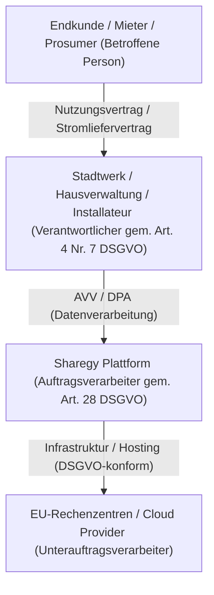
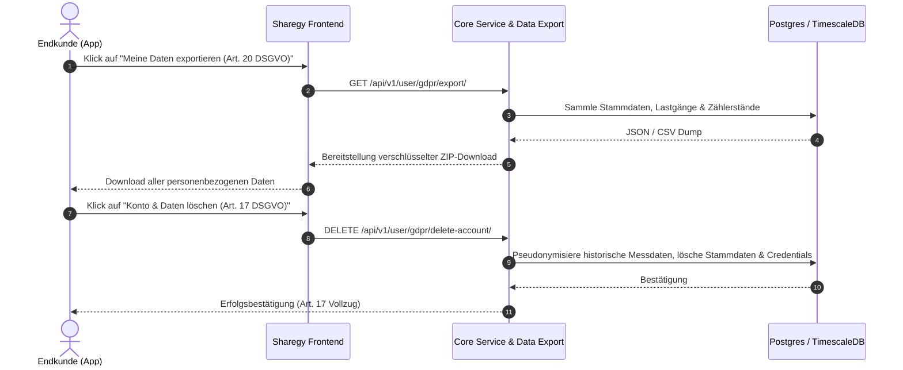

# 🛡️ DSGVO & Datenschutz-Konzept (GDPR Compliance)

**Sharegy Multi-Tenant EMS & VPP Plattform**  
*Stand: 12. September 2026 | Version: 5.3 (Production Ready / B2B-konform)*

---

## 1. Executive Summary & Zielsetzung

Die Sharegy-Plattform verarbeitet energetische Messdaten, Verbrauchs- und Einspeisedaten sowie Abrechnungsinformationen von Privat- und Gewerbekunden im Rahmen von:
1. **Home Energy Management (HEMS)**: PV-Überschuss, Speicher- und Wallbox-Steuerung.
2. **Mieterstrom- und Energy-Sharing (§ 42b EnWG)**: 15-Minuten-Lastgangmessung und Kostenverteilung.
3. **B2B Whitelabel & Partner-Betrieb**: Stadtwerke, Hausverwaltungen und Installateure.

Da hochfrequente Energieverbrauchsdaten (z. B. 15-Sekunden-Leistungswerte oder 15-Minuten-Zählerstände) Rückschlüsse auf Lebensgewohnheiten zulassen können, unterliegen sie den strengen Anforderungen der **EU-Datenschutz-Grundverordnung (DSGVO / GDPR)** sowie des **Messstellenbetriebsgesetzes (MsbG)**.

Dieses Dokument beschreibt die implementierten **Technischen und Organisatorischen Maßnahmen (TOMs)** gemäß Art. 32 DSGVO und dient Partnern als Grundlage für den **Auftragsverarbeitungsvertrag (AVV / DPA nach Art. 28 DSGVO)**.

---

## 2. Rollenverteilung nach DSGVO

* **Betroffene Person (Art. 4 Nr. 1)**: Endkunde, Mieter, Anlagenbetreiber.
* **Verantwortlicher (Art. 4 Nr. 7)**: Das lizenznehmende Stadtwerk, die Wohnungsbaugesellschaft oder der Installateurbetrieb.
* **Auftragsverarbeiter (Art. 28)**: Sharegy bzw. der Betreiber der Software-Instanz.
* **Unterauftragsverarbeiter (Art. 28 Abs. 4)**: Ausschließlich nach ISO 27001 zertifizierte Rechenzentren mit Standort innerhalb der Europäischen Union (z. B. Frankfurt am Main / Deutschland).

---

## 3. Datenkategorien & Verarbeitungszwecke

| Datenkategorie | Konkrete Datenpunkte | Rechtsgrundlage (DSGVO) | Speicherfrist & Löschkonzept |
| :--- | :--- | :--- | :--- |
| **Stammdaten** | Name, E-Mail, Anschrift, Zählpunktbezeichnung (MaLo-ID, MeLo-ID) | Art. 6 Abs. 1 lit. b (Vertragserfüllung) | Bis Vertragsende + gesetzliche Aufbewahrungsfrist (10 Jahre gem. § 257 HGB / § 147 AO für Abrechnungen) |
| **Hochfrequente Telemetriedaten** | Wirkleistung (W), Spannung (V), Batterieladestand (SoC) im 5–15s-Takt | Art. 6 Abs. 1 lit. b (EMS-Steuerung & Regelschleifen) | Rollierend 30 Tage in TimescaleDB, danach automatische Aggregation auf Stundenmittelwerte |
| **Abrechnungs-Lastgänge** | 15-Minuten-Energiearbeit (kWh) für Netzeinspeisung / Netzbezug / Mieterstrom | Art. 6 Abs. 1 lit. b & § 42b EnWG | 24 Monate für Jahresabrechnung & Nachprüfung, danach Archivierung |
| **Fernwartungs- & Logdaten** | IP-Adressen, RPC-Befehle, Diagnosetests, WSS-Verbindungsstatus | Art. 6 Abs. 1 lit. f (Sicherheit) & Art. 6 Abs. 1 lit. a (Consent) | Audit-Logs 90 Tage, Consent-Historie für die Dauer der Partnerbeziehung |

---

## 4. Technische und Organisatorische Maßnahmen (TOMs - Art. 32 DSGVO)

### 4.1 Verschlüsselung (In-Transit & At-Rest)
* **Verschlüsselung bei der Übertragung (In-Transit)**:
  * Sämtlicher HTTP-Verkehr wird über **TLS 1.3** mit modernen Cipher-Suites (AES-GCM / ChaCha20) erzwungen.
  * WebSockets (Shelly, Edge-Gateways, OCPP-Wallboxen) laufen ausschließlich über gesichertes `wss://`.
  * EDIFACT-Marktkommunikation nutzt AS4 mit Ende-zu-Ende-Verschlüsselung (BNetzA PKI & Zertifikate).
* **Verschlüsselung im Ruhezustand (At-Rest)**:
  * Datenbanken (PostgreSQL, TimescaleDB, Redis) werden mit **AES-256** auf Volume- und Tablespace-Ebene verschlüsselt.
  * Sensible Credentials (Inverter-Passwörter, Cloud-Tokens, SolarEdge API-Keys) werden in der Datenbank mit applikatorischen Secret-Keys verschlüsselt abgelegt.

### 4.2 Mandantentrennung (Multi-Tenancy Isolation)
* Daten verschiedener Stadtwerke, Genossenschaften oder Installateure sind auf Datenbank-Ebene strikt über `tenant_id` und mandantenspezifische Foreign-Key-Kaskaden voneinander isoliert.
* Partner haben ausschließlich lesenden und schreibenden Zugriff auf ihre zugewiesene `PartnerCompany` und deren freigegebene Kunden.

### 4.3 Zugriffskontrolle & Rollenrechte (RBAC)
* Granulare Rollenmatrix (`Platform-Superadmin`, `Tenant-Admin`, `Partner-Techniker`, `Endkunde`).
* Absicherung administrativer Aktionen durch **Zwei-Faktor-Authentifizierung (2FA / TOTP)**.
* Automatische Session-Timeouts und CSRF-Protection.

### 4.4 Fernwartungs-Zustimmungsmanagement (Consent Management)
* Ein Installateur oder Techniker darf **keine** Remote-Wartungsbefehle (Reverse RPC via WSS) an ein Kundengerät senden, ohne dass der Endkunde in der App eine aktive `MaintenanceConsent` erteilt hat.
* Jede Zustimmung kann vom Endkunden mit einem Klick sofort widerrufen werden.

---

## 5. Betroffenenrechte nach Art. 12–23 DSGVO

Sharegy stellt automatisierte und manuelle Schnittstellen bereit, um die gesetzlichen Betroffenenrechte nahtlos zu erfüllen:

1. **Recht auf Auskunft & Datenübertragbarkeit (Art. 15 & 20 DSGVO)**:
   * Endkunden können jederzeit einen vollständigen Maschinen-Export (JSON/CSV) ihrer Mess- und Profildaten anfordern.
2. **Recht auf Berichtigung & Löschung (Art. 16 & 17 DSGVO)**:
   * Bei Kontolöschung werden persönliche Stammdaten unverzüglich gelöscht. Historische Netzeinspeisedaten, die für steuerliche oder energiewirtschaftliche Nachweise relevant sind, werden anonymisiert.
3. **Recht auf Einschränkung der Verarbeitung (Art. 18 DSGVO)**:
   * Möglichkeit der Deaktivierung des Fernwartungs-Kanals oder des Cloud-Poller-Services.

---

## 6. Vorlage für Auftragsverarbeitungsvertrag (AVV-Anlage)

Für Stadtwerke und Whitelabel-Partner liegt eine standardisierte **AVV-Vereinbarung nach Art. 28 DSGVO** bereit, die folgende Punkte regelt:
* Gegenstand, Dauer, Art und Zweck der Verarbeitung.
* Verzeichnis der Unterauftragsverarbeiter (Cloud-Hosting, E-Mail-Versand / Push-Gateway).
* Verpflichtung der Mitarbeiter auf das Datengeheimnis.
* Meldepflicht bei Datenschutzverletzungen (Art. 33 DSGVO) innerhalb von maximal **24 Stunden**.

---

## 7. Kontakt & Datenschutzbeauftragter

* **Verantwortliche Stelle**: Sharegy Data Protection Team
* **E-Mail für Datenschutzanfragen**: `datenschutz@sharegy.de` / `privacy@sharegy.de`
