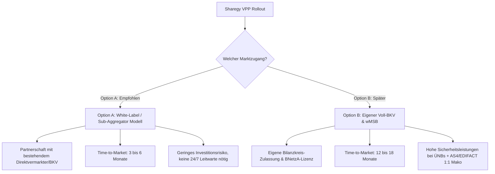
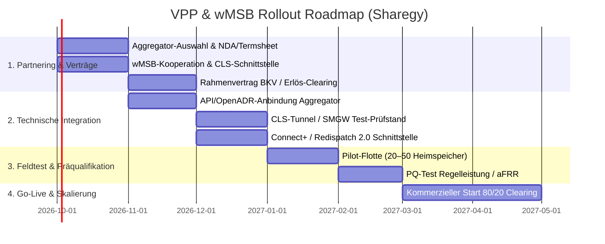
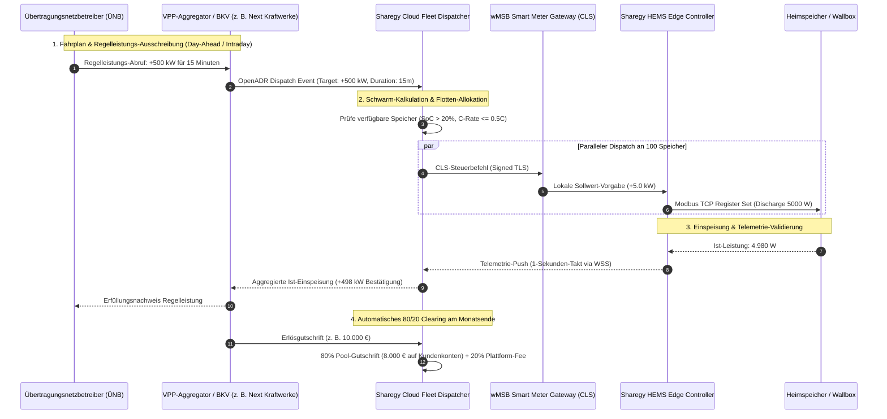

# 🚀 Real-World VPP, wMSB Gateway & Market Rollout Playbook
## Schritt-für-Schritt-Leitfaden zur echten energiewirtschaftlichen Inbetriebnahme von VPP, Smart Meter Gateways (SMGW/CLS) und Markt-Akteuren

**Version:** 1.0.0 (Produktions- & Rollout-Leitfaden)  
**Ziel:** Konkrete Handlungsanleitung, Kontakte, Anträge, Fragenkataloge und Verträge zur operativen Anbindung des Sharegy Virtuellen Kraftwerks (VPP) und Flexibilitäts-Pools an den deutschen Strommarkt.

---

## 🧭 Inhaltsverzeichnis
1. [Strategische Grundsatzentscheidung: Sub-Aggregator vs. Eigener BKV](#1-strategische-grundsatzentscheidung)
2. [Die Akteure & konkrete Ansprechpartner im deutschen Energiemarkt](#2-die-akteure--konkrete-ansprechpartner)
3. [Schritt-für-Schritt-Ablaufplan (Phase 1 bis 5)](#3-schritt-für-schritt-ablaufplan)
4. [Notwendige Verträge, Anträge & regulatorische Registrierungen](#4-notwendige-vertraege-antraege--registrierungen)
5. [Fragen- & Antwortkatalog für Erstgespräche mit Marktpartnern](#5-fragen--antwortkatalog-fuer-erstgespraeche)
6. [Technische Integrationsarchitektur (SMGW, CLS, OpenADR, Connect+)](#6-technische-integrationsarchitektur)
7. [Muster-Anschreiben & Gesprächsleitfäden](#7-muster-anschreiben--gespraechsleitfaeden)

---

## 1. Strategische Grundsatzentscheidung

Bevor Anträge gestellt werden, muss der regulatorische Pfad für Sharegy festgelegt werden:

### 🏆 Empfohlener Weg: **Option A (Sub-Aggregator / Technologie- & Flotten-Provider)**
* **Sharegy agiert als:** Virtueller Flottenmanager, HEMS-Entwickler und Customer-Frontend mit 80/20-Clearing.
* **Der Vermarktungspartner agiert als:** Bilanzkreisverantwortlicher (BKV), Börsenhändler (EPEX Spot / Intraday) und präqualifizierter Regelleistungs-Anbieter (aFRR/mFRR).
* **Vorteil:** Keine Bürgschaften in Millionenhöhe bei den 4 ÜNBs, keine eigene 24/7 energiewirtschaftliche Leitstelle, sofortige Vermarktung ab dem ersten Kunden möglich.

---

## 2. Die Akteure & konkrete Ansprechpartner

| Marktrolle | Funktion im VPP-Ökosystem | Führende Akteure in Deutschland | Zuständige Abteilung / Kontaktweg |
| :--- | :--- | :--- | :--- |
| **1. Direktvermarkter / VPP-Aggregator** | Vermarktet die Flexibilität an EPEX Spot, Intraday und Regelleistungsmärkten; schüttet Erlöse an Sharegy aus. | • **Next Kraftwerke** (Köln) • **Statkraft** (Düsseldorf) • **Entelios** (München) • **Energy2Market / e2m** (Leipzig) • **sonnen eServices** (Wildpoldsried) • **Lumenaza** (Berlin) | *Business Development / Flexible Assets / Energy Trading Partnerships* E-Mail: `partnerships@...` / `flexibility@...` |
| **2. Wettbewerblicher Messstellenbetreiber (wMSB)** | Installiert Smart Meter Gateways (SMGW), betreibt CLS-Kanäle und liefert 15-Minuten-Lastgänge. | • **Discovergy / inexogy** (Aachen/Heidelberg) • **Solandeo** (Berlin) • **co.met** (Saarbrücken) • **Theben Smart Energy** (Haigerloch) • **PPC** (Mannheim) | *Vertrieb Messwesen / Kooperationen & CLS-Services* E-Mail: `partner@solandeo.com`, `vertrieb@inexogy.com` |
| **3. Verteilnetzbetreiber (VNB)** | Zuständig für § 14a EnWG Netzdrosselung (4,2 kW) und lokales Engpassmanagement (Redispatch 2.0). | Die ca. 880 regionalen VNBs (z. B. **Westnetz**, **Bayernwerk**, **Netze BW**, **Stromnetz Berlin**, **E.DIS**, **Avacon** etc.) | *Einspeiser- & Flexibilitätsmanagement / Netzkundenbetreuung / § 14a Beauftragte* |
| **4. Übertragungsnetzbetreiber (ÜNB)** | Beschafft Frequenz-Regelleistung (FCR, aFRR, mFRR). | **TenneT TSO**, **Amprion**, **50Hertz Transmission**, **TransnetBW** | Gemeinsame Plattform: [regelleistung.net](https://www.regelleistung.net) Connect+ Plattform: [connect-plus.de](https://www.connect-plus.de) |
| **5. Bundesnetzagentur (BNetzA) & Behörden** | Regulatorische Registrierungen, MaStR, Energieversorger-Meldungen. | **Bundesnetzagentur (BNetzA)** (Bonn) | Referat *Netzzugang Strom / Messwesen* [marktstammdatenregister.de](https://www.marktstammdatenregister.de) |
| **6. BDEW / DVGW** | Vergabe von Marktpartner-Codes (BDEW-Codenummer) für Marktkommunikation. | **BDEW Bundesverband der Energie- und Wasserwirtschaft** | [bdew-codes.de](https://www.bdew-codes.de) |

---

## 3. Schritt-für-Schritt Ablaufplan

### Phase 1: Partnering & Regulatorik (Monat 1–2)
1. **Aggregator-Gespräche führen:** Kontaktaufnahme mit Next Kraftwerke, Statkraft oder Solandeo bzgl. Sub-Pool-Vermarktung für Heimspeicher und steuerbare Lasten (§ 14a EnWG).
2. **wMSB-Partnerschaft schließen:** Rahmenvereinbarung mit Discovergy/inexogy oder Solandeo für Hardware-Lieferung, Zählertausch und API-Zugriff auf die 15m-Messwerte.
3. **Marktstammdatenregister (MaStR):** Registrierung von Sharegy als Marktakteur (Dienstleister / Aggregator / Softwareplattform).

### Phase 2: Technische Schnittstellen-Kopplung (Monat 2–3)
1. **Aggregator-Schnittstelle aktivieren:**
   * Anbindung der Sharegy Cloud an das Dispatching-Gateway des Aggregators via **OpenADR 2.0b**, **IEC 60870-5-104** oder **REST-Webhook**.
   * Testen des Sollwert-Empfangs (+kW Einspeisung, -kW Laden, Ramp-Rate in Sekunden).
2. **CLS-Kanal (Smart Meter Gateway) schalten:**
   * Einrichtung des gesicherten TLS-Proxys zwischen dem SMGW (BSI TR-03109-1) und dem Sharegy HEMS Core.
   * Einbindung von FNN-Steuerbox-Signalen (§ 14a EnWG Dimmung auf 4,2 kW).
3. **Connect+ / Redispatch 2.0:**
   * Test der automatischen Erstellung und Übertragung der 96-Viertelstunden-Fahrpläne (`PT15M`).

### Phase 3: Feldtest & Präqualifikation (Monat 3–4)
1. **Pilotflotte ausrollen:** 20 bis 50 Test-Heimspeicher (z. B. Sungrow, SMA, Fronius, Deye) mit aktiver VPP-Einwilligung im Feld aufsetzen.
2. **Abruf-Simulation:** Testen von Lastabwürfen und Schnelllade-Impulsen unter Einhaltung des **20 % Mindest-SoC-Reserveschutzes**.
3. **Doppel-Prüfung (Audit Trail):** Vergleich der Soll-Abrufe mit den gemessenen wMSB-Zählerwerten (Soll vs. Ist).

### Phase 4: Kommerzieller Go-Live (Monat 5+)
1. **Freischaltung im Dashboard:** Alle Endkunden können den Flex-Bonus mit 1 Klick im [Smart Energy Optimizer](file:///c:/Users/Public/Dev/sharegy/frontend/src/pages/ControlPage.jsx) aktivieren.
2. **Automatischer Monatsabschluss:** Sharegy zieht die Erlösabrechnung des Aggregators, berechnet den 80/20 Split und stellt Gutschrift-Gutschriften bereit.

---

## 4. Notwendige Verträge, Anträge & Registrierungen

### 📑 1. Verträge mit dem Vermarktungs-Partner (BKV / Direktvermarkter)
* **Flexibilitäts-Vermarktungsvertrag (Aggregator Framework Agreement):**
  * *Inhalt:* Bedingungen für die Bereitstellung von Regelleistung (aFRR/mFRR) und Spotmarkt-Flexibilität.
  * *Vergütungsmodell:* Fixe Prämie (€/kW/Monat) oder dynamischer Erlös-Split (z. B. 90/10 Partner zu Sharegy, woraus Sharegy den 80/20 Kundensplit speist).
  * *Pönalen / Haftung:* Ausschluss von Strafzahlungen bei Ausfall einzelner privater Heimspeicher (Schwarm-Toleranzband).
* **Datenschutz- & Auftragsverarbeitungsvertrag (AVV gem. Art. 28 DSGVO):**
  * Übermittlung pseudonymisierter Anlagendaten (Postleitzahl, Netzknoten, Wirkleistung).

### 📑 2. Verträge mit dem Messstellenbetreiber (wMSB)
* **wMSB-Kooperationsvertrag:**
  * Regelung der Zählersetzung beim Kunden (Kosten für Zählertausch i. d. R. gesetzliche Preisobergrenze von 20–50 €/Jahr nach MsbG).
  * API-SLA (Übermittlung der 15m-Lastgänge bis spätestens 04:00 Uhr des Folgetages).
  * CLS-Kanal Nutzungsvereinbarung für Steuerungsimpulse.

### 📑 3. Verträge mit dem Kunden (Endnutzer / Prosumer)
* **VPP-Teilnahmevereinbarung & AGB-Zusatz (im Sharegy Dashboard integriert):**
  * Zustimmung zur netzdienlichen Steuerung des Speichers / der Wallbox.
  * Garantie des Mindest-Ladezustands (20% min-SoC).
  * Auszahlungsmodalitäten des 80 % Flex-Bonus (Gutschrift auf Stromrechnung oder Banküberweisung).

### 📑 4. Regulatorische Meldungen
* **Marktstammdatenregister (MaStR):**
  * Registrierung der Speicher als fernsteuerbare Erzeugungs-/Verbrauchseinheiten mit Verknüpfung zur MaStR-Nummer der PV-Anlage.
* **Meldung an den örtlichen VNB gem. § 14a EnWG:**
  * Übermittlung der SteuVE-Meldung zur Inanspruchnahme des reduzierten Netzentgelts (Modul 1: pauschaler Rabatt ~160 €/Jahr oder Modul 2: prozentuale Reduktion).

---

## 5. Fragen- & Antwortkatalog für Erstgespräche

### 🤝 A. Gespräch mit Direktvermarktern / Aggregatoren (z. B. Next Kraftwerke, Statkraft)

| Typische Frage des Aggregators | Richtige Sharegy-Antwort & Argumentation |
| :--- | :--- |
| *„Welche Asset-Typen poolt ihr und wie groß ist die kumulierte Leistung?“* | *„Wir bündeln private Heimspeicher (3–15 kW / 5–20 kWh), dimmbare Wallboxen (11–22 kW) und Wärmepumpen. Unsere Zielgröße im Pilot-Pool beträgt 2 bis 5 MW schaltbare Leistung mit 0,5C C-Rate.“* |
| *„Wie schnell ist eure Latenz vom Dispatch-Befehl bis zur Reaktion der Batterie?“* | *„Über unsere WebSockets (WSS) und Edge-Controller beträgt die End-to-End Latenz unter 2 Sekunden. Für Sekundärregelleistung (aFRR, 30s) und Redispatch 2.0 (15m) sind wir voll reaktionsfähig.“* |
| *„Wie stellt ihr sicher, dass Kunden-Ausschaltquoten (Default Rate) den Fahrplan nicht gefährden?“* | *„Durch dynamisches Überbuchen (Over-Provisioning) um 15–20 % und kontinuierliche Echtzeit-Telemetry. Fällt ein Speicher lokal aus, kompensieren benachbarte Speicher im Schwarm die Differenz sekundengenau.“* |
| *„Welches Schnittstellen-Protokoll bevorzugt eure Plattform?“* | *„Wir unterstützen OpenADR 2.0b (Virtual End Node / VEN), IEC 60870-5-104 sowie moderne REST Webhooks mit TLS 1.3 und Token-Authentifizierung.“* |
| *„Wie handhabt ihr den Bilanzkreis?“* | *„Wir docken unseren Pool als virtuellen Unter-Bilanzkreis (Sub-Balancing-Group) an euren Master-Bilanzkreis an. Ihr übernehmt das Börsen-Clearing, wir liefern die aggregierten 96-Viertelstunden-Daten.“* |

---

### 🔌 B. Gespräch mit wettbewerblichen Messstellenbetreibern (wMSB)

| Typische Frage des wMSB | Richtige Sharegy-Antwort |
| :--- | :--- |
| *„Welche Smart Meter Gateways (SMGW) setzt ihr voraus?“* | *„Wir sind herstellerunabhängig und kompatibel mit allen BSI-zertifizierten Gateways (PPC, EMH, Theben, Sagemcom), die über einen aktiven CLS-Kanal oder eine HKS-Schnittstelle verfügen.“* |
| *„Wie erfolgt der Zählertausch beim Endkunden?“* | *„Unsere Partner-Fachbetriebe (Elektroinstallateure) können den Einbau übernehmen (sofern beim wMSB als Monteur akkreditiert) oder der wMSB führt den Turnus-Tausch durch.“* |
| *„In welchem Format benötigt ihr die Messwerte?“* | *„Bevorzugt über eine sichere REST-API (JSON) mit 15-Minuten-Lastgängen (`kW` / `kWh`) oder standardisiert per EDIFACT MSCONS / AS4.“* |

---

### 🛡️ C. Gespräch mit dem Verteilnetzbetreiber (VNB)

| Typische Frage des VNB | Richtige Sharegy-Antwort |
| :--- | :--- |
| *„Erfüllt euer System die § 14a EnWG Festlegung BK6-22-300?“* | *„Ja. Sharegy unterstützt sowohl die direkte Dimmung auf 4,2 kW als auch das dynamische Summenleistungs-Modell am NAP. Die Dimmvorgabe wird innerhalb von < 30 Sekunden zuverlässig umgesetzt.“* |
| *„Was passiert bei Ausfall der Internetverbindung?“* | *„Das HEMS verfügt über eine lokale Fail-Safe-Logik: Bleibt der Netzkontakt aus, drosselt das System die steuerbaren Lasten nach Ablauf des Timeouts automatisch auf den sicheren 4,2 kW Grenzwert.“* |

---

## 6. Technische Integrationsarchitektur

---

## 7. Muster-Anschreiben & Gesprächsleitfäden

### ✉️ Vorlage: Erstkontakt an Direktvermarkter / Aggregatoren

> **Betreff:** Kooperationsanfrage: Flexibilitäts-Aggregator & VPP-Vermarktung für dezentrale Heimspeicher-Flotte (Sharegy)  
>  
> Sehr geehrte Damen und Herren,  
> sehr geehrtes Flexibilitäts- & Partnering-Team,  
>  
> Sharegy betreibt eine modulare Smart Energy Management Plattform (HEMS) für private und gewerbliche Prosumer mit stark wachsender installierter Basis in Deutschland und Österreich.  
>  
> Wir bündeln Heimspeicher (Sungrow, SMA, Fronius, Deye u. a.), steuerbare Verbrauchseinrichtungen gem. § 14a EnWG sowie dezentrale PV-Anlagen zu einem hochreaktiven, virtuellen Schwarmkraftwerk (VPP). Unsere Plattform unterstützt Sub-Sekunden-Telemetrie, OpenADR 2.0b und standardisierte Dispatching-Schnittstellen.  
>  
> Für die kommerzielle Vermarktung unseres Flexibilitäts-Pools (Spotmarkt-Arbitrage, aFRR/mFRR und Redispatch 2.0) suchen wir einen erfahrenen Direktvermarktungs- und Bilanzkreispartner (BKV).  
>  
> Wir möchten Ihnen gerne unser System, die Schnittstellen-Architektur sowie unsere Flotten-Roadmap in einem 30-minütigen Gespräch vorstellen.  
>  
> Bitte teilen Sie uns mit, welcher Ansprechpartner aus Ihrem Hause für ein kurzes Kennenlernen zur Verfügung steht.  
>  
> Mit freundlichen Grüßen,  
> **Geschäftsführung Sharegy**  
> Web: [sharegy.de](https://sharegy.de) | E-Mail: `kontakt@sharegy.de`

---

### ✉️ Vorlage: Erstkontakt an wettbewerbliche Messstellenbetreiber (wMSB)

> **Betreff:** Kooperationsanfrage Smart Meter Rollout & CLS-Gateway Integration (Sharegy / wMSB)  
>  
> Sehr geehrte Damen und Herren,  
>  
> im Rahmen unseres Rollouts für ganzheitliches Home Energy Management und Mieterstrom gem. § 42b EnWG binden wir Smart Meter Gateways (iMSys) und CLS-Steuerboxen in Mehrfamilienhäusern und Einfamilienhäusern ein.  
>  
> Wir suchen einen leistungsstarken Messstellenbetreiber-Partner für:  
> 1. Die zuverlässige Zählersetzung und den Rollout von Smart Meter Gateways bei unseren Kunden.  
> 2. Die Bereitstellung von 15-Minuten-Lastgängen via standardisierter REST-API / Cloud-Bridge.  
> 3. Die Nutzung des CLS-Kanals zur netzdienlichen Steuerung nach § 14a EnWG.  
>  
> Gerne möchten wir die Rahmenbedingungen für eine Kooperationsvereinbarung und technische Schnittstellen mit Ihnen besprechen.  
>  
> Mit freundlichen Grüßen,  
> **Sharegy Team**

---

## 📌 Zusammenfassung & Nächste Sofort-Aktionen

1. **Top 3 Aggregatoren anschreiben:** Next Kraftwerke, Statkraft und Solandeo mit dem Muster-Anschreiben kontaktieren.
2. **Marktstammdatenregister:** Stammdaten und Unternehmensprofil von Sharegy als Dienstleister verifizieren.
3. **OpenADR Test-Server aufsetzen:** Die interne Schnittstelle in `backend/vpp/` gegen die Testumgebung des gewählten Aggregators validieren.
4. **Erste 20 Speicherbetreiber vormerken:** Early-Adopter aus der Sharegy-Community für die Pilot-Präqualifikation zusammenstellen.
