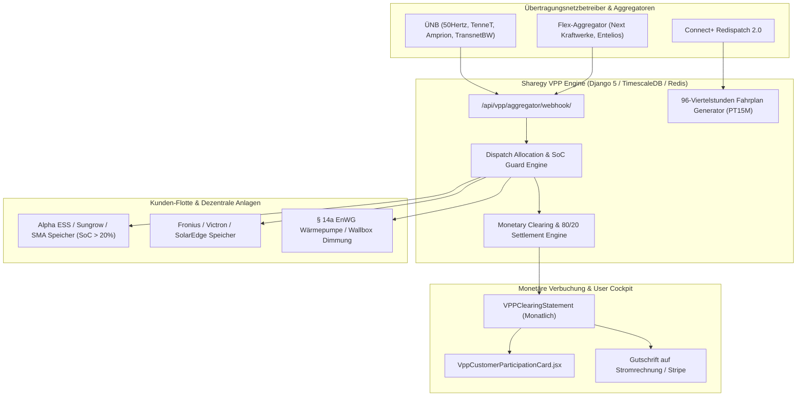

# ⚡ Betriebsdokumentation: Virtuelles Kraftwerk (VPP) & Automatisches Market Clearing

**Modul:** `vpp` (Virtual Power Plant & Flexibility Settlement Engine)  
**System:** Sharegy Cloud & Dezentrale Flexibilitäts-Plattform  
**Stand:** September 2026 (v5.3 / Production Ready)  
**Sicherheitsstufe:** BSI TR-03109-1 / IEC 60870-5-104 / Redispatch 2.0 konform  

---

## 📋 Inhaltsverzeichnis
1. [Systemübersicht & Architektur](#1-systemübersicht--architektur)
2. [Datenmodelle & Datenbank-Struktur](#2-datenmodelle--datenbank-struktur)
3. [Kern-Services & Berechnungs-Engines](#3-kern-services--berechnungs-engines)
4. [REST-API Endpunkte & Externe Schnittstellen](#4-rest-api-endpunkte--externe-schnittstellen)
5. [Konfiguration & Umgebungsvariablen](#5-konfiguration--umgebungsvariablen)
6. [Betriebsabläufe & Standard-Workflows (Runbooks)](#6-betriebsabläufe--standard-workflows-runbooks)
7. [Automatischer 80/20 Erlös-Split & Monats-Clearing](#7-automatischer-8020-erlös-split--monats-clearing)
8. [Monitoring, Alerting & Kennzahlen](#8-monitoring-alerting--kennzahlen)
9. [Fehlerbehebung & Troubleshooting](#9-fehlerbehebung--troubleshooting)

---

## 1. Systemübersicht & Architektur

Das Modul **VPP & Automated Market Clearing** ermöglicht die Aggregation tausender dezentraler Heimspeicher, bidirektionaler Wallboxen (V2G) und steuerbarer Verbrauchseinrichtungen (§ 14a EnWG SteuVE) zu einem virtuellen Großspeicher. 



### Kernfunktionen:
1. **Sekundärregelleistung (aFRR / SRL)**: Bereitstellung von positiver (+kW Einspeisung) und negativer (-kW Ladung) Regelleistung innerhalb von $< 15\,\text{s}$.
2. **Primärregelleistung (FCR)**: Schnelle Netzfrequenzstützung (50.00 Hz).
3. **Redispatch 2.0 / Connect+**: 96-Viertelstunden-Fahrpläne im standardisierten PT15M-Format.
4. **Intelligenter Schutz des Kunden-Eigenbedarfs**: Einstellbare Mindest-SoC-Reserve (10–50 %), damit für den Haushalt immer genügend Strom erhalten bleibt.
5. **Vollautomatisches 80/20 Erlös-Clearing**: 80 % der Flexibilitätsprämie werden dem Kunden gutgeschrieben, 20 % verbleiben als Plattformmarge bei Sharegy.

---

## 2. Datenmodelle & Datenbank-Struktur

Alle Tabellen sind im Django-Schema unter der App `vpp` registriert:

```
┌───────────────────────────┐         1:n         ┌───────────────────────────┐
│    VPPFlexibilityPool     │ ─────────────────── │     VPPDispatchOrder      │
│ (Regelzonen & Produkte)   │                     │ (Abruf-Auftrag vom ÜNB)   │
└─────────────┬─────────────┘                     └─────────────┬─────────────┘
              │ 1:n                                             │ 1:n
              ▼                                                 ▼
┌───────────────────────────┐         1:n         ┌───────────────────────────┐
│    VPPAssetEnrollment     │ ─────────────────── │     VPPAssetDispatch      │
│ (Kunden-OptIn & Reserve)  │                     │ (Geräte-Leistung & Erlös) │
└─────────────┬─────────────┘                     └─────────────┬─────────────┘
              │ 1:n                                             │
              ▼                                                 │ aggregiert
┌───────────────────────────┐                                   │ in
│   VPPClearingStatement    │ ◄─────────────────────────────────┘
│ (Monatsabrechnung Kunde)  │
└───────────────────────────┘
```

### 2.1 Modellbeschreibungen

| Modell | Tabelle | Zweck |
|---|---|---|
| **`VPPFlexibilityPool`** | `vpp_vppflexibilitypool` | Konfiguration von Vermarktungs-Pools je ÜNB-Regelzone (`50hertz`, `tennet`, `amprion`, `transnetbw`) und Produkt (`afrr_positive`, `fcr`, `spot_arbitrage`). |
| **`VPPDispatchOrder`** | `vpp_vppdispatchorder` | Protokolliert jeden konkreten Aktivierungsauftrag mit Soll-Leistung (kW), Dauer, Status und Bruttovergütung. |
| **`VPPDispatchTelemetry`** | `vpp_vppdispatchtelemetry` | Revisionssichere 3-Minuten-Takte von Ist-Leistung (kW), Netzfrequenz (Hz) und Flotten-SoC für den ÜNB-Erfüllungsnachweis. |
| **`VPPAssetEnrollment`** | `vpp_vppassetenrollment` | Registriert Heimspeicher einzelner Kunden mit individuellem Reserve-SoC, Status (`active`/`paused`) und Payout-Quote (Standard 80 %). |
| **`VPPAssetDispatch`** | `vpp_vppassetdispatch` | Ordnet jedem beteiligten Kundengerät die anteilig gelieferte Energie (kWh), Bruttoerlös, Kundenprämie und Sharegy-Gebühr zu. |
| **`VPPClearingStatement`** | `vpp_vppclearingstatement` | Monatliche Abrechnungseinheit je Kunde mit Auszahlungsstatus (`pending`, `credited`, `paid_out`) und Rechnungs-Referenzcode. |

---

## 3. Kern-Services & Berechnungs-Engines

### 3.1 Flottenaggregation ([`vpp/services_vpp.py`](file:///c:/Users/Public/Dev/sharegy/vpp/services_vpp.py))
* **`calculate_fleet_flexibility(tso_operator, postal_code_prefix)`**:
  * Batch-Query über alle aktiven `Device`- und `DeviceLatestMetric`-Einträge.
  * Berechnet $P_{\text{pos}}$ (Entladeleistung aller Speicher mit $\text{SoC} > 20\,\%$ + dimmbare Lasten) und $P_{\text{neg}}$ (Ladeleistung bei $\text{SoC} < 95\,\%$ + PV-Abregelung).
  * 10-Sekunden Redis-Caching (`vpp:flex_fleet:*`) gegen Lastspitzen bei API-Abfragen.

* **`generate_redispatch_schedule_15min(target_date, tso_operator)`**:
  * Erzeugt 96 Werte für den nächsten Kalendertag (PT15M) mit Netto-Planwert, Solar-/Lastprognose und Flexibilitätsbändern $P_{\min}$ bis $P_{\max}$.

### 3.2 Clearing & Allokations-Engine ([`vpp/services_clearing.py`](file:///c:/Users/Public/Dev/sharegy/vpp/services_clearing.py))
* **`allocate_and_clear_dispatch(order)`**:
  * Wird bei jedem Dispatch automatisch aufgerufen.
  * Filtert alle aktiven Speicher, deren aktueller SoC über der kundenindividuellen Mindestreserve (`min_soc_reserve_pct`) liegt.
  * Verteilt den Leistungsabruf gleichmäßig oder kapazitätsgewichtet auf die Geräte.
  * Berechnet den 80/20 Erlös-Split:
    $$\text{Kunden-Auszahlung} = \text{Bruttoerlös} \times 0{,}80$$
    $$\text{Sharegy-Marge} = \text{Bruttoerlös} \times 0{,}20$$
  * Schreibt `VPPAssetDispatch`-Datensätze und inkrementiert das Guthaben in `VPPAssetEnrollment.total_earned_eur`.

* **`execute_periodic_clearing_run(period_start, period_end)`**:
  * Aggregiert alle offenen Dispatches (`is_cleared = False`) eines Monats.
  * Erstellt ein `VPPClearingStatement` mit Status `credited` und Referenz `VPP-CLR-YYYYMM-<User>`.
  * Setzt alle enthaltenen Dispatches auf `is_cleared = True`.

---

## 4. REST-API Endpunkte & Externe Schnittstellen

| Pfad | Methode | Auth | Beschreibung |
|---|:---:|:---:|---|
| `/api/vpp/summary/` | `GET` | Bearer JWT | Aggregierte VPP-Kennzahlen & Reaktionszeiten. |
| `/api/vpp/flexibility/` | `GET` | Bearer JWT | Aktuelles Flexibilitätsband (+kW / -kW) & Status. |
| `/api/vpp/redispatch-schedule/` | `GET` | Bearer JWT | 96-Viertelstunden-Fahrplan für Redispatch 2.0 / Connect+. |
| `/api/vpp/pools/` | `GET`, `POST` | Bearer JWT | Verwaltung der Flexibilitäts-Pools je Regelzone. |
| `/api/vpp/dispatch/` | `GET`, `POST` | Bearer JWT | Übersicht und manuelle Auslösung von Abrufen. |
| `/api/vpp/dispatch/<id>/cancel/` | `POST` | Bearer JWT | Vorzeitiger Abbruch / Stornierung eines Abrufs. |
| `/api/vpp/enrollments/` | `GET`, `POST` | Bearer JWT | Endkunden-Verwaltung der Speicher-Teilnahme & Reserve-SoC. |
| `/api/vpp/enrollments/<id>/` | `PATCH` | Bearer JWT | Pause/Aktivierung oder Anpassung des Reserve-SoC. |
| `/api/vpp/earnings/` | `GET` | Bearer JWT | Endkunden-Dashboard: Bisherige Erlöse, Jahresprognose, Statements. |
| `/api/vpp/clearing/run/` | `GET`, `POST` | Staff JWT | Ausführung des monatlichen Abrechnungslaufs. |
| `/api/vpp/aggregator/webhook/` | `POST` | API-Key | Webhook für externe Leitstellen (Next Kraftwerke, 50Hertz, TenneT). |

### 4.1 Externe Webhook-Spezifikation (`POST /api/vpp/aggregator/webhook/`)

**Header:**
```http
Content-Type: application/json
X-VPP-API-KEY: sharegy-vpp-secure-key-2026
```

**Request-Payload (Beispiel Next Kraftwerke / 50Hertz):**
```json
{
  "target_power_kw": 75.0,
  "duration_minutes": 15,
  "dispatch_type": "positive_flex",
  "requested_by": "50Hertz Automatic Frequency Control",
  "pool_id": null
}
```

**Response (HTTP 202 Accepted):**
```json
{
  "status": "accepted",
  "order_id": "9b1deb4d-3b7d-4bad-9bdd-2b0d7b3dcb6d",
  "connect_plus_order_id": "DISP-20260916054918-482",
  "target_power_kw": 75.0,
  "activated_devices_count": 18,
  "remuneration_eur": 6.56,
  "estimated_ramp_up_sec": 15
}
```

---

## 5. Konfiguration & Umgebungsvariablen

In der Produktions-Umgebung (`.env` bzw. Server-Environment):

```bash
# --- VPP & Flexibilitäts-Handel ---
VPP_AGGREGATOR_API_KEY=dein-sicherer-partner-schluessel-2026
VPP_DEFAULT_TSO=50hertz
VPP_DEFAULT_MIN_SOC=20.00
VPP_CUSTOMER_REVENUE_SHARE_PCT=80.00
VPP_FLEXIBILITY_CACHE_TTL_SEC=10
```

---

## 6. Betriebsabläufe & Standard-Workflows (Runbooks)

### 6.1 Automatische Ausführung des Monats-Clearings via Cron / Celery
Um am 1. jedes Monats um 02:00 Uhr nachts automatisch alle Erlöse des Vormonats abzurechnen:

**Django Management Command / Skript-Aufruf:**
```bash
# Im Sharegy Backend-Verzeichnis:
python manage.py shell -c "from vpp.services_clearing import execute_periodic_clearing_run; stmts = execute_periodic_clearing_run(); print(f'Cleared {len(stmts)} statements.')"
```

Oder via `crontab -e`:
```cron
0 2 1 * * /var/www/sharegy/venv/bin/python /var/www/sharegy/manage.py shell -c "from vpp.services_clearing import execute_periodic_clearing_run; execute_periodic_clearing_run()" >> /var/log/sharegy/vpp_clearing.log 2>&1
```

### 6.2 Manueller Test-Dispatch über die CLI
```bash
python manage.py shell -c "
from vpp.services_vpp import trigger_vpp_dispatch
from decimal import Decimal

order = trigger_vpp_dispatch(
    target_power_kw=Decimal('25.0'),
    duration_minutes=15,
    dispatch_type='positive_flex',
    requested_by='Manueller Betriebstest'
)
print('Dispatch ausgelöst:', order.id, 'Geräte:', order.activated_devices_count)
"
```

---

## 7. Automatischer 80/20 Erlös-Split & Monats-Clearing

### 7.1 Mathematische Berechnung

Pro Dispatch-Event $i$ eines Geräts $d$:
$$E_{\text{kwh}} = P_{\text{delivered}} \times \frac{t_{\text{min}}}{60}$$
$$R_{\text{gross}} = E_{\text{kwh}} \times \text{Marktprämie} \, (\text{z. B. } 0{,}35\,\text{€/kWh})$$
$$P_{\text{Kunde}} = R_{\text{gross}} \times 0{,}80$$
$$F_{\text{Sharegy}} = R_{\text{gross}} \times 0{,}20$$

### 7.2 Kundenansicht im Dashboard
Der Kunde sieht in [`VppCustomerParticipationCard.jsx`](file:///c:/Users/Public/Dev/sharegy/frontend/src/features/energy/components/VppCustomerParticipationCard.jsx):
1. **Live-Status**: Grün leuchtendes Badge *„Aktiv vergütet (80 % Split)“*.
2. **KPIs**: Bisherige Gesamteinnahmen in €, Jahresprognose (~185–250 €/a), Anzahl Abrufe und vermiedenes CO₂.
3. **Reserve-SoC Schieberegler**: Garantierte Mindestladung für den Haushalt.
4. **Historie**: Transparente Tabelle jedes Abrufs sowie herunterladbare Monatsabrechnungen.

---

## 8. Monitoring, Alerting & Kennzahlen

### 8.1 Wichtige Metriken
* **Fleet Availability**: Anteil online erreichbarer Speicher mit $\text{SoC} > \text{Reserve-SoC}$.
* **Ramp-Up Compliance**: Erbringungszeitraum $< 15\,\text{Sekunden}$ nach Eintreffen des Webhook-Signals.
* **Fulfillment Rate**: $\frac{P_{\text{delivered}}}{P_{\text{target}}} \ge 95\,\%$.

### 8.2 Log-Pfade & Diagnostics
* **System-Logs**: `/var/log/sharegy/backend.log` (Grep nach `[VPP]` oder `vpp.services`)
* **Clearing-Logs**: `/var/log/sharegy/vpp_clearing.log`
* **Test-Suite**:
  ```bash
  python manage.py test vpp
  ```

---

## 9. Fehlerbehebung & Troubleshooting

| Problem | Mögliche Ursache | Behebung |
|---|---|---|
| **Webhook liefert 401 Unauthorized** | Fehlender oder falscher `X-VPP-API-KEY` Header. | Header prüfen und mit `VPP_AGGREGATOR_API_KEY` in den Servereinstellungen abgleichen. |
| **0 Geräte aktiviert bei Dispatch** | Keine aktiven Einschreibungen oder alle Speicher unterhalb des Reserve-SoC. | In der Datenbank `VPPAssetEnrollment` prüfen; sicherstellen, dass `DeviceLatestMetric` aktuelle SoC-Werte liefert. |
| **Clearing Statement enthält 0 €** | Es gab im Abrechnungszeitraum keine Dispatches oder alle waren bereits auf `is_cleared = True`. | `VPPAssetDispatch.objects.filter(is_cleared=False)` prüfen. |
| **Dispatch-Abruf soll sofort gestoppt werden** | Netzüberlastung vorüber oder Fehlalarm. | `POST /api/vpp/dispatch/<id>/cancel/` aufrufen; der Status wechselt auf `cancelled` und alle angeschlossenen Gateways regeln auf Normalbetrieb zurück. |
