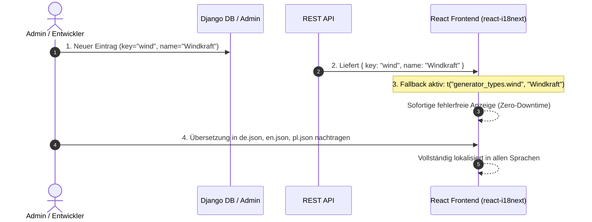

# Backend-Stammdaten, CMS & Mehrsprachigkeits-Konzept

Datum: 23. August 2026  
Status: **Architektur-Konzept & Umsetzung**

---

## 1. Ausgangslage & Fragestellung

Wie gehen wir mit der Mehrsprachigkeit für Daten um, die in der Backend-Datenbank (Django) gepflegt werden?
Insbesondere im Hinblick auf:
1. **System-Stammdaten (Kataloge)**: Erzeugertypen, Ausrichtungen, Rollen, Messgrößen, Signalarten.
2. **Community-CMS**: Spätere Pflege von Community-Webseiten durch Energy-Sharing-Community-Admins unter Verwendung rechtssicherer Standard-Templates.

---

## 2. Architektur-Entscheidung

### A. Community-CMS (Headless mit rechtssicheren Templates)
* **Sprachstrategie für CMS-Content**:
  * Community-Admins pflegen ihre Seiteninhalte in der Landessprache ihrer jeweiligen Community (z. B. vorerst Deutsch, später Polnisch in Polen).
  * Es wird **keine komplexe, verschachtelte Übersetzung von Freitexten** in der Datenbank benötigt.
  * Das `PageBlock.content`-Feld speichert einfache, strukturierte JSON-Strings (z. B. `title: "Bürgerenergie Sonnenschein eG"`).
* **Rechtliche Absicherung**:
  * Admins erhalten kein freies HTML/WYSIWYG, sondern **whitelisted Block-Typen** (Hero, Text, Live-Sankey, Mitgliedsantrag, Impressum, Datenschutz).
  * Feste Plattform-Rahmen (Header, Navigation, Footer, Buttons, gesetzliche Pflichtangaben) werden über die Frontend-Sprachdateien (`react-i18next`) in DE, EN und PL bereitgestellt.

---

### B. System-Stammdaten (Key-basiertes i18n Mapping)
Alle System-Kataloge besitzen einen stabilen technischen `key` (z. B. `solar`, `battery`, `power`, `grid_exchange`, `S`, `SW`).

---

## 3. Der 3-Stufen-Prozess bei neuen Keys

1. **Backend / Datenbank**:
   * Neuer Datensatz wird in Django angelegt mit `key="neuer_key"` und `name="Deutscher Fallback"`.
2. **Automatischer Fallback (Ausfallsicherheit)**:
   * Das Frontend ruft `t(`namespace.${item.key}`, item.name)` auf.
   * Fehlt der Key in der Sprachdatei, wird **automatisch und ohne Fehler** der Backend-Name `item.name` angezeigt.
3. **Übersetzung nachtragen**:
   * Der Key wird in `de.json`, `en.json` und `pl.json` eingetragen.

---

## 4. Übersicht der Stammdaten-Namespaces

| Namespace | Model | Beispiele |
| :--- | :--- | :--- |
| `roles` | `DeviceRole` | `producer`, `consumer`, `battery`, `both`, `grid` |
| `generator_types` | `GeneratorType` | `solar`, `wind`, `battery`, `heatpump`, `biomass`, `hydro`, `chp`, `other` |
| `orientations` | `Orientation` | `S`, `SO`, `SW`, `O`, `W`, `NO`, `NW`, `N`, `flat` |
| `energy_signals` | `EMSSignalType` | `solar_production`, `grid_exchange`, `household_load`, `battery_storage`, `ev_charging`, `heat_pump` |
| `metrics` | `MetricDefinition` | `power`, `energy`, `voltage`, `current`, `frequency`, `temperature`, `humidity`, `soc`, `soh` |

