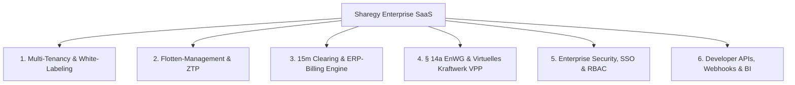

# 🏢 Sharegy Enterprise SaaS Blueprint & Architecture Guide

Datum: 24. August 2026  
Status: **Strategischer Architektur- und Funktionsplan**

---

## 1. Vision & Strategische Positionierung

Vom smarten Heimanwender-EMS zu einer **skalierbaren B2B/B2B2C-Energieplattform**.  
Zielgruppen: **Stadtwerke**, **Energieversorger**, **Bürgerenergiegenossenschaften**, **Immobilienwirtschaft (Wohnbau/Gewerbe)** und **Installateursnetzwerke**.



---

## 2. Die 6 Säulen der Enterprise-Plattform

### 🏛️ Säule 1: Multi-Tenancy & White-Labeling (Mandanten & Marken)
Enterprise-Kunden möchten ihren Endkunden das Portal unter eigenem Namen und Corporate Design präsentieren.

* **Custom Domains & SSL**:
  * Automatische Zuweisung von Mandanten-Domains (z. B. `portal.stadtwerke-musterstadt.de`).
* **Dynamisches Theming**:
  * Logo, Favicon, Primär-/Sekundärfarben, Impressum und AGB pro Tenant in der Datenbank hinterlegt und dynamisch ausgeliefert.
* **Hierarchische Organisationsstruktur**:
  ```
  Sharegy Plattform (Superadmin)
   └── Stadtwerk / Genossenschaft (Enterprise Tenant)
        ├── Quartier / Liegenschaft (Sub-Tenant)
        │    └── Haushalte / Zählpunkte (Units)
  ```

---

### 📡 Säule 2: Flotten-Management & Installateurs-Portal
Zentrales Cockpit für Partner, die tausende Standorte und Gateways betreuen.

* **Flotten-Dashboard (`/enterprise/fleet`)**:
  * Kartenansicht & Tabellenfilter aller Standorte mit Live-Status (🟢 Online, 🟡 Warnung, 🔴 Offline).
  * Filter nach Region, Signalqualität, Softwareversion und Fehlermeldungen.
* **Zero-Touch Provisioning (ZTP)**:
  * Handwerker scannt QR-Code am Gateway $\rightarrow$ System verknüpft Zähler/Wechselrichter automatisch mit dem Kundenvertrag.
* **Batch-Operationen**:
  * Massen-Updates von Konfigurationen oder Notfall-Abschaltungen für ganze Postleitzahlengebiete.

---

### 💶 Säule 3: Enterprise Clearing & ERP-Billing Engine
Rechtssichere 15-Minuten-Bilanzierung und kaufmännische Abrechnung nach EnWG und GoBD.

* **15-Minuten-Clearing nach Marktregeln**:
  * Automatisches Matching von Erzeugung und Verbrauch aller Community-Mitglieder pro 15-Minuten-Slot.
* **Automatisierte PDF-Rechnungsstellung**:
  * Monatliche/jährliche Abrechnungen mit transparenter Ausweisung von Reststrom, Community-Strom, Netzentgelten und Umlagen (§ 42b EnWG).
* **Finanz- & ERP-Schnittstellen**:
  * **DATEV / SAP Export**: CSV-Buchungsstapel für die Finanzbuchhaltung.
  * **SEPA-XML Export**: Lastschrift-Dateien für den automatischen Bankeinzug.
* **Revisionssicherer Audit-Trail**:
  * Unveränderliche Protokollierung aller Zählerwerte für steuerliche Prüfungen und Wirtschaftsprüfer.

---

### ⚡ Säule 4: § 14a EnWG Dimmung & Virtuelles Kraftwerk (VPP)
Regulatorische Steuerbarkeit und monetäre Flexibilitätsvermarktung.

* **§ 14a EnWG Steuerbox-Integration**:
  * Standardisierte Schnittstelle zur netzdienlichen Dimmung von Wärmepumpen, Batteriespeichern und Wallboxen bei Netzengpässen.
* **Virtuelles Kraftwerk (VPP / Virtual Power Plant)**:
  * Kollektive Aggregation hunderter Heimspeicher zur Teilnahme am Regelenergiemarkt (FCR/aFRR) oder Peak-Shaving.
* **Dynamische Tarif-Arbitrage**:
  * Automatisierte Preissignale an Speicher (z. B. Speicherladung bei negativen Börsenstrompreisen, Entladung zu Spitzenzeiten).

---

### 🔐 Säule 5: Enterprise Security, SSO & Rollenkonzept (RBAC)
Höchste Sicherheits- und Governance-Standards für Großkunden.

* **Single Sign-On (SSO)**:
  * SAML 2.0 / OIDC Anbindung an Microsoft Entra ID (Azure AD), Okta, Keycloak und Google Workspace.
* **Granulare Rollen**:
  * `Superadmin`: Globale Plattformverwaltung
  * `Tenant Admin`: Verwaltung der eigenen Kunden/Liegenschaften
  * `Billing Manager`: Nur Zugriff auf Tarife, Zählerstände und Rechnungen
  * `Technician / Installer`: Gateway-Status, Logs und Setup-Tools (keine Finanzdaten)
  * `Auditor`: Schreibgeschützter Prüfzugriff
* **2-Faktor-Authentifizierung (2FA / TOTP)** für alle administrativen Zugänge.

---

### 🔌 Säule 6: Developer API, Webhooks & BI-Konnektoren
Nahtlose Einbettung in bestehende IT- und Datenlandschaften von Energieversorgern.

* **Public REST API**:
  * API-Key Management mit Rate-Limiting, IP-Whitelisting und Scopes (`read:metrics`, `write:tariffs`).
* **Echtzeit-Webhooks**:
  * Event-Benachrichtigungen (`device.offline`, `invoice.created`, `grid_limit.exceeded`).
* **Business Intelligence (BI) Pipelines**:
  * Direkte Konnektoren für PowerBI, Tableau, Grafana oder Data Warehouses (Snowflake, BigQuery).

---

## 3. Phasen-Roadmap zur Enterprise-Reife

| Phase | Fokus | Haupt-Features |
| :--- | :--- | :--- |
| **Phase 1** | **B2B Multi-Tenancy & RBAC** | • White-Labeling (Logo, Farben, Custom Domains)<br>• Granulares Rollenkonzept (Admin, Techniker, Endkunde) |
| **Phase 2** | **Flotten-Management & Installateurs-Tools** | • Großkunden-Kartenansicht aller Standorte<br>• QR-Code Quick-Onboarding für Handwerker |
| **Phase 3** | **Automated Billing & 15m Clearing** | • PDF-Rechnungsgenerator & SEPA-XML Export<br>• DATEV / SAP Buchungsexporte |
| **Phase 4** | **§ 14a EnWG Dimmung & VPP-Aggregation** | • API-gestützte Lastverschiebung<br>• Flotten-Arbitrage für Heimspeicher |

