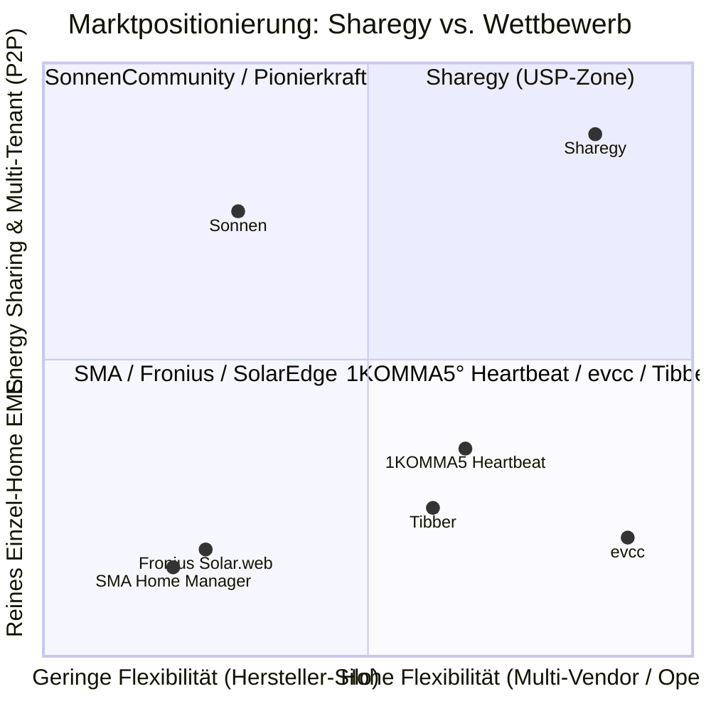

# 📊 Markt- & Wettbewerbsanalyse: Sharegy vs. Etablierte HEMS & EMS

**Datum**: 25. August 2026  
**Bereich**: Strategie, Produkt-Positionierung, HEMS / EMS Markt-Benchmark

---

## 🎯 Zusammenfassung & Marktpositionierung

Sharegy positioniert sich als **herstellerunabhängige, prädiktive und Community-fähige Energie-Management- & Sharing-Plattform**.  
Im Vergleich zu etablierten Marktteilnehmern kombiniert Sharegy die Flexibilität von Open-Source-Lösungen (*evcc, Home Assistant*) mit der Business- & Bilanzierungslogik von Enterprise-Plattformen (*Sonnen, 1KOMMA5°, GridX*).

---

## 1. 🚀 Wo Sharegy BESSER ist (USPs & Unfair Advantages)

### A. Energy Sharing & Quartiers-Bilanzierung (Der größte Moat)
* **Wettbewerb**: 95 % aller EMS (*SMA, Fronius, 1KOMMA5°, evcc*) sind **reine Single-Home-Inseln**. Sie können Energie nur hinter dem eigenen Hausanschluss optimieren.
* **Sharegy**: Ist von Grund auf für **Multi-Tenant, Mieterstrom und Energy-Sharing-Gemeinschaften** konzipiert. Überschüsse können bilanziell mit Nachbarn, Mietern oder der Community geteilt und über P2P-Tarife abgerechnet werden.

### B. Herstellerunabhängigkeit ohne Hardware-Knebelung
* **Wettbewerb**: SMA verlangt SMA-Komponenten; 1KOMMA5° bindet Kunden an das eigene Hardware-Paket; proprietäre Smart-Meter-Gateways kosten oft 800–1.500 €.
* **Sharegy**: Vollständig herstellerunabhängig. Offener **MQTT-Hub, REST-API, ioBroker, Home Assistant, Modbus und Shelly-Support**. Ein 20-€-Shelly oder Standard-Zähler reicht aus.

### C. Transparente Submeter-Disaggregation mit Residual-Zähler
* **Wettbewerb**: Zeigt meist nur „Hausverbrauch gesamt“ oder erfordert für jedes Kabel teure Zwischenzähler.
* **Sharegy**: Berechnet automatisch die ungemessene Grundlast ($E_{\text{residual}} = E_{\text{Haus}} - \sum E_{\text{gemessen}}$). 100 % der Energie fließen mathematisch exakt in die Donut- und Mengenbilanz ein.

### D. Kombination aus 48h-PV-Forecast + EPEX Spot + Multi-Dauer Optimizer (1h/2h/4h)
* **Wettbewerb**: Optimiert oft nur stur auf Momentanwerte (*„Scheint jetzt die Sonne? Ja $\rightarrow$ Relais an“*).
* **Sharegy**: Berechnet echte **Opportunitätskosten** (PV-Einspeisevergütung vs. schwankender Börsenpreis) und findet mit Sliding-Windows die exakten Zeitfenster für Haushaltsgeräte (1h), Wärmepumpen (2h) und Wallboxen (4h).

---

## 2. 💎 Wo Sharegy GUT & EIGENSTÄNDIG ist

* **Modernes Cockpit & Visualisierung**: Live-Sankey-Diagramme (SVG/ECharts), interaktive 24h-Zeitstrahlen mit KI-Highlighting, Benchmark-Karten (*E-Auto-km, Baum-Äquivalente*) und Dark-Mode-Optik im Optimizer.
* **Tarif-Flexibilität**: Parallele Unterstützung von Festpreisen, dynamischem EPEX Spot Börsenpreis, individuellen EEG-Vergütungssätzen (*20 Jahre gesetzlicher Bestandsschutz*) und Nulleinspeisung.
* **Vollständige Mehrsprachigkeit (i18n)**: Durchgängige Lokalisierung in Deutsch, Englisch und Polnisch.

---

## 3. ⚖️ Wo Sharegy GLEICH / AUF AUGENHÖHE ist (Parity)

* **Solar-Prognosegüte**: Anbindung an hochauflösende Wetterdienste (Open-Meteo, Strahlungsdaten, Neigung/Azimut) liefert die gleiche Prognosegenauigkeit wie SMA oder SolarEdge.
* **KPI-Analysen**: Autarkiegrad, Eigenverbrauchsquote, Peak-Leistung (kW), CO₂-Vermeidung und Euro-Finanzvorteil entsprechen exakt dem Industriestandard.
* **Tibber-Integration**: Direkter Abruf von Verträgen und Zählerdaten via GraphQL-API.

---

## 4. ⚠️ Wo Sharegy aktuell noch SCHLECHTER / IM RÜCKSTAND ist (Ehrliche Lücken)

| Schwachstelle | Wie es die Konkurrenz macht | Wo Sharegy aktuell steht | Was zu tun ist (Roadmap) |
| :--- | :--- | :--- | :--- |
| **Millisekunden-Regelkreis (Zero-Feed-in)** | SMA/Fronius regeln Speicher & Wechselrichter im 100ms-Takt lokal am Netzanschlusspunkt. | Sharegy agiert primär auf Sekunden-/Minuten-Ebene (Cloud & MQTT-Scheduler). | Lokaler Edge-Dienst / Sidecar für ultraschnelle lokale Modbus-Regelung. |
| **Automatisierte Aktorik (Closed Loop)** | `evcc` steuert 50+ Wallboxen direkt per OCPP/Modbus an und schaltet automatisch zwischen 1- und 3-Phasen um. | Sharegy liefert exzellente **Fahrpläne & Empfehlungen (Advisory Mode)**, triggert die Wallbox aber noch nicht vollautomatisch bidirektional. | Ausbau der MQTT/OCPP Aktorik im EMS-Control-Hub. |
| **§ 14a EnWG & EEBUS-Zertifizierung** | 1KOMMA5° und GridX haben zertifizierte Schnittstellen zu Smart Meter Gateways (Steuerbox-Dimmung auf 4,2 kW). | Sharegy hat die Logik im Datenmodell, aber noch keine FNN/EEBUS-Zertifizierung. | Integration von EEBUS / OCPP 2.0.1 Protokollstapeln. |
| **Time-Series Skalierung bei Millionen Datenpunkten** | Enterprise-Lösungen nutzen TimescaleDB / InfluxDB / ClickHouse. | Sharegy nutzt aktuell SQLite / PostgreSQL mit Django-Aggregationen. | Migration der `DeviceMetric`-Tabellen auf TimescaleDB (Hypertables). |

---

## 🎯 Strategisches Gesamtfazit

* **Gegenüber SMA / Fronius / SolarEdge**: **Besser** – Viel moderner, herstellerunabhängig, vorbereitet für dynamische Tarife und Quartiers-Sharing.
* **Gegenüber 1KOMMA5° (Heartbeat)**: **Gleichauf bei Software-Intelligenz**, **Besser bei Unabhängigkeit** (kein teurer Hardware-Zwang), **Schwächer bei Vertrieb/Installateursnetz**.
* **Gegenüber evcc**: **Besser im Gesamtüberblick, Bilanzierung & Sharing**, **Schwächer bei nischiger Wallbox-Phasenumschaltung**.
* **Gegenüber Sonnen / Enpal**: **Besser** – Keine Bindung an einen einzigen Stromanbieter oder proprietäre Hardware.

