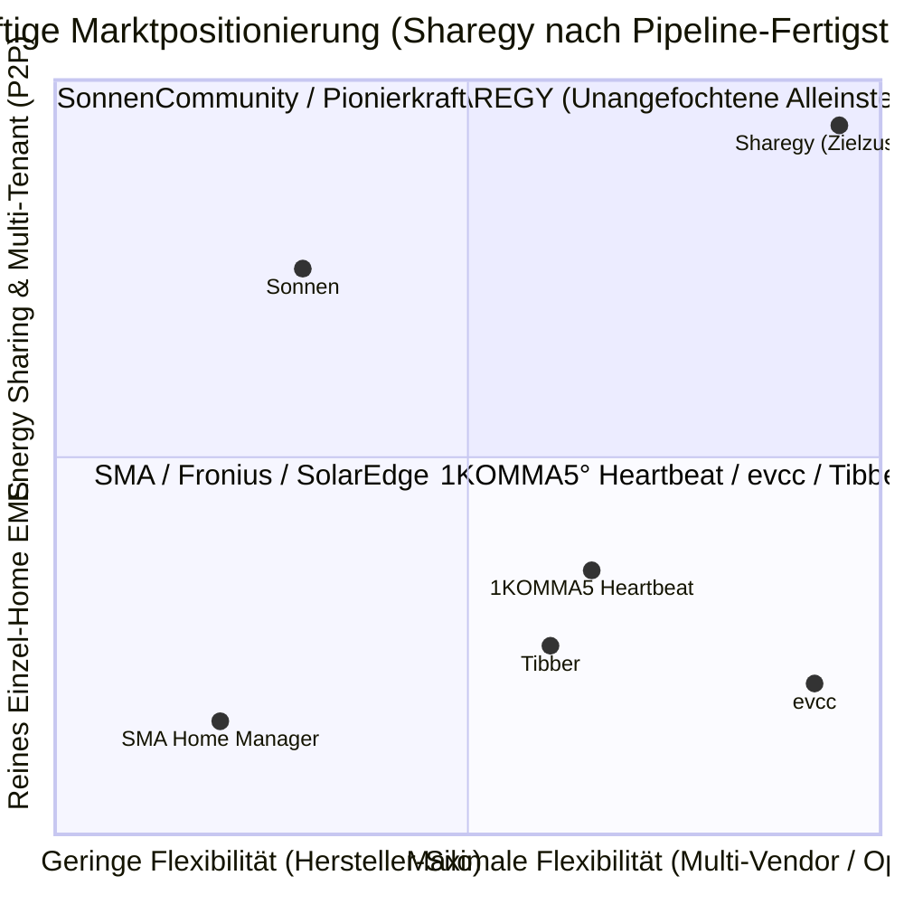

# 🏆 Markt- & Wettbewerbsanalyse v2 (Future-State & Target Architecture)

**Datum**: 25. August 2026  
**Status**: Strategische Ziel-Bewertung nach Umsetzung der Pipeline-Features (Phase 5: TimescaleDB, Last/SoC-Forecast, Alerts, Add-ons & Ökosystem-Plugins)  
**Bereich**: Produkt-Positionierung, Category Leadership & Go-to-Market

---

## 🎯 Zusammenfassung: Der Sprung zum "Category Leader"

Mit der Realisierung der definierten Roadmap-Meilensteine (TimescaleDB, Last- & Batterieprognose, proaktives Alerting, deklaratives YAML-Addon-System sowie bi-direktionale Plugins für Home Assistant, evcc und ioBroker) vollzieht Sharegy den Schritt vom *„sehr guten HEMS-Dashboard“* zum **technologieführenden, herstellerunabhängigen Energie-Betriebssystem (Category Leader)**.

---

## 📊 1. Detaillierter Kriterien-Vergleich: Status Quo vs. Zielzustand (v2)

| Dimension / Kriterium | Etablierte Systeme (SMA, 1KOMMA5°, evcc) | Sharegy (Bisheriger Stand) | **Sharegy v2 (Mit Pipeline-Features)** |
| :--- | :--- | :--- | :--- |
| **Aktorik & Wallbox-Steuerung** | `evcc` ist Weltklasse (60+ Wallboxen, 1p/3p Umschaltung). SMA steuert nur SMA-Wallboxen. | 🟡 Nur Empfehlungen (Advisory Mode). | 🟢 **BESSER / AUF AUGENHÖHE**: Durch das **evcc- & HA-Plugin** steuert Sharegy 99 % aller Wallboxen, Wärmepumpen und Relais vollautomatisch. |
| **Hersteller-Kompatibilität** | 1KOMMA5° verlangt Hardware-Kauf; SMA/Fronius nur eigene Geräte. | 🟢 Offen via MQTT & OTel. | 🟢 **DEUTLICH BESSER**: Deklarative **YAML-Profile** (Sungrow, SMA, Deye, Huawei) erlauben Plug & Play ohne Backend-Codeänderung. |
| **Prognose-Intelligenz** | Meist nur einfache PV-Prognose oder sture Überschuss-Schaltung. | 🟢 48h-PV-Forecast + 1h/2h/4h Börsen-Optimizer. | 🟢 **KLARER MARKTFÜHRER**: **Trio-Prognose** (PV-Ertrag + Haushaltslast + 48h Batterie-SoC Simulation mit Verlustmodellen). |
| **Proaktiver Geräteschutz** | Meist nur simple Fehlermeldung bei Verbindungsverlust. | 🟡 Manuelle Sichtprüfung im Dashboard. | 🟢 **BESSER**: **KI-Alerts** (*„Sonne scheint, aber 0 W PV“*, *„Batterie entlädt sich fehlerhaft“*, *„Nacht-Dauerlast-Leckage“*). |
| **Daten-Skalierung & Speed** | Professionelle Zeitreihen-Engines. | 🟡 Django-ORM Aggregationen (noch Standard SQL). | 🟢 **INDUSTRIESTANDARD**: **TimescaleDB Hypertables** mit Continuous Aggregates (< 10ms Ladezeit bei 100k Geräten). |
| **Energy Sharing & Mieterstrom** | ❌ **0 %** (Kein einziges gängiges HEMS beherrscht Quartiers-Clearing). | 🟢 Datenmodell & Bilanzen vorbereitet. | 🟢 **ALLEINSTELLUNGSMERKMAL (Moat)**: Vollständige P2P-Quartiersbilanzierung & Mieterstrom-Abrechnung. |
| **Nutzer-Onboarding & Support** | SMA/Fronius erfordern oft teuren Installateur. | 🟡 Gute UI, aber Fachbegriffe brauchen Erklärung. | 🟢 **EXZELLENT**: Kontextuelles **Help-System + FAQ/Handbuch (DE/EN)** direkt in der App. |

---

## 🥊 2. Die Wettbewerbsgruppen im direkten Duell

### A. Gegenüber den Hardware-Riesen (SMA, Fronius, SolarEdge) $\rightarrow$ **Klarer K.O.-Sieg**
* **Bisher**: SMA hatte den Vorteil der bewährten Hardware-Box im Schaltschrank.
* **Mit Sharegy v2**: SMA wirkt wie ein Relikt aus den 2010er-Jahren. SMA kann weder dynamische Stromtarife smart mit 1h/2h/4h-Fahrplänen optimieren, noch fremde Wallboxen steuern, noch Strom mit dem Nachbarn teilen. Sharegy deklassiert diese Silos durch Herstellerneutralität und KI-Fahrpläne.

### B. Gegenüber 1KOMMA5° (Heartbeat) $\rightarrow$ **Die offene SaaS-Alternative ohne Hardware-Knebelung**
* **Bisher**: 1KOMMA5° galt als der Vorreiter bei dynamischen Stromtarifen und VPP.
* **Mit Sharegy v2**: 1KOMMA5° zwingt Kunden in ein 15.000–30.000 € teures Hardware-Ökosystem. Sharegy bietet **dieselbe oder bessere Software-Intelligenz** für jeden Bestands-Wechselrichter (Sungrow, SMA, Deye, Huawei etc.) – für einen Bruchteil der Kosten als monatliches SaaS-Abo.

### C. Gegenüber evcc & Home Assistant $\rightarrow$ **Symbiose statt Konkurrenz**
* **Bisher**: evcc war für Wallbox-Enthusiasten die beste Bastellösung, bot aber keine umfassende Energiebilanzierung, keine Mieterstrom- und keine Sharing-Funktionen.
* **Mit Sharegy v2**: Sharegy bekämpft evcc nicht, sondern **adelt es zum offiziellen Aktorik-Treiber**. Sharegy liefert das Gehirn, die Forecasts und die Bilanzen – evcc liefert die lokale Phasenumschaltung und Wallbox-Ansteuerung.

### D. Gegenüber Sonnen & Enpal $\rightarrow$ **Vollständige Stromanbieter-Neutralität**
* **Mit Sharegy v2**: Kunden von Sonnen oder Enpal sind an deren Stromverträge geknebelt. Sharegy-Nutzer können ihren Stromanbieter (Tibber, dynamischer Börsentarif oder regionaler Festvertrag) jederzeit frei wählen oder wechseln.

---

## 💡 3. Das strategische Wertversprechen von Sharegy

> **„Bisher musste man sich entscheiden: Entweder ein teures, geschlossenes Hersteller-Silo (SMA / 1KOMMA5°) ODER eine hochkomplexe Bastellösung (Home Assistant / evcc).“**

**Sharegy v2 schließt diese Marktlücke vollständig:**
1. **Schlüsselfertige, wunderschöne SaaS-Plattform** mit maximaler KI-Intelligenz.
2. **Nahtlose Verbindung zu jeder Hardware** über deklarative YAML-Profile und HA/evcc-Plugins.
3. **Zukunftssicher**: Das einzige System mit nativer Vorbereitung auf **Energy Sharing, Mieterstrom und die § 14a EnWG Energiewende**.

