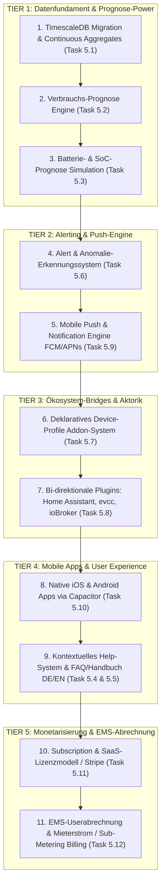

# 🎯 Verbindliche Ausführungs- & Prioritätenliste (Execution Roadmap)

**Datum**: 25. August 2026  
**Bereich**: Sprint-Planung, Meilenstein-Steuerung, Execution Backlog  
**Ziel**: Systematische Abarbeitung der strategischen Meilensteine vom Datenfundament über Integrationen bis hin zu Subscription, Monetarisierung und EMS-Userabrechnung.

---

## 🏛️ Das 5-Stufen-Phasenmodell (Tiers)

Wir arbeiten die offenen Arbeitspakete in 5 sequenziellen Stufen ab, um technische Abhängigkeiten optimal zu nutzen:

---

## 📋 Detaillierte Arbeitspakete & Spezifikation

---

### 🟢 TIER 1: DATENFUNDAMENT & PROGNOSE-POWER (Abgeschlossen / In Betrieb)

#### 1. 🗄️ Task 5.1: TimescaleDB Migration & Continuous Aggregates
* **Zweck**: Skalierbare Speicherung von Millionen Telemetrie-Zeilen ohne Performance-Verlust.
* **Maßnahmen**:
  1. `devices_devicemetric` als TimescaleDB-Hypertable (`timestamp`-Partitionierung) konfigurieren.
  2. SQL Continuous Aggregates (1m, 5m, 1h) direkt in PostgreSQL für Sub-10ms Chartabfragen.
  3. Retention & Compression Policy: Automatische Kompression nach 7 Tagen, Rohdaten-Retention nach 30 Tagen.
* **Ergebnis**: 100x schnellere Historien-Abfragen, 90 % weniger Speicherverbrauch.

#### 2. 📈 Task 5.2: Verbrauchs-Prognose (Household Load Forecast Engine)
* **Zweck**: Berechnung der voraussichtlichen Haushaltslast für präzise Netto-Überschussplanung.
* **Maßnahmen**:
  1. Berechnung von Wochentags- und Tageszeit-Lastprofilen aus historischen Zählerdaten.
  2. Heizgradtage-/Temperatur-Kompensation für Wärmepumpen und Klimageräte.
  3. Bereitstellung der 24h–48h Lastkurve in der Prognose-Pipeline.
* **Ergebnis**: Realistische Residuallast-Kurve für die nächsten 2 Tage.

#### 3. 🔋 Task 5.3: Batterie- & SoC-Prognose (24h/48h Simulation)
* **Zweck**: Vorausschauende Transparenz über Batterieladung und Autarkie.
* **Maßnahmen**:
  1. 48h SoC-Simulation: $SoC(t+1) = SoC(t) + \eta \cdot (P_{\text{PV}} - P_{\text{Last}})$.
  2. Berücksichtigung von Batterie-Kapazität, Ladebegrenzungen, Mindest-Notstromreserve und Verlusten.
  3. Visualisierung der prognostizierten Ladekurve im Energie-Dashboard.
* **Ergebnis**: Exakte Prognose über Akkulaufzeit und Nachladebedarf.

---

### 🟡 TIER 2: ALERTING & PUSH-BENACHRICHTIGUNGEN

#### 4. 🚨 Task 5.6: Intelligentes Alert- & Anomalie-Erkennungssystem (Umgesetzt)
* **Maßnahmen**:
  1. Hintergrundprüfung auf Kern-Anomalien:
     * 🔥 **„Keine PV erkannt“**: Globalstrahlung vorhanden, aber PV-Leistung $= 0\,\text{W}$.
     * 🔥 **„Batterie leer / Tiefstand“**: SoC fällt unter Schwellwert (z. B. $< 10\,\%$).
     * 🔥 **„Unerwarteter Nachtverbrauch“**: Dauerlast $> 1.500\,\text{W}$ nachts.
     * 🟢 **„Börsenstrom-Preischance / Negativer Strompreis“**: Günstige Ladefenster erkennen.
  2. Dedizierte Alarmzentrale-Seite (`/app/alerts`), Modal & Live-Badge in der Sidebar.
* **Ergebnis**: Proaktiver Schutz vor Ertragsverlust, Tiefentladung und Stromverschwendung.

#### 5. 📲 Task 5.9: Mobile Push & Notification Engine (Backend)
* **Maßnahmen**:
  1. Django `notifications`-App mit `DeviceToken`-Verwaltung (iOS/Android/Web-Push).
  2. Integration von Firebase Cloud Messaging (`FCM`) und Apple Push Notification Service (`APNs`).
  3. Konfigurierbare Benachrichtigungs-Präferenzen, Ruhezeiten (Quiet Hours) und Dringlichkeitsstufen.
* **Ergebnis**: Sofortige Zustellung kritischer Alarme auf das Smartphone.

---

### 🔵 TIER 3: ÖKOSYSTEM-BRIDGES & HARDWARE-INTEGRATION

#### 6. 📄 Task 5.7: Deklaratives Device-Profile Addon-System
* **Maßnahmen**:
  1. Trennung von Transport (MQTT/REST) und Daten-Mapping.
  2. YAML-Profil-Bibliothek (`sungrow_sh10rt.yaml`, `sma_tripower.yaml`, `fronius_solarapi.json`, `deye_hybrid.yaml`, `huawei_fusionsolar.yaml`).
  3. Automatischer Mapper in die Sharegy-Standardmetriken (`pv_power_w`, `battery_soc`, `grid_power_w`).
* **Ergebnis**: Plug & Play Einbindung neuer Wechselrichter in 10 Minuten ohne Backend-Codeänderung.

#### 7. 🔌 Task 5.8: Bi-direktionale Plugins (Home Assistant, evcc & ioBroker)
* **Maßnahmen**:
  1. **Home Assistant Custom Component**: Automatischer Telemetrie-Upload via MQTT & Bereitstellung von Optimizer-Sensoren für HA-Automationen.
  2. **evcc Provider-Plugin**: Übergabe der Sharegy Optimizer-Bestfenster als dynamischer Tarif (`tariff: custom`), sodass evcc 60+ Wallboxen mit Phasenumschaltung steuert.
  3. **ioBroker Adapter**: 2-Wege-Sync über MQTT.
* **Ergebnis**: 100 % Kompatibilität zu bestehenden Smart Homes und Wallboxen ohne eigene Hardware.

---

### 🟣 TIER 4: MOBILE APPS & USER EXPERIENCE

#### 8. 📱 Task 5.10: Native iOS & Android Apps via Capacitor
* **Maßnahmen**:
  1. Capacitor-Integration für die React/Tailwind Web-App.
  2. Biometrie-Login (FaceID, TouchID, Fingerabdruck).
  3. Native Lockscreen- und Homescreen-Widgets (Live-PV, Batterie-SoC, Optimizer-Fahrplan).
  4. Build-Pipelines für Apple App Store & Google Play Store.
* **Ergebnis**: Echte App-Store-Präsenz, maximale Kundenbindung und täglicher Blickfang über Widgets.

#### 9. ❓ Task 5.4 & 5.5: Kontextuelles Help-System & FAQ/Handbuch (DE/EN)
* **Maßnahmen**:
  1. In-App Side-Drawer mit Quick-Guides auf allen Hauptseiten.
  2. Durchsuchbares FAQ- und Wissensportal mit Schritt-für-Schritt-Anleitungen für Wechselrichter, Zähler und Smart-Home-Bridges.
  3. Zweisprachig gepflegt (Deutsch / Englisch).
* **Ergebnis**: Nahtloses Onboarding und minimale Support-Aufwände.

---

### 🟠 TIER 5: MONETARISIERUNG & EMS-ABRECHNUNG (Neu aufgenommen)

#### 10. 💳 Task 5.11: Subscription- & SaaS-Lizenzmodell (Stripe / Feature-Gating)
* **Zweck**: Kommerzielle Monetarisierung für Endkunden (B2C) und Prosumer/Installateure (B2B).
* **Maßnahmen**:
  1. **Tarifstufen-Definition**:
     * 🆓 **Free / Community**: 1 Haushalt, 7 Tage Historie, Basis-Monitoring, Standard-Alarmierung.
     * ⚡ **Pro HEMS (€ 4,99 / Monat)**: Unbegrenzte Historie, 48h KI-Last- & Solar-Prognose, Intelligenter Dynamic-Tariff-Optimizer, Push-Notifications, Wallbox-/Wärmepumpen-Aktorik.
     * 🏢 **Multi-Home / Vermieter (€ 14,99 / Monat)**: Mehrere Zähler/Haushalte, Mieterstrom-Allokation, PDF-Abrechnungs-Generator.
  2. **Payment & Stripe Integration**:
     * Stripe Checkout, Customer Portal (Kreditkarte, SEPA-Lastschrift, PayPal, Apple/Google Pay).
     * Webhook-Handler für automatische Verlängerung, Kündigung, Upgrade und Downgrade.
  3. **Feature-Gating & Entitlements**:
     * Deklarative Berechtigungsprüfung im Backend (`user.has_feature("optimizer_pro")`) und Frontend (`<FeatureGate feature="pro_forecast">`).
* **Ergebnis**: Automatisierte Zahlungsabwicklung, wiederkehrender MRR (Monthly Recurring Revenue) und klarer Kundennutzen.

#### 11. 🧾 Task 5.12: EMS-Userabrechnung & Sub-Metering Billing Engine (Mieterstrom & WEG)
* **Zweck**: Rechtssichere, stichtagsgenaue Kosten- und Verbrauchsabrechnung für Mehrparteienhäuser, Mieterstrom-Gemeinschaften, Einliegerwohnungen und geteilte Ladeinfrastruktur.
* **Maßnahmen**:
  1. **Sub-Meter & Zähler-Allokation (`billing/services_allocation.py`)**:
     * Automatische Aufteilung von Netzbezug, PV-Direktverbrauch, Batteriespeicher und Einspeisung auf einzelne Wohneinheiten oder Verbraucher (z. B. Partei A, Partei B, Allgemeinstrom, Wallbox).
  2. **Stichtags- & Tarif-Integration**:
     * Verrechnung mit den stichtagsgenau hinterlegten Tarifen (`HomeTariff.valid_from`), dynamischen Börsenpreisen und Grundgebühren.
  3. **PDF-Abrechnungs-Generator**:
     * Automatische Erstellung prüffähiger PDF-Jahres- und Monatsabrechnungen für Mieter und Hausverwaltungen inkl. kWh-Nachweis, Eigenverbrauchsquote und MwSt.-Ausweis.
  4. **Export & Schnittstellen**:
     * CSV-, Excel- und DATEV-kompatibler Export für Steuerberater und Hausverwaltungssoftware.
* **Ergebnis**: Vollständige Mieterstrom- und Nebenkostenabrechnung auf Knopfdruck ohne manuelle Tabellenkalkulation.
