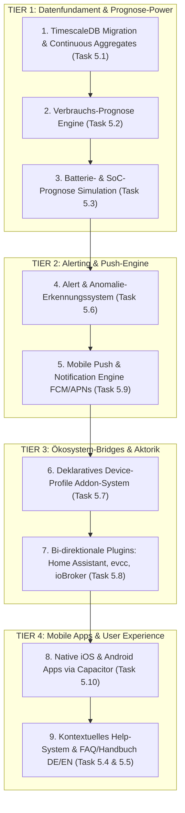

# 🎯 Verbindliche Ausführungs- & Prioritätenliste (Execution Roadmap)

**Datum**: 25. August 2026  
**Bereich**: Sprint-Planung, Meilenstein-Steuerung, Execution Backlog  
**Ziel**: Systematische Abarbeitung der strategischen Meilensteine vom Datenfundament bis zu den nativen Apps.

---

## 🏛️ Das 4-Stufen-Phasenmodell (Tiers)

Wir arbeiten die offenen Arbeitspakete in 4 sequenziellen Stufen ab, um technische Abhängigkeiten optimal zu nutzen:

---

## 📋 Detaillierte Arbeitspakete & Spezifikation

---

### 🟢 TIER 1: DATENFUNDAMENT & PROGNOSE-POWER (Sofort starten)

#### 1. 🗄️ Task 5.1: TimescaleDB Migration & Continuous Aggregates
* **Warum jetzt?**: `DeviceMetric` sammelt mit jeder Sekunde Telemetrie Millionen Zeilen. Hypertables verhindern Datenbank-Verlangsamung.
* **Maßnahmen**:
  1. `devices_devicemetric` als TimescaleDB-Hypertable (`timestamp`-Partitionierung) konfigurieren.
  2. SQL Continuous Aggregates (1m, 5m, 1h) direkt in PostgreSQL für Sub-10ms Chartabfragen.
  3. Retention & Compression Policy: Automatische Kompression nach 7 Tagen, Rohdaten-Retention nach 30 Tagen.
* **Ergebnis**: 100x schnellere Historien-Abfragen, 90 % weniger Speicherverbrauch.

#### 2. 📈 Task 5.2: Verbrauchs-Prognose (Household Load Forecast Engine)
* **Warum jetzt?**: Erst mit dem vorhergesagten Grundverbrauch kann der Optimizer echte Netto-PV-Überschüsse berechnen.
* **Maßnahmen**:
  1. Berechnung von Wochentags- und Tageszeit-Lastprofilen aus historischen Zählerdaten.
  2. Heizgradtage-/Temperatur-Kompensation für Wärmepumpen und Klimageräte.
  3. Bereitstellung der 24h–48h Lastkurve in der Prognose-Pipeline.
* **Ergebnis**: Realistische Residuallast-Kurve für die nächsten 2 Tage.

#### 3. 🔋 Task 5.3: Batterie- & SoC-Prognose (24h/48h Simulation)
* **Warum jetzt?**: Der Anwender will im Dashboard sehen: *„Reicht mein Akku heute Nacht oder muss ich nachladen?“*
* **Maßnahmen**:
  1. Vorausschauende 48h SoC-Simulation: $SoC(t+1) = SoC(t) + \eta \cdot (P_{\text{PV}} - P_{\text{Last}})$.
  2. Berücksichtigung von Batterie-Kapazität, Ladebegrenzungen, Mindest-Notstromreserve und Verlusten.
  3. Visualisierung der prognostizierten Ladekurve im Energie-Dashboard.
* **Ergebnis**: Vollständige Transparenz über den Batteriezustand der nächsten 48 Stunden.

---

### 🟡 TIER 2: ALERTING & PUSH-BENACHRICHTIGUNGEN

#### 4. 🚨 Task 5.6: Intelligentes Alert- & Anomalie-Erkennungssystem
* **Maßnahmen**:
  1. Celery-Hintergrundprüfung alle 5 Minuten auf 3 Kern-Anomalien:
     * 🔥 **„Keine PV erkannt“**: Wetterdienst meldet Globalstrahlung $> 400\,\text{W/m}^2$, aber Wechselrichter meldet $0\,\text{W}$.
     * 🔥 **„Batterie leer / Ungewöhnliche Entladung“**: SoC fällt unerwartet unter $10\,\%$ oder entlädt sich bei Sonnenschein ins Netz.
     * 🔥 **„Unerwarteter Verbrauch“**: Dauerlast $> 1.500\,\text{W}$ nachts zwischen 01:00 und 05:00 Uhr.
  2. Speicherung der Alarme im Django-Modell `AlertEvent` und Anzeige im Frontend-Dashboard.
* **Ergebnis**: Proaktiver Schutz vor Hardware-Defekten, PV-Ertragsverlust und Stromverschwendung.

#### 5. 📲 Task 5.9: Mobile Push & Notification Engine (Backend)
* **Maßnahmen**:
  1. Django `notifications`-App mit `DeviceToken`-Verwaltung (iOS/Android/Web).
  2. Integration von Firebase Cloud Messaging (`FCM`) und Apple Push Notification Service (`APNs`).
  3. Konfigurierbare Ruhezeiten (Quiet Hours) und Dringlichkeitsstufen (Kritisch vs. Info).
* **Ergebnis**: Sofortige Zustellung von Alarmen auf den Smartphone-Sperrbildschirm.

---

### 🔵 TIER 3: ÖKOSYSTEM-BRIDGES & HARDWARE-INTEGRATION

#### 6. 📄 Task 5.7: Deklaratives Device-Profile Addon-System
* **Maßnahmen**:
  1. Trennung von Transport (MQTT/REST) und Daten-Mapping.
  2. YAML-Profil-Bibliothek (`sungrow_sh10rt.yaml`, `sma_tripower.yaml`, `fronius_solarapi.json`, `deye_hybrid.yaml`, `huawei_fusionsolar.yaml`).
  3. Automatischer Mapper in die Sharegy-Standardmetriken (`pv_power_w`, `battery_soc`, `grid_power_w`).
* **Ergebnis**: Plug & Play Einbindung neuer Wechselrichter in 10 Minuten ohne Backend-Codeänderung.

#### 7. 🔌 Task 5.8: Bi-direktionale Plugins (Home Assistant, evcc & ioBroker)
* **Maßnahmen**:
  1. **Home Assistant Custom Component**: Automatischer Telemetrie-Upload via MQTT & Bereitstellung von Optimizer-Sensoren für HA-Automationen.
  2. **evcc Provider-Plugin**: Übergabe der Sharegy Optimizer-Bestfenster als dynamischer Tarif (`tariff: custom`), sodass evcc 60+ Wallboxen mit Phasenumschaltung steuert.
  3. **ioBroker Adapter**: 2-Wege-Sync über MQTT.
* **Ergebnis**: 100 % Kompatibilität zu bestehenden Smart Homes und Wallboxen ohne eigene Hardware.

---

### 🟣 TIER 4: MOBILE APPS & USER EXPERIENCE

#### 8. 📱 Task 5.10: Native iOS & Android Apps via Capacitor
* **Maßnahmen**:
  1. Capacitor-Integration für die React/Tailwind Web-App.
  2. Biometrie-Login (FaceID, TouchID, Fingerabdruck).
  3. Native Lockscreen- und Homescreen-Widgets (Live-PV, Batterie-SoC, Optimizer-Fahrplan).
  4. Build-Pipelines für Apple App Store & Google Play Store.
* **Ergebnis**: Echte App-Store-Präsenz, maximale Kundenbindung und täglicher Blickfang über Widgets.

#### 9. ❓ Task 5.4 & 5.5: Kontextuelles Help-System & FAQ/Handbuch (DE/EN)
* **Maßnahmen**:
  1. In-App Side-Drawer mit Quick-Guides auf allen Hauptseiten.
  2. Durchsuchbares FAQ- und Wissensportal mit Schritt-für-Schritt-Anleitungen für Wechselrichter, Zähler und Smart-Home-Bridges.
  3. Zweisprachig gepflegt (Deutsch / Englisch).
* **Ergebnis**: Nahtloses Onboarding und minimale Support-Aufwände.

