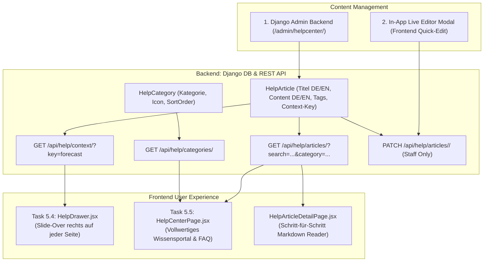

# 📚 Architektur & Walkthrough: Task 5.4 & 5.5 – Kontextuelles Help-System & Wissensportal

**Datum**: 25. August 2026  
**Bereich**: In-App Support, Kontext-Hilfe, FAQ-Portal, Knowledge Base, Headless Content Management  
**Status**: 🚀 In Umsetzung

---

## 🎯 1. Zielsetzung & Kernfragen

1. **Wo stehen die Texte & Anleitungen?**
   * Vollständig strukturiert in der Datenbank (`helpcenter`-App) in einem **Headless-Modell** mit Markdown-Unterstützung (Texte, Code-Snippets, Tabellen, Warn-Boxen und Bilder).
   * Getrennte Felder für **Deutsch (`_de`)** und **Englisch (`_en`)**.
2. **Wie erfolgt die laufende Pflege?**
   * **Django Admin**: Voller Zugriff für Entwickler & Redaktion.
   * **In-App Quick-Editor**: Für angemeldete Mitarbeiter (`is_staff`) direkt im Drawer/Portal per Klick auf „✏️ Bearbeiten“ ohne Deployment.

---

## 🏛️ 2. Architektur & Systemüberblick

---

## 📋 3. Spezifikation der Komponenten

### A. Task 5.4: In-App Help Drawer (Slide-Over)
* Button **`? Hilfe & Tipps`** in der Sidebar und im Top-Header jeder Seite.
* Beim Klick gleitet von rechts ein eleganter Drawer ein (ohne Seitenwechsel):
  * **Kontexterkennung**: Erkennt die aktuelle URL/Route (z. B. `context_key = "forecast"` oder `"energy_dashboard"` oder `"devices"`).
  * **Top 3 Quick-Guides**: Zeigt sofort die relevantesten Erklärungen für die aktuelle Ansicht.
  * **Schnellsuche**: Live-Suche im gesamten Wissensportal.
  * **Direktlink**: Button *„Zum vollständigen Handbuch ↗“*.

### B. Task 5.5: Wissensportal & FAQ-Center (`/app/help`)
* **Kategorie-Übersicht**:
  * ☀️ **Erzeuger & Photovoltaik**: Wechselrichter-Anbindung (SMA, Sungrow, Fronius, Deye, Huawei).
  * ⚡ **Strompreise & Tarife**: Dynamische Tarife, Tibber, Börsenstrom-Formeln.
  * 🤖 **Smart Energy Optimizer**: Fahrpläne, Ladefenster, Wärmepumpen-Steuerung.
  * 🚨 **Alarmzentrale**: Notifikationen, Ertragsausfall-Erkennung, Schwellwerte.
  * 🧾 **Abrechnung & Mieterstrom**: Sub-Metering, Zählerallokation, PDF-Export.
* **Volltextsuche**: Schnelle Client- & Backend-Suche mit Treffer-Highlighting.
* **Artikel-Ansicht**: Responsiver Markdown-Reader mit Alert-Boxen (`> [!NOTE]`, `> [!TIP]`, `> [!WARNING]`), Copy-to-Clipboard für Codeblöcke und "War dieser Artikel hilfreich?"-Feedback.

