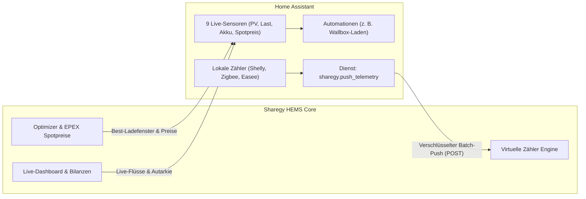

# Walkthrough & Handbuch: Home Assistant Integration & Telemetrie-Push

**Datum**: 25. August 2026  
**Bereich**: Smart Home, Home Assistant Custom Component, Telemetrie-Push, HEMS-Steuerung, Aktorik  
**Status**: 🟢 **VOLLSTÄNDIG DOKUMENTIERT & EINSATZBEREIT**  

---

## 🎯 Überblick & Architektur

Die **Sharegy Home Assistant Custom Component** verbindet dein Smart Home bidirektional mit Sharegy HEMS:



---

## ⚙️ 1. Einrichtung in Home Assistant

### Parameter-Übersicht:

| Feld in HA | Welcher Wert wird erwartet? | Beispiele |
| :--- | :--- | :--- |
| **Sharegy Server-URL** (`host`) | Vollständige HTTP(S)-Adresse der Sharegy-Instanz | • `http://192.168.178.50:8000`<br>• `http://sharegy.local:8000`<br>• `https://sharegy.de` |
| **API-Key / Token** (`api_key`) | Haushalts-Schlüssel aus Sharegy | • **MQTT-Passwort (PW)** *(aus Sharegy unter Schnittstellen)*<br>• **MQTT-UserID / Token** *(16-stelliger Haushalts-Code)* |
| **Abfrage-Intervall** (`scan_interval`) | Aktualisierungsintervall der Sensoren | `10` *(Sekunden)* |

> [!NOTE]
> In Sharegy ist dein **MQTT-Token** identisch mit deiner **MQTT-UserID** (dem Haushalts-Code in deinem Topic wie `h/1A2B3C4D5E6F7A8B/#`). Du kannst sowohl dein **MQTT-PW** als auch die **MQTT-UserID** als `api_key` verwenden.

---

## 📊 2. Verfügbare Sensoren in Home Assistant

Sobald die Integration verbunden ist, stehen 9 Entitäten für Dashboards und Automationen bereit:

1. `sensor.sharegy_solar_erzeugung` (`W`) – Aktuelle PV-Leistung.
2. `sensor.sharegy_hausverbrauch` (`W`) – Gesamter Haushaltsstrombedarf.
3. `sensor.sharegy_netzleistung` (`W`) – Netzbezug (+) oder Netzeinspeisung (-).
4. `sensor.sharegy_batterieleistung` (`W`) – Speicher Ladeleistung (+) / Entladeleistung (-).
5. `sensor.sharegy_batterie_ladestand_soc` (`%`) – Akku-Füllstand.
6. `sensor.sharegy_autarkiegrad` (`%`) – Heutiger Autarkiegrad.
7. `sensor.sharegy_eigenverbrauchsquote` (`%`) – Heutige Eigenverbrauchsquote.
8. `sensor.sharegy_borsenstrompreis` (`ct/kWh`) – Dynamischer EPEX Spot-Börsenstrompreis.
9. `sensor.sharegy_optimizer_best_zeitfenster` – Bestes Ladefenster (z. B. `13:00 - 15:00`).

---

## 📤 3. Messwerte von Home Assistant an Sharegy senden (`push_telemetry`)

In Home Assistant ist der Messwerte-Push ein **Dienst / eine Aktion (`sharegy.push_telemetry`)**, die über eine reguläre Home Assistant Automation in Intervallen ausgeführt wird.

### Schritt 3.1: Dienst in HA testen
1. In Home Assistant: **Entwicklerwerkzeuge** $\rightarrow$ **Aktionen / Dienste**.
2. Dienst auswählen: **`Sharegy HEMS: Push Telemetry to Sharegy`** (`sharegy.push_telemetry`).
3. Auf **In YAML bearbeiten** klicken und folgenden Test ausführen:

```yaml
action: sharegy.push_telemetry
data:
  devices:
    - identifier: "shelly_plug_kitchen"
      name: "Kaffeevollautomat"
      power_w: 1250.0
      energy_kwh: 4.5
      role: "consumer"
```
4. Klicke auf **Aktion ausführen**. Das Gerät erscheint sofort in Sharegy!

---

### Schritt 3.2: Zyklische Automation einrichten

1. In Home Assistant: **Einstellungen $\rightarrow$ Automatisierungen & Szenen $\rightarrow$ Neue Automatisierung erstellen**.
2. Oben rechts Drei-Punkte-Menü $\rightarrow$ **In YAML bearbeiten**.
3. Vorlage einfügen und Sensor-Namen anpassen:

```yaml
alias: "Sharegy: Zählerdaten an Sharegy übertragen"
description: "Sendet alle 10 Sekunden Messwerte lokaler Sensoren an Sharegy HEMS"
trigger:
  - platform: time_pattern
    seconds: "/10"
condition: []
action:
  - service: sharegy.push_telemetry
    data:
      devices:
        # 1. Hauptanschluss (z. B. Shelly 3EM oder Poweropti)
        - identifier: "ha_grid_meter"
          name: "Hausanschluss (Shelly 3EM)"
          power_w: "{{ states('sensor.shelly_3em_total_power') | float(0) }}"
          energy_kwh: "{{ states('sensor.shelly_3em_total_energy') | float(0) }}"
          role: "grid"

        # 2. Wärmepumpe
        - identifier: "ha_heatpump"
          name: "Wärmepumpe"
          power_w: "{{ states('sensor.heatpump_power') | float(0) }}"
          role: "consumer"

        # 3. Wallbox / E-Auto
        - identifier: "ha_wallbox"
          name: "Wallbox"
          power_w: "{{ states('sensor.wallbox_power') | float(0) }}"
          role: "consumer"
mode: restart
```
4. Speichern. Fertig!

---

## 🤖 4. Aktorik-Automation: E-Auto im günstigsten Zeitfenster laden

Nutze das vom Optimizer berechnete Zeitfenster zur automatischen Aktor-Steuerung:

```yaml
alias: "Sharegy: E-Auto im Optimizer-Zeitfenster laden"
description: "Schaltet die Wallbox ein, sobald das günstigste Zeitfenster aktiv ist"
trigger:
  - platform: template
    value_template: >
      
      
        
        {{ now().strftime('%H:%M') == start_time }}
      
        false
      
condition:
  - condition: state
    entity_id: binary_sensor.wallbox_car_connected
    state: "on"
action:
  - service: switch.turn_on
    target:
      entity_id: switch.wallbox_charging
```
