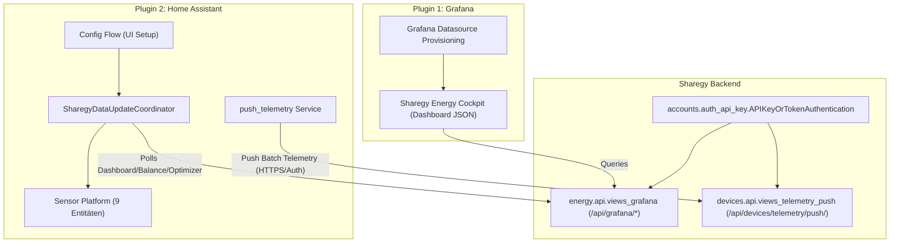

# Walkthrough: Plugins für Grafana & Home Assistant (Task 5.8)

**Datum**: 25. August 2026  
**Status**: 🟢 **ERFOLGREICH IMPLEMENTIERT & VERIFIZIERT**  
**Bereich**: Externe Integrationen, Visualisierung, Grafana SimpleJSON/Infinity, Home Assistant Custom Component, API-Key Auth, Telemetrie-Push  

---

## 🎯 Zusammenfassung der Umsetzung

Für Sharegy HEMS wurden zwei einsatzbereite Plugins und Integrations-Pakete entwickelt:

1. **Grafana Integration (`plugins/grafana/`)**:
   * Ermöglicht das Erstellen beliebiger Dashboards in Grafana mit sicherer Authentifizierung (`Authorization: Bearer <Token>` oder `X-API-Key`).
   * REST-Bridge kompatibel mit Grafana **JSON / Infinity / SimpleJSON Datasource**:
     * `GET /api/grafana/`: Healthcheck & Ping.
     * `POST /api/grafana/search`: Dynamische Metrik-Auswahl (PV, Last, Netz, Speicher, Autarkie, Spotpreise, Submeter).
     * `POST /api/grafana/query`: Datapoint-Stream für Grafana Timeseries (`[[value, timestamp_ms], ...]`).
     * `POST /api/grafana/annotations`: Live System-Alerts direkt im Grafana Zeitstrahl.
   * **Ready-to-use Cockpit Dashboard JSON**: [`plugins/grafana/dashboards/sharegy_energy_cockpit.json`](file:///c:/Users/Public/Dev/eswes/plugins/grafana/dashboards/sharegy_energy_cockpit.json) mit Live-Gauges, PV-vs-Last Charts, SoC-Anzeige, Börsenstrompreisen und gestapeltem Sub-Metering.

2. **Home Assistant Custom Integration (`plugins/homeassistant/custom_components/sharegy/`)**:
   * Vollständige, native Home Assistant Integration (`custom_components/sharegy`) mit UI-Config-Flow.
   * **Live-Sensoren in HA**:
     * `sensor.sharegy_solar_erzeugung` (W)
     * `sensor.sharegy_hausverbrauch` (W)
     * `sensor.sharegy_netzleistung` (W)
     * `sensor.sharegy_batterieleistung` (W)
     * `sensor.sharegy_batterie_ladestand_soc` (%)
     * `sensor.sharegy_autarkiegrad` (%)
     * `sensor.sharegy_eigenverbrauchsquote` (%)
     * `sensor.sharegy_borsenstrompreis` (ct/kWh)
     * `sensor.sharegy_optimizer_best_zeitfenster` (z. B. `13:00 - 15:00` für Aktorik/Automationen)
   * **Sicherer & verschlüsselter Rückkanal**:
     * Service `sharegy.push_telemetry` und Batch-API `POST /api/devices/telemetry/push/` zur Übertragung lokaler HA-Zähler (Shelly 3EM, Zigbee-Plugs, Wallbox, Wärmepumpe) an Sharegy.

---

## 🏗️ Implementierte Komponenten



### Dateistruktur & Artefakte

* [`accounts/auth_api_key.py`](file:///c:/Users/Public/Dev/eswes/accounts/auth_api_key.py): Universeller Authenticator für `X-API-Key` & `Bearer <Token>`.
* [`energy/api/views_grafana.py`](file:///c:/Users/Public/Dev/eswes/energy/api/views_grafana.py) & [`energy/api/urls_grafana.py`](file:///c:/Users/Public/Dev/eswes/energy/api/urls_grafana.py): Grafana JSON-Bridge.
* [`devices/api/views_telemetry_push.py`](file:///c:/Users/Public/Dev/eswes/devices/api/views_telemetry_push.py): Sichere Telemetrie-Einspeisung.
* **Grafana-Paket**:
  * [`plugins/grafana/README.md`](file:///c:/Users/Public/Dev/eswes/plugins/grafana/README.md)
  * [`plugins/grafana/provisioning/datasources/sharegy_datasource.yaml`](file:///c:/Users/Public/Dev/eswes/plugins/grafana/provisioning/datasources/sharegy_datasource.yaml)
  * [`plugins/grafana/dashboards/sharegy_energy_cockpit.json`](file:///c:/Users/Public/Dev/eswes/plugins/grafana/dashboards/sharegy_energy_cockpit.json)
* **Home Assistant Integration**:
  * [`plugins/homeassistant/README.md`](file:///c:/Users/Public/Dev/eswes/plugins/homeassistant/README.md)
  * [`plugins/homeassistant/custom_components/sharegy/manifest.json`](file:///c:/Users/Public/Dev/eswes/plugins/homeassistant/custom_components/sharegy/manifest.json)
  * [`plugins/homeassistant/custom_components/sharegy/__init__.py`](file:///c:/Users/Public/Dev/eswes/plugins/homeassistant/custom_components/sharegy/__init__.py)
  * [`plugins/homeassistant/custom_components/sharegy/const.py`](file:///c:/Users/Public/Dev/eswes/plugins/homeassistant/custom_components/sharegy/const.py)
  * [`plugins/homeassistant/custom_components/sharegy/coordinator.py`](file:///c:/Users/Public/Dev/eswes/plugins/homeassistant/custom_components/sharegy/coordinator.py)
  * [`plugins/homeassistant/custom_components/sharegy/sensor.py`](file:///c:/Users/Public/Dev/eswes/plugins/homeassistant/custom_components/sharegy/sensor.py)
  * [`plugins/homeassistant/custom_components/sharegy/config_flow.py`](file:///c:/Users/Public/Dev/eswes/plugins/homeassistant/custom_components/sharegy/config_flow.py)
  * [`plugins/homeassistant/custom_components/sharegy/services.yaml`](file:///c:/Users/Public/Dev/eswes/plugins/homeassistant/custom_components/sharegy/services.yaml)
  * [`plugins/homeassistant/custom_components/sharegy/translations/de.json`](file:///c:/Users/Public/Dev/eswes/plugins/homeassistant/custom_components/sharegy/translations/de.json)
  * [`plugins/homeassistant/custom_components/sharegy/translations/en.json`](file:///c:/Users/Public/Dev/eswes/plugins/homeassistant/custom_components/sharegy/translations/en.json)

---

## 🧪 Verifikationsergebnisse

1. **Django Test Suite**:
   * Alle **34 Tests laufen erfolgreich durch**:
     ```
     Ran 34 tests in 46.509s - OK
     ```
   * Getestet wurden:
     * Bearer Token & `X-API-Key` Authentifizierung
     * Unauthorisierter Zugriffsschutz (401/403)
     * Grafana Search & Timeseries Query mit Datapoints
     * Home Assistant Batch Telemetrie-Push mit automatischer Geräteanlegung und Metrikerfassung.
2. **Syntax- & JSON-Prüfung**:
   * Alle JSON-Dateien (Grafana Dashboard, Manifest, Translations) und Python-Dateien validiert.
