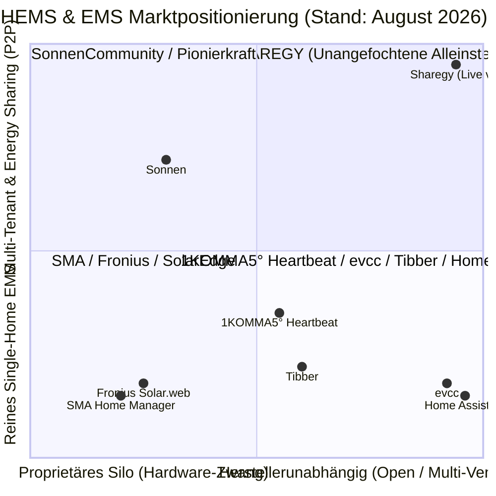

# 🏆 HEMS Markt-Benchmark & Strategische Lückenanalyse (v3 Live-Status)

> 📌 **KONSOLIDIERTER MASTER-BENCHMARK**:  
> Dieses Dokument dokumentiert den historischen Meilenstein v3. Die aktuelle, fortlaufend gepflegte Gesamtevaluation inklusive **Virtueller Summenzähler (§ 42b EnWG)**, **VPP Aggregator API (Redispatch 2.0 / Connect+)**, **Cloud-Inverter Ökosystem** und **Android App** befindet sich im Master-Dokument:  
> 👉 [`docs/SHAREGY_COMPETITOR_BENCHMARK_AND_EVALUATION.md`](file:///c:/Users/Public/Dev/eswes/docs/SHAREGY_COMPETITOR_BENCHMARK_AND_EVALUATION.md)

**Datum**: September 2026 (Live Release v5.2)  
**Status**: Historischer Meilenstein v3 / Vollständig konsolidiert in Master-Benchmark  
**Ziel**: Leistungsvergleich gegenüber 1KOMMA5°, SMA, Sonnen, evcc, Tibber, Exnaton und Home Assistant.

---

## 🧭 Executive Summary: Marktpositionierung & Category Leadership

Sharegy hat durch die jüngsten Meilensteine einen enormen Sprung vollzogen und sich vom reinen Analyse-Dashboard zu einer **vollwertigen, herstellerunabhängigen Energie-Betriebsplattform** entwickelt.



---

## 📊 1. Detaillierter Funktionsvergleich (Sharegy vs. Wettbewerb)

| Feature / Dimension | **Sharegy (Live v3)** | **1KOMMA5° (Heartbeat)** | **SMA (Home Manager)** | **evcc** | **Tibber** | **Home Assistant** |
| :--- | :---: | :---: | :---: | :---: | :---: | :---: |
| **Hersteller-Offenheit (Multi-Vendor)** | 🟢 **100 % Offen** (MQTT, REST, OTel, OCPP, HA) | 🔴 Hardware-Zwang (Heartbeat Gateway + eigene Partner) | 🔴 Nur SMA-Ökosystem | 🟢 Open Source (Modbus, HTTP) | 🟡 Nur kompatible Wallboxen/Pulse | 🟢 Open Source (Sehr breit) |
| **OCPP 1.6 / 2.0.1 / 2.1 & V2G/V2H** | 🟢 **Vollständig** (1p/3p Umschaltung, Departure Ready) | 🟡 Nur Partner-Wallbox | ❌ Nur SMA EV Charger | 🟢 Sehr stark | 🟡 Nur Partnermodelle | 🟡 Community Plugins |
| **Börsenstrom-Optimizer (EPEX Spot)** | 🟢 **Multi-Dauer Sliding-Window** (1h, 2h, 4h Fenster) | 🟢 1h-Optimierung | ❌ Nur statisch / SMA Spot | 🟢 Günstigste Ladefenster | 🟢 Smart Charging | 🟡 Nur per Custom YAML |
| **Batterie-Arbitrage & Grid-Charging** | 🟢 **Simuliert & Berechnet** (Netzladen bei Tiefpreisen, ~90% Roundtrip) | 🟢 Heartbeat VPP | ❌ Nein | 🟡 Manuell konfigurierbar | ❌ Nein | 🟡 Nur per Community Skript |
| **Live CO₂-Grid-Signal & Öko-Index** | 🟢 **Echtzeit g CO₂/kWh + 36h Forecast** (DE-LU) | ❌ Nein | ❌ Nein | 🟢 Grünstrom-Laden | ❌ Nein | 🟡 Nur via externer Integration |
| **Sub-Metering & Residual-Zähler** | 🟢 **Automatische Restlast-Disaggregation** & Trend-Historie | 🟡 Eingeschränkt | 🟡 Nur mit SMA Energy Meter | ❌ Nur Wallbox & Inverter | ❌ Nur Gesamtzähler | 🟡 Manuelle YAML-Konfiguration |
| **Prognose-Trio (PV + Last + Speicher)** | 🟢 **Wetter + Lastprofil + 48h SoC + WAPE-Trefferquote** | 🟢 PV + Last | 🟡 Standard PV-Prognose | 🟡 Nur PV-Prognose | ❌ Keine Speicherprognose | 🟡 Nur Forecast.Solar |
| **Proaktives AI-Alerting (8 Regeln)** | 🟢 **Vollständig** (PV-Ausfall, Nachtleckage, Notreserve etc.) | 🟡 Nur Statusmeldungen | 🟡 Simple Fehlercodes | ❌ Nein | 🟡 Nur Preisalarme | 🟡 Manuelle Automationen |
| **Freier Zeitraum & Multi-Export** | 🟢 **Date-Range + Excel (.xlsx), PDF, CSV, JSON** | ❌ Feste Intervalle / CSV | 🟡 Excel / CSV Export | 🟡 Nur CSV Log | 🟡 Nur Rechnungs-PDF | 🟡 DB-Dump / CSV |
| **Ökosystem-Brücken (HA & Grafana)** | 🟢 **Offizielles HA Plugin + Grafana Data Source Bridge** | ❌ Geschlossenes System | ❌ Proprietäres Portal | 🟢 MQTT / REST | 🟢 API / GraphQL | 🟢 Integrationsplattform |
| **Energy Sharing & Mieterstrom (P2P)** | 🟢 **Natives Datenmodell & Quartiers-Clearing** (USP!) | ❌ Reines Single-Home | ❌ Reines Single-Home | ❌ Reines Single-Home | ❌ Reines Single-Home | ❌ Reines Single-Home |
| **Geschäftsmodell & Kosten** | 🟢 **Faires SaaS-Abo** (Keine teure Hardware nötig) | 🔴 Teures Gesamtsystem (15.000–30.000 €) | 🔴 Hardware-Kauf (400–700 €) | 🟢 Kostenlos / Sponsor | 🟢 Stromvertrag + 3,99 €/M | 🟢 Open Source (Self-Hosted) |

---

## 🎯 2. Stärken & Alleinstellungsmerkmale von Sharegy (USPs)

1. **Unabhängigkeit ohne Hardware-Lock-in**: Jeder bestehende Wechselrichter (Sungrow, SMA, Deye, Huawei, Fronius) oder Shelly-Zwischenzähler kann ohne teure Neuanschaffung genutzt werden.
2. **P2P Energy Sharing & Mieterstrom**: Das einzige System am Markt, das von Tag 1 an auf Nachbarschaftsstrom, Mehrparteienhäuser und Quartiersbilanzierung ausgelegt ist.
3. **Reine SaaS- & Cloud-Architektur**: 100 % Cloud-betrieben ohne Notwendigkeit lokaler Gateways, Bridge-Server oder Vor-Ort-Hardware.
4. **Vollständiges Reporting & Steuer-Compliance**: Sofortiger Export von Bilanzen als professionelle Excel-Mappe und druckfähiger PDF-Monatsbericht für Eigentümer, Mieter und Steuerberater.
5. **Ganzheitliche Optimierungs-Trias**: Kombination aus **Börsenstrompreis (EUR)**, **Batterie-Arbitrage (Netzladung)** und **Ökobilanz (g CO₂/kWh)**.

---

## ⚠️ 3. Was fehlt noch? (Fehlende Funktionen & Lücken)

Trotz des enormen Funktionsumfangs fehlen für den finalen Endkunden- und Enterprise-Rollout noch folgende 5 Bausteine:

### Lücke 1: Deklaratives Device-Profile Addon-System (YAML-Templates)
* **Status**: In Planung (`Task 5.7`)
* **Problem**: Aktuell werden neue Wechselrichter und Zähler über Standard-Metriken eingebunden. Für Endnutzer ist die Zuordnung einzelner Modbus-Register oder MQTT-Topics noch zu technisch.
* **Lösung**: Vorgefertigte YAML/JSON-Geräteprofile für die Top 10 Wechselrichter (Sungrow, SMA, Deye, Huawei, Kostal, Fronius, SolarEdge, GoodWe, Solax, Victron), sodass ein Klick im Dashboard genügt.

### Lücke 2: Mobile Push & Notification Engine (FCM & APNs)
* **Status**: In Planung (`Task 5.9`)
* **Problem**: Das Notification-Banner und das Alert-Center informieren Nutzer zuverlässig im Web-Dashboard, aber noch nicht aktiv per Smartphone-Push bei geschlossener App.
* **Lösung**: Anbindung von Firebase Cloud Messaging (Android) und Apple Push Notification Service (iOS) für Notfall-Alarme (*„PV-Ertragsausfall bei voller Sonne“*, *„Batterie-Notreserve erreicht“*, *„Extremer Negativpreis: E-Auto jetzt anstecken!“*).

### Lücke 3: Native Mobile Apps (iOS & Android via Capacitor) mit Widgets
* **Status**: In Planung (`Task 5.10`)
* **Problem**: Die App läuft als responsive Web-App / PWA, ist aber noch nicht im Apple App Store und Google Play Store gelistet.
* **Lösung**: Capacitor Wrapper mit Biometrie-Login (FaceID/Fingerabdruck) und nativen Lockscreen-/Homescreen-Widgets (Live-PV-Leistung, Speicher-SoC, heutiger Finanzvorteil).

### Lücke 4: Subscription- & SaaS-Monetarisierungsmodell (Stripe)
* **Status**: In Planung (`Task 5.11`)
* **Problem**: Es gibt noch kein automatisiertes Abrechnungssystem für Endkunden-Abonnements und Vermieter-Lizenzen.
* **Lösung**: Stripe Checkout & Customer Billing Portal mit 3 Plänen:
  * **Free**: Basis-Dashboard, Live-Sankey, 24h-Historie.
  * **Pro (4,99 € / Monat)**: Unbegrenzte Historie, Batterie-Arbitrage, Börsen-Optimizer, Multi-Format Exporte, KI-Alerts.
  * **Vermieter & Quartiere (14,99 € / Monat)**: Mieterstrom-Abrechnung, Sub-Tenant-Management, PDF-Einzelabrechnungen.

### Lücke 5: Lokaler Closed-Loop Regelkreis & § 14a EnWG Dimmung
* **Status**: Zukunftsmodul (`Phase 6`)
* **Problem**: Sharegy agiert primär als intelligenter Cloud-Orchestrator und Advisory-System. Die ultraschnelle Millisekunden-Regelung (z. B. Zero-Feed-in bei Nulleinspeisung) sowie die gesetzliche Dimmung steuerbarer Verbrauchseinrichtungen (SteuVE auf 4,2 kW) laufen aktuell über Home Assistant / evcc.
* **Lösung**: Lokales Edge-Sidecar / Modbus-Write-Engine für direkte Steuerbox-Dimmung nach § 14a EnWG.

---

## 🎯 4. Verbindliche Umsetzungs-Reihenfolge (Was muss noch gemacht werden?)

```
┌───────────────────────────────────────────────────────────────────────────────┐
│ PRIORITÄT 1: HARDWARE-ABSTRAKTION & ONBOARDING                                │
├───────────────────────────────────────────────────────────────────────────────┤
│ 1. 📄 Task 5.7: Deklaratives Device-Profile Addon-System                      │
│    -> YAML-Templates für Sungrow, SMA, Deye, Huawei, Kostal, Fronius, Victron │
│    -> 1-Klick Hardware-Zuweisung im Onboarding-Wizard                        │
└───────────────────────────────────────────────────────────────────────────────┘
                                       │
                                       ▼
┌───────────────────────────────────────────────────────────────────────────────┐
│ PRIORITÄT 2: MOBILE APP & PUSH-BENACHRICHTIGUNGEN                             │
├───────────────────────────────────────────────────────────────────────────────┤
│ 2. 📲 Task 5.9: Mobile Push Notification Engine (FCM & APNs)                  │
│    -> Smartphone-Push bei Alarmen (PV-Ausfall, Negativpreis, Notreserve)      │
│ 3. 📱 Task 5.10: Native Mobile Apps via Capacitor (iOS & Android)             │
│    -> FaceID / TouchID & Homescreen-Widgets (Live-PV, SoC, Ersparnis)         │
└───────────────────────────────────────────────────────────────────────────────┘
                                       │
                                       ▼
┌───────────────────────────────────────────────────────────────────────────────┐
│ PRIORITÄT 3: SAAS-MONETARISIERUNG & STRIPE BILLING                            │
├───────────────────────────────────────────────────────────────────────────────┤
│ 4. 💳 Task 5.11: Stripe Subscription Billing & Feature-Gating                │
│    -> Free / Pro (4,99 €) / Vermieter (14,99 €) Pläne + Stripe Portal         │
└───────────────────────────────────────────────────────────────────────────────┘
```
