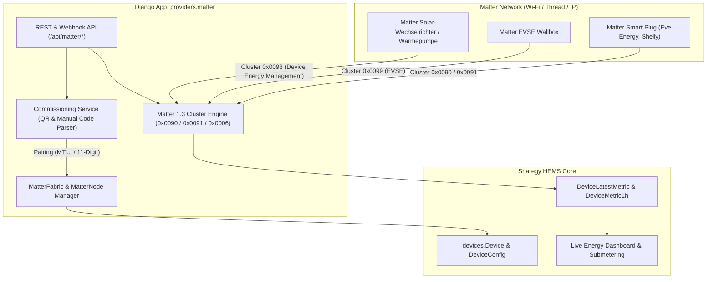

# Walkthrough: Sharegy Matter Hub & Matter 1.3 Energy Management (Task 5.12)

**Datum**: 26. August 2026  
**Bereich**: IoT, Matter Standard (CSA Spec 1.3), Energy Reporting, Commissioning, Smart Plugs, EVSE & Inverter  
**Status**: 🟢 **ERFOLGREICH IMPLEMENTIERT & VERIFIZIERT**  

---

## 🎯 Zusammenfassung

Mit diesem Release erhält **Sharegy HEMS** einen nativen **Matter Hub & Bridge Engine** mit voller Unterstützung des neuen **Matter 1.3 Energy Management Standards**.

Damit können moderne Smart-Home- und Energie-Geräte (Matter-over-Wi-Fi, Matter-over-Thread und Matter-over-IP) ohne herstellerspezifische Cloud oder proprietäre Protokolle direkt mit Sharegy gekoppelt und gesteuert werden:
* **Eve Energy Matter Plugs, Shelly Matter, TP-Link Tapo Matter**.
* **Matter 1.3 EVSE Wallboxen** (mit Ladeleistungssteuerung und Lastmanagement).
* **Matter 1.3 Wärmepumpen, PV-Wechselrichter & Batteriespeicher**.

---

## 🏗️ Architektur & Unterstützte Matter 1.3 Cluster



### Spezifikationskonforme Cluster:
1. **`0x0090` (`Electrical Power Measurement Cluster`)**:
   * Liest `ActivePower` (W / mW), `ActiveCurrent` (mA), `RMSVoltage` (mV) und `PowerFactor` aus und persistiert sie direkt in `DeviceLatestMetric`.
2. **`0x0091` (`Electrical Energy Measurement Cluster`)**:
   * Erfasst `CumulativeEnergyImported` (mWh / Wh) und aggregiert historische Stundendaten in `DeviceMetric1h`.
3. **`0x0006` (`On/Off Cluster`)**:
   * Ermöglicht das bidirektionale Ein- und Ausschalten sowie Toggeln von Relais und Steckdosen.
4. **`0x0098` / `0x0099` (`Device Energy Management & EVSE Clusters`)**:
   * Ermöglicht dynamische Ladeleistungs-Drosselung (`power_adjustment_limit_w`, `max_charge_current_a`) durch den Sharegy Optimizer.

---

## 💻 Implementierte Komponenten

### 1. Backend Engine (`providers/matter/`)
* [`providers/matter/models.py`](file:///c:/Users/Public/Dev/eswes/providers/matter/models.py):
  * `MatterFabric`: 64-Bit Fabric-ID und Controller-Zuordnung je Haushalt.
  * `MatterNode`: Repräsentiert gekoppelte Endgeräte mit Vendor-ID, Product-ID, Discriminator, Setup-PIN, IP-Adresse und Live-Payload.
  * `MatterEndpoint` & `MatterCluster`: Cluster-Fähigkeiten je Endpunkt (`0x0090`, `0x0091`, `0x0006`, `0x0098`, `0x0099`).
* [`providers/matter/services/commissioning.py`](file:///c:/Users/Public/Dev/eswes/providers/matter/services/commissioning.py):
  * Parst **Matter QR-Code Payloads** (`MT:...`), **11-stellige** und **21-stellige manuelle Pairing-Codes**.
  * Baut automatisch die Verbindung zum Sharegy Device-Modell (`DeviceRole: consumer/producer/grid/battery`) auf.
* [`providers/matter/services/cluster_engine.py`](file:///c:/Users/Public/Dev/eswes/providers/matter/services/cluster_engine.py):
  * Dekodiert Attributberichte, speichert Zeitreihen und führt Steuerbefehle (`toggle`, `set_on_off`, `set_power_limit`) aus.
* [`providers/matter/api/views.py`](file:///c:/Users/Public/Dev/eswes/providers/matter/api/views.py) & [`providers/matter/api/urls.py`](file:///c:/Users/Public/Dev/eswes/providers/matter/api/urls.py):
  * `GET /api/matter/status/`: Hub-Status, Fabric-ID, verbundene Knoten.
  * `POST /api/matter/commission/`: Pairing-Endpoint für neue Geräte.
  * `POST /api/matter/nodes/<node_id>/command/`: Steuerungs-Befehle.
  * `DELETE /api/matter/nodes/<node_id>/`: Entkoppeln von Knoten.
  * `POST /api/matter/telemetry/report/`: Webhook für Border-Router.
  * `POST /api/matter/simulate/`: Simulation für Testläufe.

### 2. Frontend UI
* [`frontend/src/features/matter/components/MatterHubCard.jsx`](file:///c:/Users/Public/Dev/eswes/frontend/src/features/matter/components/MatterHubCard.jsx):
  * Zeigt Fabric-Status, aktive Knoten mit Live-Watt (`0x0090`), Zählerstand (`0x0091`), Online-Ampel und Ein/Aus-Schalter.
* [`frontend/src/features/matter/components/MatterPairingModal.jsx`](file:///c:/Users/Public/Dev/eswes/frontend/src/features/matter/components/MatterPairingModal.jsx):
  * Geführter Kopplungs-Dialog für QR-Codes (`MT:...`), 11-/21-stellige Codes und Setup-PINs.
* [`frontend/src/pages/InterfacesPage.jsx`](file:///c:/Users/Public/Dev/eswes/frontend/src/pages/InterfacesPage.jsx):
  * Voll integriert in die Schnittstellen-Übersicht neben MQTT und OpenTelemetry.

---

## 🧪 Verifikationsergebnisse

1. **Django Test Suite**:
   * Alle **39 Tests im Gesamtsystem laufen erfolgreich durch**:
     ```
     Ran 39 tests in 52.309s - OK
     ```
   * Getestete Matter-Szenarien:
     * QR-Code & Manuelles Code-Parsen
     * Smart Plug & EVSE Commissioning
     * Matter 1.3 Cluster 0x0090 / 0x0091 Telemetrie-Einspeisung
     * Schaltbefehle (Toggle / On / Off)
     * Webhook-Ingestion & Delete API
2. **Frontend Production Build**:
   * `vite build` schließt fehlerfrei ab (`✓ built in 31.23s`).
