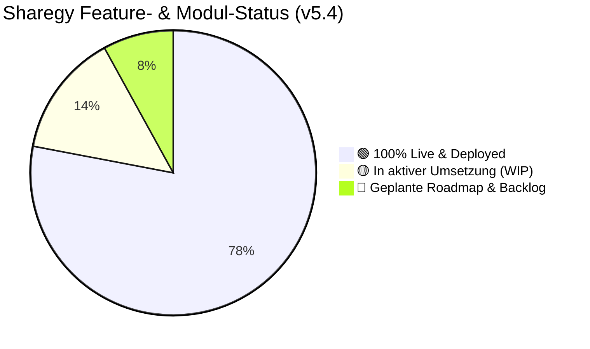

# 🛠️ Sharegy Optimierungs-, Audit- & Backlog-Masterplan

**Dokument-Status:** Konsolidierter Entwicklungs-Status & Roadmap-Masterplan  
**Stand:** 19. September 2026 (v5.4 / Enterprise & Compliance Release)  

---

## 📊 1. Gesamt-Statusübersicht (Fertiggestellt vs. Offen)



---

## 🟢 2. Was ist bereits fertiggestellt? (100% Live & Gepusht)

Alle folgenden Meilensteine und Enterprise-Features sind vollständig im Code implementiert, getestet (`python manage.py check`, `npm run build`), im Online-Handbuch dokumentiert und nach `origin/main` gepusht:

| Bereich / Meilenstein | Live seit | Implementierte Kernkomponenten & Nutzen |
|---|:---:|---|
| **📁 Zentraler Dokumenten- & Export-Manager** | v5.4 (Sep 2026) | `/app/documents` mit KPI-Karten, On-Demand Streaming-Exporten (PDF, CSV, JSON, DATEV, MSCONS), SHA-256 Hashketten-Prüfung und GoBD-Archivierung. |
| **🔑 Granulare Enterprise RBAC-Rollenmatrix** | v5.4 (Sep 2026) | 5 feingranulare Rollen (`SuperAdmin`, `Dispatcher`, `Billing Specialist`, `Field Technician`, `Auditor / Read-Only`) in Backend (`permissions.py`, `models.py`) und Frontend (`useUser.js`). |
| **⏳ Skeleton-Loading & SWR Caching UX** | v5.4 (Sep 2026) | Reusable `Skeleton`-Suite (`SkeletonCard`, `SkeletonKpiGrid`, `SkeletonChart`, `SkeletonTable`) & globales TanStack Query SWR-Caching (`staleTime: 2m`) für Zero Layout Shift. |
| **📖 Helpcenter 2.0 & Online-Handbuch** | v5.4 (Sep 2026) | 11 Themen-Kategorien, 46 zweisprachige (DE/EN) Enterprise-Artikel inkl. RBAC-Matrix, GoBD-Audit-Trail und Export-Manager. |
| **⚡ Smart Meter CLS & § 14a EnWG Gateway** | v5.3 (Sep 2026) | Dimm- und Lastabwurfbefehle via BNetzA CLS-Kanal mit VNB-Quittierung & Audit-Trail. |
| **📈 VPP Flexibilität & Market Clearing** | v5.3 (Sep 2026) | Virtuelles Kraftwerk für Heimspeicher-Pooling, aFRR/SRL- & Intraday-Vermarktung mit 80/20 Erlös-Clearing. |
| **🧭 Rollen- & Kontextbasierte Navigation** | v5.3 (Sep 2026) | Dynamische Side-Navigation für EMS-Prosumer, Mieterstrom, GGV-Sharing, Installateure und Liegenschafts-Admins. |
| **📧 E-Mail-Zustellbarkeit (MS Graph M365)** | v5.3 (Sep 2026) | Microsoft Graph REST-API (`noreply@smartevo.de`) mit 100% Posteingangs-Garantie bei Gmail, GMX & Outlook. |
| **🚨 Alert- & Incident-Engine** | v5.3 (Sep 2026) | Saubere Trennung von Telemetrie-Alarmen (`AlertEvent`) und Helpdesk-Tickets (`Ticket`) mit Support-Drawer. |
| **M1: Core HEMS & Telemetrie-Härtung** | v5.2 | TimescaleDB Hypertables, Deadband-Filter, $O(1)$ LatestMetric-Snapshots. |
| **M2: Live Flow & Sankey-Engine** | v5.2 | ECharts/SVG Sankey, Merit-Order Flussverteilung, Restlast-Disaggregation. |
| **M3: Smart Autopilot & Dispatch Hub** | v5.2 | 4 Autopilot-Modi, BWWP SG-Ready Anti-Cycling Schutz, Live Power Budgeting. |
| **M4: Spotpreise & Batterie-Arbitrage** | v5.2 | 7-Tage EPEX Trend, dynamische Tarife, 96h Solar- & Lastprognose mit Random Forest ML. |
| **M5: 6-Sprachen i18n** | v5.2 | DE, EN, PL, FR, IT, ES mit automatischem Fallback und Translation-Sync. |
| **M6: UI/UX Glassmorphism & Theme Engine** | v5.2 | Dark/Light Mode, Mobile Topbar, Drawer & Bottom-Nav. |
| **M7: Multi-Cloud-Inverter Ökosystem** | v5.2 | Sungrow, Fronius, SMA, SolarEdge, Huawei, Deye, Hoymiles, GoodWe, Kostal, Victron API v2. |
| **M8: Native Android App (Capacitor 7)** | v5.2 | Capacitor Native Shell, Fastlane Release Pipeline, FCM Push, Deep Linking. |
| **M9: B2B Whitelabel & AS4 Mako Hub** | v5.2 | Partner-Flottencockpit, Dynamic Theming Engine, BNetzA EDIFACT MSCONS/UTILMD Generator. |
| **M10: Cloudflare Edge CDN & Security** | v5.2 | Full Strict Universal SSL, 3x Edge Cache Rules, WebSockets Anycast, Sub-10ms DNS. |

---

## 🟡 3. Was ist in aktiver Umsetzung / Vorbereitung? (WIP)

Für die folgenden Module existieren detaillierte Spezifikationen und teils implementierte Code-Basen in `docs/wip/`:

| Modul / Feature | Spezifikation | Aktueller Fortschritt | Nächster Schritt |
|---|---|:---:|---|
| **📱 Dual-App Android (Home vs. Pro)** | [`WIP_DUAL_APP_ECOSYSTEM_USER_VS_PARTNER.md`](./WIP_DUAL_APP_ECOSYSTEM_USER_VS_PARTNER.md) | 🟢 **90 %** | Build-Flavors `android-home` und `android-pro` im Fastlane-Release finalisieren. |
| **🌐 Dynamische Whitelabel SSL-Provisionierung** | [`WIP_DYNAMIC_WHITELABEL_SSL_PROVISIONING.md`](./WIP_DYNAMIC_WHITELABEL_SSL_PROVISIONING.md) | 🟡 **70 %** | CNAME Ingress-Proxy (Caddy/Traefik) mit On-Demand ACME Let's Encrypt verknüpfen. |
| **🌐 smartEvo Dachmarken-Website Integration** | [`WIP_SMARTEVO_WEBSITE_PRODUCT_INTEGRATION.md`](./WIP_SMARTEVO_WEBSITE_PRODUCT_INTEGRATION.md) | 🟡 **65 %** | Vereinheitlichung der Hero- und Feature-Cards im Astro-Frontend (`smartevo-web`). |
| **🛰️ Entkoppelter Monitoring-Cluster & Reverse-RPC** | [`WIP_DECOUPLED_MONITORING_CLUSTER_AND_REVERSE_RPC.md`](./WIP_DECOUPLED_MONITORING_CLUSTER_AND_REVERSE_RPC.md) | 🟡 **55 %** | Dual-Socket WSS Control Plane zur Zero-Trust Fernwartung von Edge-Gateways. |
| **📡 EEBUS & Cloud Ecosystem Bridge** | [`WIP_EEBUS_AND_CLOUD_ECOSYSTEM_BRIDGE.md`](./WIP_EEBUS_AND_CLOUD_ECOSYSTEM_BRIDGE.md) | 🟡 **45 %** | SHIP/SPINE Daemon für lokale Wärmepumpen-Anbindung (Vaillant, Viessmann, Bosch). |

---

## 🔴 4. Was muss noch gemacht werden? (Geplante Roadmap & Backlog)

Empfohlene nächste Ausbaustufen für Enterprise-Power-User und Großkunden (jeweils mit eigenständiger WIP-Spezifikation):

### 1. ⚡ [`WIP_COMMAND_CENTER_SPOTLIGHT_SEARCH.md`](./WIP_COMMAND_CENTER_SPOTLIGHT_SEARCH.md)
* **Ziel**: Tastaturgesteuertes Quick-Nav-Overlay (`Cmd+K` / `Ctrl+K`) für Power-User und Admins.
* **Funktionen**: Schnellsprung zu jeder Liegenschaft, jedem Zähler, Quartier und Handbuch-Artikel in $< 300\,\text{ms}$, Theme-Toggle & Schnell-Exporte.

### 2. 🔔 [`WIP_ENTERPRISE_NOTIFICATION_AND_ACTIVITY_FLYOUT.md`](./WIP_ENTERPRISE_NOTIFICATION_AND_ACTIVITY_FLYOUT.md)
* **Ziel**: Ablösung des modalen Alert-Centers durch ein reaktives Topbar-Dropdown.
* **Funktionen**: 4 Tabs (🚨 Störungen, ⚡ VPP/Netz-Aktionen, 📄 Neue IBN-Protokolle, 👥 System-Events) & 1-Klick-„Alle als gelesen markieren“.

### 3. 🍞 [`WIP_GLOBAL_TOAST_NOTIFICATION_SYSTEM.md`](./WIP_GLOBAL_TOAST_NOTIFICATION_SYSTEM.md)
* **Ziel**: Elegante, nicht-blockierende Statusmeldungen für asynchrone Aktionen („Dimm-Befehl gesendet“, „Zählerstand gespeichert“).
* **Funktionen**: Undo-Button für rückgängig machbare Aktionen, Auto-Dismiss nach 4–6 Sekunden, Glassmorphic Styling.

### 4. 🔐 [`WIP_TWO_FACTOR_AUTHENTICATION_MFA.md`](./WIP_TWO_FACTOR_AUTHENTICATION_MFA.md)
* **Ziel**: Pflicht-2FA für privilegierte Rollen (`SuperAdmin`, `Dispatcher`, `Partner-Installateur`).
* **Funktionen**: Google Authenticator / 1Password TOTP QR-Code Setup, Notfall-Backup-Codes, Session-Token Scoping.

### 5. 🪝 [`WIP_OUTBOX_WEBHOOK_DISPATCHER_ERP_CRM.md`](./WIP_OUTBOX_WEBHOOK_DISPATCHER_ERP_CRM.md)
* **Ziel**: Transaktionale Event-Benachrichtigung für ERP- & CRM-Systeme von Stadtwerken & Verwaltern (SAP, DATEV, Salesforce).
* **Events**: `meter.reading.created`, `invoice.issued`, `vpp.dispatch.triggered`, `handover.completed` mit HMAC-SHA256 Signatur.

---

## 🎯 5. Nächste empfohlene Schritte

```
[1. Spotlight Command-Center (Cmd+K)] ──► [2. Topbar Notification Flyout] ──► [3. Global Toast System]
                                                                                       │
[5. Webhook-Dispatcher (ERP/CRM)]     ◄── [4. Zwei-Faktor-Authentifizierung (2FA)] ◄──┘
```
