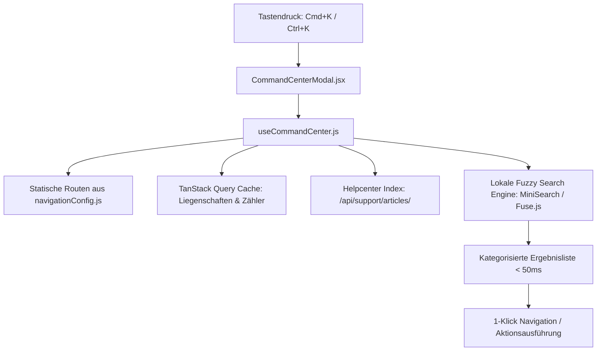

# ⚡ [WIP] Globales Cmd+K / Ctrl+K Command-Center (Spotlight-Search)

**Dokument-Status:** In Konzeption / Spezifikation  
**Fortschritt:** 🟡 25 %  
**Priorität:** 🔴 Hoch (Power-User & Admin UX)  
**Lead / Modul:** `frontend/src/components/common/`, `frontend/src/hooks/`, `navigationConfig.js`  

---

## 🎯 1. Problemstellung & Motivation

Power-User, Stadtwerke-Disponenten und Liegenschafts-Administratoren verwalten dutzende oder hunderte Liegenschaften, Geräte, Messpunkte und Handbuch-Artikel. 
Die manuelle Navigation über Menüs, Unterseiten und Filterleisten kostet Zeit. Ein **tastaturgesteuertes Quick-Nav-Overlay (Spotlight-Search)** ermöglicht die blitzschnelle Bedienung in $< 300\,\text{ms}$.

---

## 🖥️ 2. UI-Layout & Interaktions-Design

- **Tastatur-Shortcut**: `Cmd + K` (macOS) bzw. `Ctrl + K` (Windows / Linux) oder Direktklick auf das Suchfeld in der Topbar.
- **Escape-Taste**: Schließen des Overlays bei Beibehaltung des aktuellen Ansichts-Status.
- **Pfeiltasten (`↑` / `↓`) & `Enter`**: Schnelle Auswahl und Navigation ohne Mausberührung.

```
+─────────────────────────────────────────────────────────────────────────────+
|  🔍 Suche nach Liegenschaft, Zähler, Handbuch-Artikel oder Aktion...        |
+─────────────────────────────────────────────────────────────────────────────+
|  🏢 Liegenschaften & Quartiere                                              |
|  • Quartier Sonnenblick (Berlin) ───────────────► Liegenschaft öffnen       |
|  • WEG Ahornhof (München) ──────────────────────► Mieterstrom-Messkonzept   |
|                                                                             |
|  ⚡ Schnellausführung (Quick Actions)                                       |
|  • 🌓 Dark / Light Mode umschalten (Toggle Theme)                           |
|  • 📁 DATEV / MSCONS Monats-Export generieren ──► Download Hub öffnen       |
|  • 📡 WSS Remote-RPC Fernwartung testen                                     |
|                                                                             |
|  📖 Handbuch & Support                                                      |
|  • Artikel: "§ 14a EnWG Dimmung & CLS-Kanal"                                |
|  • Artikel: "Enterprise RBAC-Rollenmatrix & Berechtigungen"                 |
+─────────────────────────────────────────────────────────────────────────────+
|  ESC Schließen  |  ↑↓ Navigieren  |  ↵ Auswählen  |  Tab Kategorie filtern  |
+─────────────────────────────────────────────────────────────────────────────+
```

---

## 🏗️ 3. Architektur & Datenquellen



---

## 🛠️ 4. Technische Komponenten & Umsetzungsschritte

1. **`frontend/src/hooks/useCommandCenter.js`**:
   - Globaler Event-Listener auf `keydown` (`(e.metaKey || e.ctrlKey) && e.key === 'k'`).
   - State-Management für `isOpen`, `searchQuery`, `selectedIndex`, `activeCategoryFilter`.
2. **`frontend/src/components/common/CommandCenterModal.jsx`**:
   - Backdrop mit Glassmorphism-Effekt und animiertem Einblenden.
   - Kategorisierte Suchergebnisse mit Icons (`Building2`, `Zap`, `FileText`, `HelpCircle`, `Moon`, `Sun`).
3. **Erweiterung von `navigationConfig.js`**:
   - Annotation von Direkt-Aktionen mit Keywords (`['theme', 'dark', 'light', 'export', 'datev', 'mscons']`).
4. **Integration in `AppShell.jsx`**:
   - Globale Einbindung auf Root-Ebene für alle angemeldeten Benutzer.
