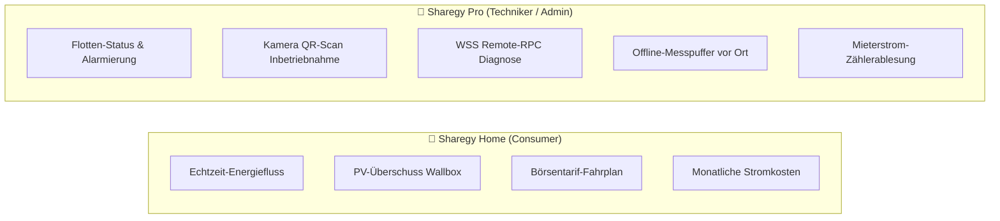
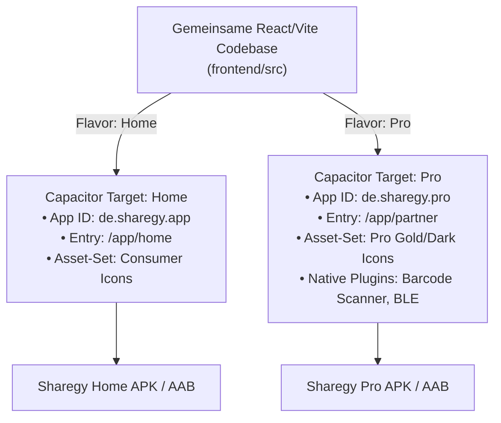

# 📱 [WIP] Dual-App Android-Ökosystem (Sharegy Home vs. Sharegy Pro)

**Status:** ✅ Struktur & Build-Flavors eingerichtet  
**Fortschritt:** 🟢 90 %  
**Priorität:** 🔴 Hoch (Dual-Target in `frontend/android-home` und `frontend/android-pro`)  
**Lead / Modul:** `frontend/android-home`, `frontend/android-pro`, `frontend/scripts/cap-sync-flavor.js`, `frontend/src/config/appFlavor.js`  

---

## 🎯 1. Strategische Motivation

Mit dem Ausbau der B2B2C-Partnerstrategie (Installateure, Solar-Fachbetriebe, Wohnungsbaugesellschaften und Stadtwerke) entstehen zwei völlig unterschiedliche Nutzerprofile auf mobilen Endgeräten:

---

## 📱 2. Feature-Vergleich der beiden Android Apps

| Kriterium | 🏠 `Sharegy Home` (Consumer & Mieter) | 🔧 `Sharegy Pro` (Installateur & Verwalter) |
| :--- | :--- | :--- |
| **Package Name** | `de.sharegy.app` | `de.sharegy.pro` |
| **Zielgruppe** | Eigenheimbesitzer, Mieter, Wohnungseigentümer | PV-Installateure, Servicetechniker, Hausverwalter |
| **Startbildschirm** | Live-Energiefluss & Autarkiegrad | Flotten-Health-Dashboard & Fehlertickets |
| **Hardware-Features** | Standard Web-Push, Lokale Benachrichtigung | **Kamera-Barcode/QR-Scanner** für Inverter & Zähler, Bluetooth BLE (lokale Inbetriebnahme) |
| **Offline-Fähigkeit** | Standard PWA Caching | **Offline-Inbetriebnahme-Puffer** (Speichert Anlagendaten im Keller ohne Mobilfunk und synct bei Netzempfang) |
| **Diagnose-Tools** | Keine (Einfachheit steht im Vordergrund) | **WSS Remote-RPC Konsole**, Ping-Tests, Inverter-Modbus Register-Dump |
| **Branding / UI** | Helles/Dunkles Theme, Akzentfarben des Stadtwerks | Technisches "Pro Dark"-Design mit Hochkontrast-Indikatoren |

---

## 🏗️ 3. Technische Umsetzung mit Capacitor & Android Studio

Um maximale Code-Wiederverwendung zu gewährleisten, nutzen beide Apps dieselbe React-Codebase mit unterschiedlichen Build-Flavors:

### 3.1 Native Capacitor-Plugins für `Sharegy Pro`
1. `@capacitor-community/barcode-scanner`:
   * Ermöglicht das direkte Scannen von Wechselrichter-Typenschildern, Sungrow/SMA QR-Codes und Smart-Meter Barcodes im Zählerschrank.
2. `@capacitor/network` & `@capacitor/preferences`:
   * Zuverlässige Erkennung von Offline-Zuständen in Zählerräumen und automatischer Synchronisations-Queue.
3. `@capacitor-community/bluetooth-le` (*Optional Q2 2027*):
   * Direkte lokale Konfiguration von Shelly- und Edge-Gateways ohne Kunden-WLAN.

---

## 🚀 4. Meilensteine & Roadmap

* **Phase 1 (Live ✅)**: Responsive Web-App mit integriertem Partner-Cockpit und dynamischem Rollenfilter.
* **Phase 2 (Q4 2026)**: Fertigstellung des Rollen- & Kontext-Sidenav-Splittings ([`WIP_ROLE_BASED_SIDENAV_AND_CONTEXT_NAVIGATION.md`](./WIP_ROLE_BASED_SIDENAV_AND_CONTEXT_NAVIGATION.md)).
* **Phase 3 (Q1 2027)**: Einrichtung des separaten Capacitor Build-Flavors `android-pro/` mit QR-Scanner-Integration.
* **Phase 4 (Q2 2027)**: Eigener Google Play Store Release für `Sharegy Pro: Installateur & Flotte`.
