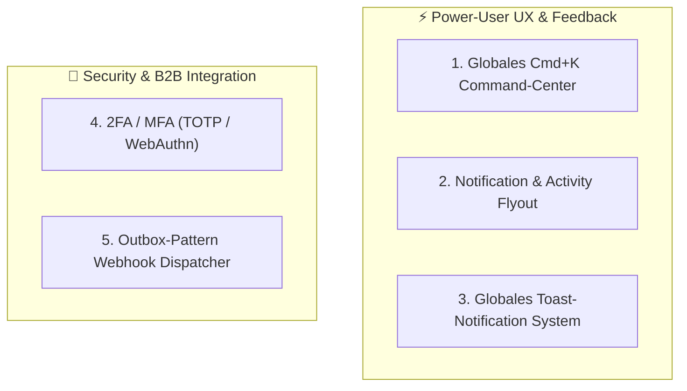

# 🛠️ [WIP] Enterprise Power-User, Automation & Security Extensions

**Dokument-Status:** In Konzeption / Spezifikation für nächste Umsetzungsphase  
**Stand:** 19. September 2026 (v5.4 Roadmap)  
**Lead / Module:** `frontend/src/components/`, `accounts`, `alerts`, `core/webhooks`, `auth`  
**Priorität:** 🔴 Hoch (Enterprise & Großkunden-Upgrade)  

---

## 🎯 1. Zielsetzung & Überblick

Dieses Dokument spezifiziert die fünf verbleibenden Ausbaustufen der **Enterprise-UX & Automation-Suite** für Sharegy:



---

## ⚡ 2. Feature 1: Globales `Cmd+K` / `Ctrl+K` Command-Center (Spotlight-Search)

### 2.1 Problemstellung & Nutzen
Power-User, Stadtwerke-Disponenten und Administratoren verwalten hunderte Liegenschaften, Geräte und Zähler. Die manuelle Navigation über Menüs kostet wertvolle Sekunden. Ein globales Keyboard-Overlay ermöglicht die Steuerung in $< 300\,\text{ms}$.

### 2.2 UI-Konzept & Shortcuts
- **Shortcut**: `Cmd + K` (Mac) bzw. `Ctrl + K` (Windows/Linux) oder Klick auf die Suchleiste in der Topbar.
- **Fuzzy Search Engine**: Lokale Indizierung mit MiniSearch / Fuse.js für verzögerungsfreie Ergebnisse.

```
+─────────────────────────────────────────────────────────────────────────────+
|  🔍 Suche nach Liegenschaft, Zähler, Handbuch-Artikel oder Aktion...        |
+─────────────────────────────────────────────────────────────────────────────+
|  🏢 Liegenschaften & Zähler                                                 |
|  • Quartier Sonnenblick (Berlin) ───────────────► Liegenschaft öffnen       |
|  • Zähler #DE00014521485 (WEG Ahornhof) ───────► 15m-Lastgang anzeigen     |
|                                                                             |
|  ⚡ Schnellausführung (Quick Actions)                                       |
|  • 🌓 Dark / Light Mode umschalten (Toggle Theme)                           |
|  • 📄 DATEV / MSCONS Monats-Export generieren ──► Download Hub öffnen       |
|  • 📡 Fernwartungs-Diagnose starten (WSS Test)                              |
|                                                                             |
|  📖 Handbuch & Support                                                      |
|  • Artikel: "§ 14a EnWG Dimmung & CLS-Kanal"                                |
|  • Artikel: "Enterprise RBAC-Rollenmatrix"                                  |
+─────────────────────────────────────────────────────────────────────────────+
|  ESC Schließen  |  ↑↓ Navigieren  |  ↵ Auswählen  |  Tab Kategorie wechseln |
+─────────────────────────────────────────────────────────────────────────────+
```

### 2.3 Technische Umsetzung
- **Frontend-Komponente**: `frontend/src/components/common/CommandCenterModal.jsx`
- **Globaler Hook**: `useCommandCenter.js` mit `keydown`-Listener für `metaKey + 'k'` / `ctrlKey + 'k'`.
- **Datenquellen**:
  - Statische Routen & Aktionen aus `navigationConfig.js`
  - Liegenschafts- & Zähler-Cache via TanStack Query
  - Helpcenter-Artikelindex über `/api/support/articles/`

---

## 🔔 3. Feature 2: Enterprise Notification & Activity Flyout (Topbar-Glocke)

### 3.1 Problemstellung & Nutzen
Aktuell öffnet das Glocken-Icon ein modales Alert-Fenster. Für den täglichen Betrieb ist ein dezentes, reaktives Dropdown-Flyout ergonomischer, das Ereignisse nach Kategorien bündelt.

### 3.2 Tab-Struktur & Badge-Logik
- **Tabs im Flyout**:
  1. 🚨 **Störungen & Alarme**: Wechselrichter offline, Phasen-Schieflast, Schwellwertüberschreitungen.
  2. ⚡ **VPP & Netz-Aktionen**: § 14a EnWG Dimm-Befehle, Regelleistungs-Abrufe (aFRR), Batterie-Ladestopps.
  3. 📄 **IBN & Dokumente**: Neue Inbetriebnahmeprotokolle, generierte Jahresabrechnungen.
  4. 👥 **System-Events**: Neue Benutzer-Einladungen, API-Key Änderungen, Audit-Warnungen.
- **Aktionen**:
  - 1-Klick-„Alle als gelesen markieren“
  - „Filtere nach ungelesenen Nachrichten“
  - Direktlink zur auslösenden Liegenschaft oder Komponente.

### 3.3 Technische Umsetzung
- **Frontend**: `frontend/src/components/layout/NotificationFlyout.jsx` mit `useFloating` / Popover-Positionierung.
- **Backend API**: `GET /api/alerts/recent/?tab=vpp&unread_only=true` und `POST /api/alerts/mark-all-read/`.

---

## 🍞 4. Feature 3: Globales Toast-Notification-System

### 4.1 Problemstellung & Nutzen
Erfolgsmeldungen („Einstellung gespeichert“, „Dimm-Signal gesendet“) blockieren bisher den Workflow durch Modals oder werden unauffällig inline angezeigt. Ein elegantes Toast-System liefert sofortige Bestätigung mit Undo-Möglichkeit.

### 4.2 Toast-Typen & Interaktion
- 🟢 **Success**: „Liegenschaft erfolgreich angelegt.“
- 🔵 **Info**: „DATEV-Export wird im Hintergrund generiert...“
- 🟠 **Warning**: „Batterie-SoC unter 15 % Reservegrenze.“
- 🔴 **Error**: „Verbindungsaufbau zum Cloud-Inverter fehlgeschlagen.“
- ↩️ **Action / Undo**: „Gerät gelöscht [Rückgängig machen]“ (5s Zeitfenster).

### 4.3 Technische Umsetzung
- **Provider**: `frontend/src/components/ui/ToastProvider.jsx` (oder Einbindung von `sonner`).
- **Globaler Hook**: `const { toast } = useToast();`
- **Design**: Glassmorphic Styling passend zum Dark/Light Theme mit Swipe-to-Dismiss auf Touch-Geräten.

---

## 🔐 5. Feature 4: 2FA / Zwei-Faktor-Authentifizierung (TOTP & WebAuthn)

### 5.1 Problemstellung & Sicherheitsanforderung
Großkunden, Stadtwerke und Liegenschafts-Admins verwalten kritische Infrastruktur (Steuerung von MW-Batteriepools nach § 14a EnWG). Eine 2-Faktor-Authentifizierung ist für BSI- und ISO 27001-Compliance unerlässlich.

### 5.2 Architektur & Ablauf
```
[User Login (E-Mail + Passwort)]
               │
               ▼
┌──────────────────────────────────────────────┐
│  Backend prüft: "Ist 2FA für User aktiv?"     │
└──────────────────────┬───────────────────────┘
                       │
       ┌───────────────┴───────────────┐
       ▼ (Ja)                          ▼ (Nein & Rolle != Admin)
┌──────────────────────────────┐ ┌──────────────────────────────┐
│  Temp-JWT Token ausstellen   │ │  Vollwertiges JWT Access-    │
│  (scope: 'mfa_pending')      │ │  Token ausstellen            │
└──────────────┬───────────────┘ └──────────────────────────────┘
               │
               ▼
┌──────────────────────────────┐
│  MFA-Modal: TOTP 6-Digit Code│ (Google Authenticator, 1Password)
└──────────────┬───────────────┘
               │
               ▼
┌──────────────────────────────┐
│  POST /api/auth/mfa/verify/  │
│  -> Ausgabe Voll-JWT Token   │
└──────────────────────────────┘
```

### 5.3 Technische Umsetzung
- **Backend**: `django-otp` / `pyotp` mit verschlüsselten `TOTPDevice`-Secrets in PostgreSQL.
- **Endpunkte**:
  - `POST /api/auth/mfa/setup/`: Generiert TOTP-Secret & QR-Code (Data-URI).
  - `POST /api/auth/mfa/confirm/`: Aktiviert 2FA nach erstmaliger Code-Eingabe & liefert 8 Backup-Codes.
  - `POST /api/auth/mfa/verify/`: Validiert den 6-stelligen TOTP-Token beim Login.
- **Rollen-Policy**: Pflicht für Rollen `system_admin`, `dispatcher` und `partner_admin`.

---

## 🪝 6. Feature 5: Outbox-Pattern Webhook-Dispatcher für ERP & CRM

### 6.1 Problemstellung & Nutzen
Stadtwerke, Energieversorger und Hausverwaltungen nutzen ERP-Systeme (SAP, DATEV, Salesforce, Aareon). Bei wichtigen Ereignissen müssen diese Systeme in Echtzeit via HTTP-Webhooks benachrichtigt werden, ohne dass die Sharegy-Transaktion bei Verbindungsausfällen blockiert wird.

### 6.2 Outbox-Architektur & Resilienz
```
┌──────────────────────────────────────────────┐
│      Sharegy Fachlogik (z. B. Billing)       │
├──────────────────────────────────────────────┤
│ 1. Transaktion: Rechnung erzeugen            │
│ 2. Outbox-Eintrag in DB: `WebhookEvent`      │
└──────────────────────┬───────────────────────┘
                       │ (Transaktional garantiert / ACID)
                       ▼
┌──────────────────────────────────────────────┐
│        PostgreSQL: `core_webhookevent`       │
└──────────────────────┬───────────────────────┘
                       │
                       ▼ (Celery Worker / Poller alle 2s)
┌──────────────────────────────────────────────┐
│          Celery Outbox Dispatcher            │
├──────────────────────────────────────────────┤
│ • HMAC-SHA256 Signatur (`X-Sharegy-Signature`)│
│ • Exponential Backoff Retry (5 Versuche)     │
│ • Dead-Letter-Queue bei permanentem 4xx/5xx  │
└──────────────────────┬───────────────────────┘
                       │
                       ▼ (HTTPS POST)
┌──────────────────────────────────────────────┐
│     B2B-Partner ERP / CRM Endpoint           │
│     (z. B. https://api.stadtwerke.de/hook)   │
└──────────────────────────────────────────────┘
```

### 6.3 Unterstützte Webhook-Events
| Event-Name | Payload-Inhalt | Anwendungsfall |
|---|---|---|
| `meter.reading.created` | Zähler-ID, 15m-Zählerstand (kWh), Timestamp, PTB-Status | Automatische Übernahme in Abrechnungssysteme |
| `invoice.issued` | Rechnungs-ID, Betrag, Empfänger, PDF-Download-URL | DATEV- / SAP-FiBu Import |
| `vpp.dispatch.triggered` | Signal-Typ, Soll-Leistung (kW), Dauer, Ziel-Pool | Netzleitstellen-Synchronisation |
| `handover.completed` | Liegenschaft, Seriennummern, PDF-Hash | Archivierung im CRM des Solarteurs |

---

## 📋 7. Umsetzungs-Reihenfolge & Roadmap

```
[Phase 1: Spotlight Cmd+K & Toast System] ──► [Phase 2: Topbar Notification Flyout]
                                                                │
[Phase 4: Outbox-Pattern Webhook Engine]   ◄── [Phase 3: Zwei-Faktor-Authentifizierung (2FA)]
```
