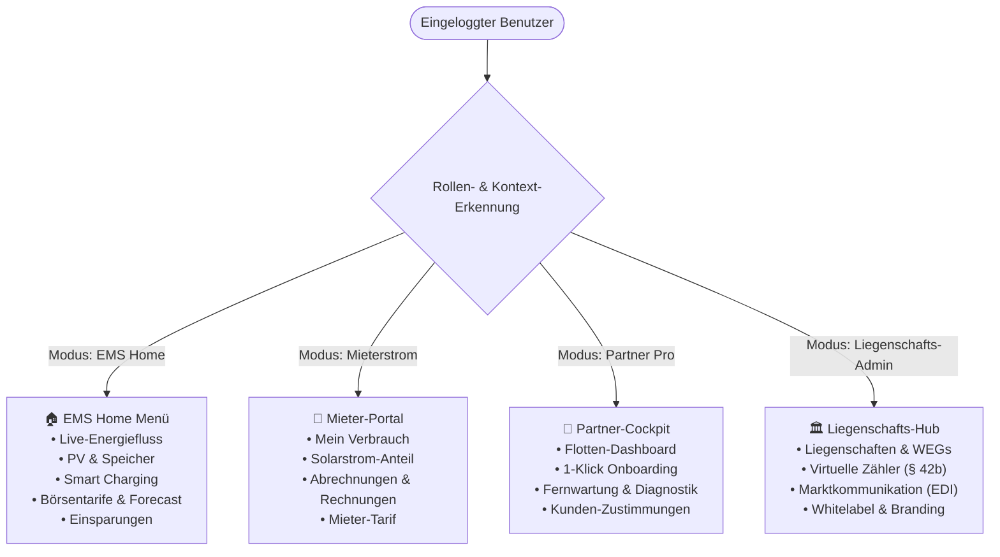

# 🧭 [WIP] Rollen- & Kontextbasierte Sidenav-Aufteilung

**Status:** In Konzeption / UI-Refactoring Vorbereitung  
**Fortschritt:** 🟡 40 %  
**Priorität:** 🔴 Hoch (Ziel: Q4 2026 / Q1 2027)  
**Lead / Modul:** `frontend/src/components/AppShell.jsx`, `frontend/src/context/AuthContext.jsx`

---

## 🎯 1. Problemstellung & Motivation

Die aktuelle Desktop- und Mobile-Navigation ([`AppShell.jsx`](file:///c:/Users/Public/Dev/eswes/frontend/src/components/AppShell.jsx)) bietet eine Fülle an Reitern und Modulen (EMS-Live-Flow, dynamische Tarife, Mieterstrom-Abrechnungen, Liegenschaften, Flotten-Cockpit, Marktdaten, Whitelabel-Einstellungen).

Für unterschiedliche Zielgruppen führt eine "All-in-One"-Sidenav jedoch zu **kognitiver Überlastung (Clutter)**:
* **Privater EMS-User (Eigenheimbesitzer / Prosumer)**: Möchte seinen PV-Überschuss, Speicher, Wallbox und Börsenstrompreise sehen – keine Mieterstrom-Messkonzepte oder B2B-Whitelabel-Einstellungen.
* **Tenant-User (Mieter in WEG / Mieterstrom)**: Möchte seinen Verbrauch, Mieterstrom-Anteil, Kosten und Monatsabrechnungen sehen – keine Wechselrichter-Settings oder Batterie-Entladestrategien.
* **Installateur / Partner-Techniker**: Braucht primär seine Kunden-Flottenübersicht, Schnell-Inbetriebnahme und WSS-Diagnosetools.
* **Tenant-Admin (Hausverwaltung / Stadtwerke-Admin)**: Verwaltet Liegenschaften, Zählpunkte, EDIFACT-Exporte und Tarife.
* **Multi-Rollen-Nutzer (z. B. Installateur mit eigener Heim-PV)**: Benötigt einen nahtlosen **Kontext-Umschalter** in der Kopfzeile ("Privates EMS" ⟷ "Partner Flotten-Cockpit").

---

## 🏛️ 2. Zielarchitektur: Rollenprofile & Menü-Struktur



---

## 📋 3. Menü-Struktur im Detail

### 🏠 Profil A: `EMS_PROSUMER` (Eigenheim & Gewerbe-EMS)
| Menüpunkt | Pfad | Icon | Beschreibung |
| :--- | :--- | :---: | :--- |
| **Live-Energiefluss** | `/app` | ⚡ | Echtzeit-Flussdiagramm (PV, Speicher, Netz, Last) |
| **Optimierung & Forecast** | `/app/forecast` | ☀️ | 96h Solar-Ertragsprognose & Fahrplan |
| **Wallbox & Smart Charging** | `/app/charging` | 🚗 | PV-Überschussladen & Sofort-Boost |
| **Börsenstrom & Tarife** | `/app/tariffs` | 📈 | 15-Minuten-EPEX-Spot Börsenpreise |
| **Geräte & Wechselrichter** | `/app/devices` | 🔌 | Direktanbindung Cloud-Inverter & Relais |
| **Statistik & Einsparung** | `/app/analytics` | 💰 | Autarkiegrad, Eigenverbrauch & ROI |

### 🏢 Profil B: `TENANT_CONSUMER` (Mieter & Wohnungsnutzer)
| Menüpunkt | Pfad | Icon | Beschreibung |
| :--- | :--- | :---: | :--- |
| **Mein Verbrauch** | `/app/tenant-view` | 📊 | Eigener 15m-Stromverbrauch in Echtzeit |
| **Mieterstrom-Anteil** | `/app/solar-share` | ☀️ | Solarstrom vs. Netzbezug aus der Liegenschaft |
| **Abrechnungen & Belege** | `/app/invoices` | 📄 | Monatliche Stromkosten & Abrechnungs-PDFs |
| **Tarifinformationen** | `/app/tariff-info` | 🏷️ | Aktueller Arbeitspreis & Grundgebühr |

### 🔧 Profil C: `PARTNER_PRO` (Installateur & Service-Betrieb)
| Menüpunkt | Pfad | Icon | Beschreibung |
| :--- | :--- | :---: | :--- |
| **Flotten-Übersicht** | `/app/partner` | 🛠️ | Alle Kundenanlagen mit Status & Health-Score |
| **1-Klick Onboarding** | `/app/partner/onboard` | ➕ | Neue PV-Anlage / Wechselrichter anlegen |
| **Fernwartung & Diagnose** | `/app/partner/remote-rpc` | 📡 | WSS Reverse-RPC Tests & Fehlercode-Analyse |
| **Kunden-Consents** | `/app/partner/consents` | 🛡️ | Wartungs-Freigaben & Zustimmungs-Status |

### 🏛️ Profil D: `TENANT_ADMIN` (Hausverwaltung / Stadtwerke)
| Menüpunkt | Pfad | Icon | Beschreibung |
| :--- | :--- | :---: | :--- |
| **Liegenschaften & WEGs** | `/app/tenant` | 🏢 | Gebäude, Unterzähler & Mieteinheiten |
| **Virtueller Summenzähler** | `/app/vpp/virtual-meter` | 🧮 | § 42b EnWG Reststrom- & Solar-Allokation |
| **Marktkommunikation** | `/app/mako` | ✉️ | BNetzA MSCONS 2.2b / UTILMD 2.4 & AS4 |
| **Branding & Whitelabel** | `/app/settings/whitelabel` | 🎨 | Eigene Farben, Logo & Subdomain |

---

## 🔄 4. Kontext-Umschalter (Multi-Role Switcher)

Befindet sich ein Benutzer in mehreren Rollen (z. B. `partner_admin` **und** privater Anlagenbesitzer), wird in der oberen Kopfzeile ein diskretes Dropdown gerendert:

```
+-------------------------------------------------------------+
| [Logo] Sharegy      [ Context: 🔧 Partner Flotte ▼ ] [User] |
+-------------------------------------------------------------+
|                                                             |
|  Dropdown-Auswahl:                                          |
|  ✓ 🔧 Partner-Cockpit (Elektro Meier GmbH)                  |
|    🏠 Privates EMS (Zuhause PV)                             |
|    🏢 Liegenschaft Sonnenblick (Verwalter)                  |
|                                                             |
+-------------------------------------------------------------+
```

Das Umschalten des Kontexts aktualisiert:
1. Den State `activeContextMode` im `TenantThemingContext` bzw. `AuthContext`.
2. Die sichtbaren Menüpunkte in der Sidenav.
3. Die standardmäßige Landing-Page nach dem Login.

---

## 🛠️ 5. Technische Implementierungs-Schritte

1. **`NavConfig.js` erstellen**:
   * Zentrale Definition aller Navigations-Items mit Rollen- und Modus-Tags (`modes: ['EMS_PROSUMER', 'PARTNER_PRO', ...]`).
2. **`ContextSwitcher.jsx` Komponente**:
   * Dropdown in der Top-Bar von [`AppShell.jsx`](file:///c:/Users/Public/Dev/eswes/frontend/src/components/AppShell.jsx) bei mehrfachen Mitgliedschaften.
3. **Persistierung**:
   * Speichern des zuletzt gewählten Modus im `localStorage` (`sharegy_active_context`).
4. **Mobile Bottom-Bar Anpassung**:
   * Auf mobilen Bildschirmen zeigt die Bottom-Navigation maximal 4–5 der wichtigsten Icons des aktuell aktiven Profils.
