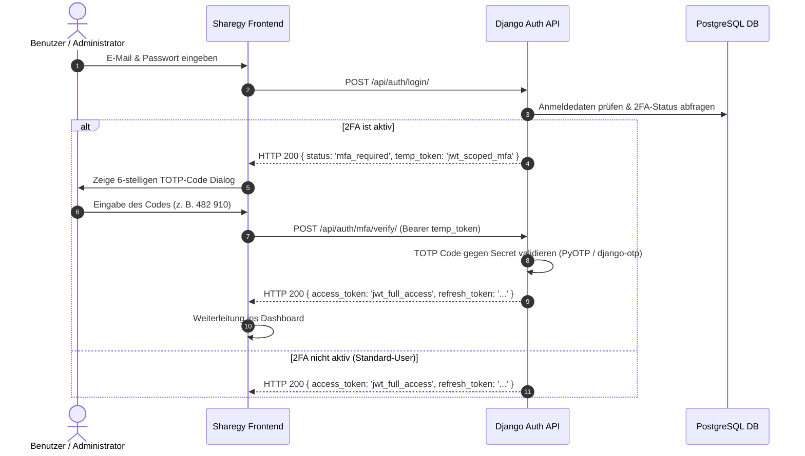

# 🔐 [WIP] Zwei-Faktor-Authentifizierung (2FA / MFA via TOTP & WebAuthn)

**Dokument-Status:** In Konzeption / Spezifikation  
**Fortschritt:** 🟡 20 %  
**Priorität:** 🔴 Hoch (Security- & BSI-Compliance)  
**Lead / Modul:** `accounts`, `auth`, `core/security`  

---

## 🎯 1. Problemstellung & Sicherheitsanforderung

Privilegierte Benutzerrollen (`system_admin`, `dispatcher`, `partner_admin`, `billing_specialist`) steuern netzkritische Anlagen (Virtuelle Kraftwerke nach § 14a EnWG mit mehreren Megawatt aggregierter Leistung) und verwalten sensible Bank- und Abrechnungsdaten.
Eine **Zwei-Faktor-Authentifizierung (2FA)**:
* Verhindert unberechtigte Zugriffe bei kompromittierten Passwörtern.
* Erfüllt BSI TR-03109 / ISO 27001 Sicherheitsstandards für kritische Energieinfrastrukturen.
* Unterstützt gängige Authenticator-Apps (Google Authenticator, 1Password, Microsoft Authenticator) und Hardware-Security-Keys (FIDO2 / WebAuthn).

---

## 🏗️ 2. Authentifizierungs-Ablauf & Token-Scoping

---

## 📊 3. Rollen-Policies & Pflicht-2FA

| Rolle | 2FA-Status | Enforcement / Richtlinie |
|---|:---:|---|
| **SuperAdmin (`system_admin`)** | 🔴 Pflicht | Login ohne 2FA wird nach Erstkonfiguration verweigert |
| **Dispatcher (`dispatcher`)** | 🔴 Pflicht | VPP-Befehle und Lastabwurf erfordern verifizierte 2FA-Sitzung |
| **Partner Admin (`partner_admin`)** | 🔴 Pflicht | Zugriff auf Kundenflotten und Fernwartung erfordert 2FA |
| **Billing Specialist (`finance`)** | 🟡 Dringend empfohlen | Kann per Tenant-Policy zur Pflicht erklärt werden |
| **Standard Prosumer & Mieter** | ⚪ Optional | Freiwillige Aktivierung im Profil (`/app/profile/security`) |

---

## 🛠️ 4. Technische Komponenten & Umsetzungsschritte

1. **Backend (`accounts/models_mfa.py` & `accounts/views_mfa.py`)**:
   - `UserTOTPDevice`: Speichert Base32-Secret, Status (`is_confirmed`), Backup-Codes (gehasht mit SHA-256).
   - `POST /api/auth/mfa/setup/`: Liefert TOTP-URI & QR-Code (Data-URI) zur Initialisierung.
   - `POST /api/auth/mfa/confirm/`: Aktiviert 2FA nach erstmaliger erfolgreicher Code-Bestätigung und generiert 8 Notfall-Backup-Codes.
   - `POST /api/auth/mfa/verify/`: Validiert TOTP-Code während des Logins.
   - `POST /api/auth/mfa/disable/`: Deaktivierung nur mit gültigem TOTP-Code oder Passwort-Bestätigung.
2. **Frontend UI-Komponenten**:
   - `frontend/src/features/auth/components/MfaChallengeModal.jsx`: Eingabefeld mit 6 Ziffern-Autofokus.
   - `frontend/src/features/auth/components/MfaSetupWizard.jsx`: Schritt-für-Schritt Einrichtung mit QR-Code und Backup-Codes Download.
